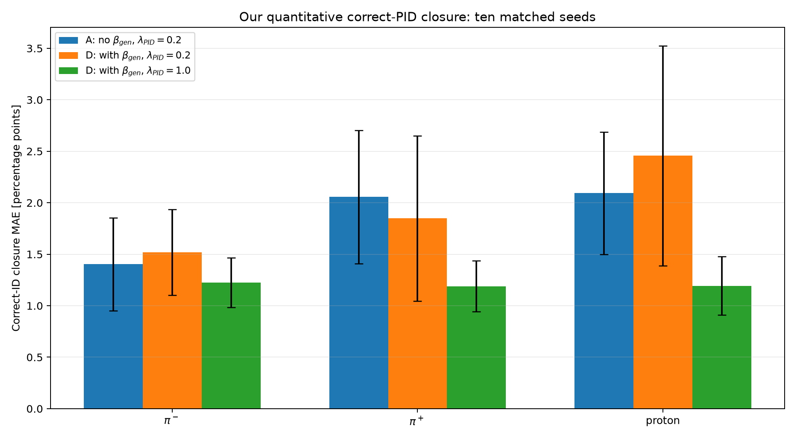
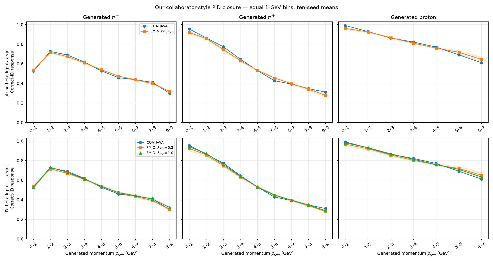
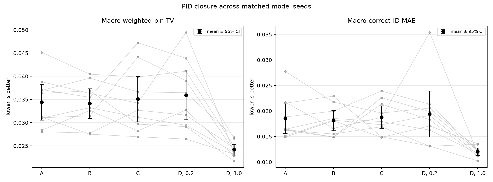
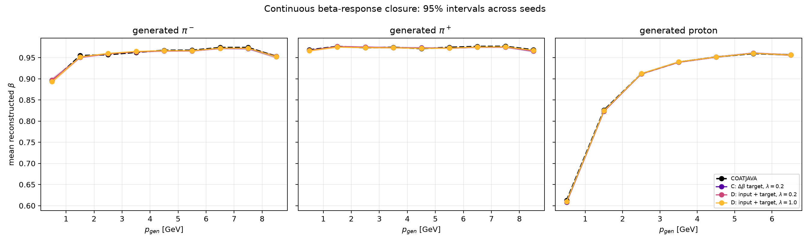

# QuantumMC Forward Foundation Model

A conditional stochastic surrogate for one selected component of the CLAS12
simulation and reconstruction chain.

The present implementation learns the reconstructed response of a generated
hadron **after** the event has a valid trigger electron and **after** that
hadron has been successfully reconstructed in the Forward Detector (FD). It is
therefore a first response-modeling baseline, not yet a complete detector or
event foundation model.

This README distinguishes three objects that must not be conflated:

1. the physical generated-particle state;
2. the tensors actually passed to PyTorch;
3. the parameters of the probability distributions predicted by the network.

## 1. Where this model sits in the physics workflow

The full simulation path is

```text
physics event generator
        |
        v
generated truth event X
        |
        v
GEMC / GEANT4 detector transport
        |
        v
simulated detector signals
        |
        v
COATJAVA reconstruction
        |
        v
reconstructed event Y
```

The eventual forward foundation model should approximate the expensive map

$$
K(Y\mid X)=P(\text{reconstructed event }Y\mid\text{truth event }X).
$$


The current Step 1 network learns only the highlighted conditional response
factor for selected FD hadrons:

$$
P(\Delta_i,\widehat s_i
\mid x_i,T=1,C_i=\mathrm{FD},F_i=1).
$$

Here:

- $x_i$ is the generated truth state of hadron $i$;
- $T\in\{0,1\}$ is the event-level valid-trigger-electron outcome;
- $C_i$ is the particle reconstruction outcome or detector region;
- $F_i$ denotes the current fiducial and data-quality selection;
- $\Delta_i$ is the reconstructed-minus-generated kinematic residual;
- $\widehat s_i$ is the PID assigned by reconstruction.


The model does **not** presently learn:

- whether a generated event triggers;
- whether a generated particle is reconstructed;
- whether it is reconstructed in FD, CD, FT, or nowhere;
- the electron response;
- correlations among particles in a complete event;
- time-dependent detector conditions.

## 2. Event rows, particle rows, and trigger electrons

The Aug17-26 phase-space sample contains 5,000,000 generated events and
20,000,000 generated-particle rows. In this production, each event contains
exactly four generated particles:

$$
e^-,\qquad \pi^+,\qquad \pi^-,\qquad p.
$$

Thus one event contributes four rows:

| Row in one event | Generated PID | Particle |
|---|---:|---|
| 1 | 11 | electron |
| 2 | 211 | $\pi^+$ |
| 3 | -211 | $\pi^-$ |
| 4 | 2212 | proton |

Consequently, the statement “one generated event gives one generated-electron
row” means exactly **one electron particle record per event**, not a row
containing several electrons.

A trigger electron is a reconstructed electron candidate satisfying the
experiment's trigger-related detector and quality conditions. At the data-model
level,

$$
T=
\begin{cases}
1,&\text{a valid trigger electron is present},\\
0,&\text{no valid trigger electron is present}.
\end{cases}
$$

This is a supervised label because a future model must learn the trigger
efficiency

$$
P(T=1\mid x_e),
$$

using both triggered and untriggered generated events. If only $T=1$ events
were retained, the denominator of the efficiency would be absent.

Step 1 does not train this trigger model. Its hadron rows are already
conditioned on $T=1$.

The composite event identifier is

```text
(source_file_id, event_id)
```

because `event_id` alone is only locally unique within a source file. All
particles from the same event are assigned to the same train, validation, or
test partition.

## 3. One Step 1 supervised example

One training row represents **one generated hadron**, together with its matched
reconstructed FD candidate. It is not a complete event.

The physical truth state is

$$
x_i^{\mathrm{phys}}
=(p_i^{\mathrm{gen}},\theta_i^{\mathrm{gen}},
\phi_i^{\mathrm{gen}},s_i^{\mathrm{gen}})
\in
(0,\infty)\times[0,\pi]\times S^1\times\mathcal S,
$$

where

$$
\mathcal S=\{-211,211,2212\}
=\{\pi^-,\pi^+,p\}.
$$

The physical response label is

$$
\Delta_i^{\mathrm{phys}}
=(\Delta p_i,\Delta\theta_i,\Delta\phi_i)\in\mathbb R^3,
$$

with

$$
\Delta p_i=p_i^{\mathrm{rec}}-p_i^{\mathrm{gen}},
\qquad
\Delta\theta_i=\theta_i^{\mathrm{rec}}-
\theta_i^{\mathrm{gen}},
$$

$$
\Delta\phi_i=
\mathrm{wrap}_{[-\pi,\pi)}\,
(\phi_i^{\mathrm{rec}}-\phi_i^{\mathrm{gen}}).
$$

The reconstructed PID label $\widehat s_i$ is allowed to differ from the
generated PID. Such rows describe physical/reconstruction contamination and
must not automatically be deleted as corrupted data.

The physics-informed beta branch independently controls a truth input and a
continuous timing-response target:

$$
\beta_{\mathrm{gen}}
=\frac{p_{\mathrm{gen}}}{\sqrt{p_{\mathrm{gen}}^2+m_s^2}},
\qquad
\Delta\beta=\beta_{\mathrm{rec}}-\beta_{\mathrm{gen}},
$$

where $m_s$ is the generated-species mass. When enabled, $\beta_{\mathrm{gen}}$
is the fifth continuous input; $\Delta\beta$ is the fourth response target.
The switches are independent so their effects can be identified separately.
The four-target response vector is

$$
(\Delta p,\Delta\theta,\Delta\phi,\Delta\beta)\in\mathbb R^4.
$$

The model still predicts reconstructed PID with its categorical head; it does
not replace PID with a hand-written beta cut.

## 4. Correct computational input to the network

The code does **not** pass the raw tuple
`(gen_p, gen_theta, gen_phi, gen_pid)` as one tensor.

### 4.1 Continuous feature map

The base continuous map is

$$
\Phi_0(p,\theta,\phi)
=\left[
\log(1+p),\ \theta,\ \sin\phi,\ \cos\phi
\right]\in\mathbb R^4.
$$

The physics-informed map appends the exact relativistic coordinate

$$
\Phi_\beta(p,\theta,\phi,s)
=\left[\Phi_0(p,\theta,\phi),
\frac{p}{\sqrt{p^2+m_s^2}}\right]\in\mathbb R^5.
$$

In the data, momentum is numerically stored in GeV and angles in radians. The
logarithm compresses the momentum range. The pair
$(\sin\phi,\cos\phi)$ respects the circular topology of azimuth and removes
the artificial discontinuity between $-\pi$ and $+\pi$. Because
$\beta_{\mathrm{gen}}$ is determined by $(p,s)$, it adds no truth information;
it supplies a useful nonlinear physics coordinate directly.

The implementation is:

```python
BASE_CONTINUOUS_FEATURES = (
    "log1p_gen_p",
    "gen_theta",
    "sin_gen_phi",
    "cos_gen_phi",
)
BETA_INPUT_FEATURE = "beta_gen"
```

Each feature is standardized using training-set statistics only:

$$
z_j=\frac{\Phi_j-\mu_j^{\mathrm{train}}}
{\sigma_j^{\mathrm{train}}}.
$$

For a minibatch of size $B$,

$$
z_x\in\mathbb R^{B\times d_x},
\qquad d_x\in\{4,5\}.
$$

The ordered columns are

```text
continuous[:, 0] = standardized log(1 + gen_p)
continuous[:, 1] = standardized gen_theta
continuous[:, 2] = standardized sin(gen_phi)
continuous[:, 3] = standardized cos(gen_phi)
continuous[:, 4] = standardized beta_gen  # physics-informed option
```

### 4.2 Generated species is a separate categorical input

The generated particle identity is encoded separately:

```python
SPECIES = (-211, 211, 2212)
species_to_index = {pid: i for i, pid in enumerate(SPECIES)}
```

Hence

| `species_index` | Generated PID | Particle |
|---:|---:|---|
| 0 | -211 | $\pi^-$ |
| 1 | 211 | $\pi^+$ |
| 2 | 2212 | proton |

For a batch,

$$
s_{\rm index}\in\{0,1,2\}^{B}.
$$

The network maps this integer to a learned embedding

$$
E_s:\{0,1,2\}\longrightarrow\mathbb R^{d_s}
$$

and concatenates it with the continuous features:

```python
species = self.species_embedding(species_index)   # [B, d_s]
network_input = torch.cat([continuous, species], dim=-1)
# shape: [B, d_x + d_s]
```

For the full configuration, $d_s=16$, so the first backbone layer receives 20
numbers without $\beta_{\mathrm{gen}}$ and 21 with it.

The actual model input is therefore the pair

$$
(z_x,s_{\rm index})
\in\mathbb R^{B\times d_x}\times\{0,1,2\}^{B},
$$

not one raw vector called `x`.

## 5. Correct training labels

### 5.1 Continuous response target

The raw response targets are standardized using training-only statistics:

$$
z_{\Delta,j}
=\frac{\Delta_j-\mu_{\Delta,j}^{\mathrm{train}}}
{\sigma_{\Delta,j}^{\mathrm{train}}}.
$$

Thus the original model uses

$$
\mathtt{targets}\in\mathbb R^{B\times3}.
$$

The opt-in beta configuration uses

$$
\mathtt{targets}\in\mathbb R^{B\times4}
$$

with ordered columns
$(\Delta p,\Delta\theta,\Delta\phi,\Delta\beta)$.

For example:

```python
targets.shape
# torch.Size([2048, 3])

targets[0]
# tensor([-2.7308, 0.8157, -1.7413])
```

The three columns are standardized
$(\Delta p,\Delta\theta,\Delta\phi)$, not reconstructed
$(p,\theta,\phi)$ and not values directly in GeV/radians. The first example
means that its $\Delta p$ lies 2.7308 training standard deviations below the
training mean, and similarly for the two angles.

Physical residuals are recovered through the inverse affine map:

```python
physical_residuals = target_scaler.inverse(targets.cpu().numpy())

delta_p     = physical_residuals[:, 0]  # GeV
delta_theta = physical_residuals[:, 1]  # rad
delta_phi   = physical_residuals[:, 2]  # rad
```

### 5.2 Reconstructed PID target

`rec_pid_index` contains one integer class label per particle, taking values in

$$
\{0,\ldots,C-1\}^{B}.
$$

It therefore has shape `[B]`, not `[B, C]`:

```python
rec_pid_index.shape
# torch.Size([2048])

rec_pid_index
# tensor([9, 10, 7, ..., 9, 10, 7], device="mps:0")
```

These integers are vocabulary positions, not raw PDG/CLAS PID codes. The
vocabulary is discovered from the training split, sorted, and saved in the
checkpoint:

```python
rec_pid_vocabulary = sorted(train_frame["rec_pid"].unique())
rec_pid_to_index = {
    pid: index for index, pid in enumerate(rec_pid_vocabulary)
}
unknown_index = len(rec_pid_vocabulary)
```

For the saved full run discussed in this repository, the observed mapping is:

| Class index | Raw reconstructed PID | Interpretation |
|---:|---:|---|
| 0 | -2212 | antiproton |
| 1 | -321 | $K^-$ |
| 2 | -211 | $\pi^-$ |
| 3 | -11 | positron |
| 4 | 11 | electron |
| 5 | 22 | photon |
| 6 | 45 | deuteron code used by the reconstruction convention |
| 7 | 211 | $\pi^+$ |
| 8 | 321 | $K^+$ |
| 9 | 2112 | neutron |
| 10 | 2212 | proton |
| 11 | `OTHER` | PID absent from the training vocabulary |

Therefore the displayed prefix

```text
[9, 10, 7]
```

decodes to

```text
[neutron, proton, pi+]
```

for those three reconstructed rows. Their generated identities cannot be
deduced from `rec_pid_index`; those are stored separately in `species_index`.

Always decode from the checkpoint rather than hard-coding this table:

```python
checkpoint = torch.load("runs/fd_response_seed/model.pt", map_location="cpu")
pid_labels = [*checkpoint["rec_pid_vocabulary"], "OTHER"]

decoded_targets = [
    pid_labels[int(i)] for i in rec_pid_index.detach().cpu().tolist()
]
```

## 6. Correct model outputs and tensor shapes

The neural network does not directly output one vector
`(delta_p, delta_theta, delta_phi, rec_pid)`.

It returns parameters of two probability distributions:

1. a Gaussian mixture distribution for the standardized residual vector;
2. a categorical distribution for reconstructed PID.

Let

- $B$ be batch size;
- $K$ be the number of Gaussian-mixture components;
- $D=3$ for the original residual model or $D=4$ when beta is enabled;
- $C$ be the number of reconstructed-PID classes.

The returned object is

```python
@dataclass
class ModelOutput:
    mixture_logits: torch.Tensor  # [B, K]
    means: torch.Tensor           # [B, K, D]
    log_scales: torch.Tensor      # [B, K, D]
    pid_logits: torch.Tensor      # [B, C]
```

### 6.1 Residual distribution head

For standardized response $z_\Delta\in\mathbb R^D$, the implemented MDN is

$$
q_\vartheta(z_\Delta\mid z_x,s)
=\sum_{k=1}^{K}\pi_k(z_x,s)
\prod_{j=1}^{D}
\mathcal N\!\left(
z_{\Delta,j};\mu_{kj}(z_x,s),\sigma_{kj}^2(z_x,s)
\right),
$$

where

$$
\pi=\mathrm{softmax}\,(\ell^{\rm mix}),
\qquad
\sigma=\exp(\ell^{\rm scale}).
$$

The component covariance matrices are diagonal. Dependence among the three
residual coordinates can nevertheless be represented through shared mixture
membership, although this remains less expressive than full-covariance or
flow-based components.

### 6.2 Reconstructed-PID head

The categorical probabilities are

$$
q_\vartheta(\widehat s=c\mid z_x,s)
=\mathrm{softmax}\,(\ell^{\rm PID})_c.
$$

For the displayed development batch,

```python
output.pid_logits.shape
# torch.Size([2048, 12])
```

This means:

- 2,048 particle rows;
- 12 raw scores per particle, one for each possible reconstructed-PID class.

Logits are not probabilities. Convert them with

```python
pid_probabilities = torch.softmax(output.pid_logits, dim=-1)
# pid_probabilities.shape == [2048, 12]
# pid_probabilities[i].sum() == 1, up to floating-point error
```

If `rec_pid_index[0] == 9`, the correct-class probability for row zero is

```python
pid_probabilities[0, 9]
```

### 6.3 Shape inspection snippet

```python
continuous, species_index, targets, rec_pid_index = next(iter(loader))

continuous = continuous.to(device)
species_index = species_index.to(device)
targets = targets.to(device)
rec_pid_index = rec_pid_index.to(device)

output = model(continuous, species_index)

print("continuous       ", continuous.shape)          # [B, 4]
print("species_index    ", species_index.shape)       # [B]
print("targets          ", targets.shape)             # [B, 3]
print("rec_pid_index    ", rec_pid_index.shape)       # [B]
print("mixture_logits   ", output.mixture_logits.shape) # [B, K]
print("means            ", output.means.shape)        # [B, K, 3]
print("log_scales       ", output.log_scales.shape)   # [B, K, 3]
print("pid_logits       ", output.pid_logits.shape)   # [B, C]
```

For `configs/fd_response_seed.yaml`, normally

```text
B = 2048, K = 5, C = 12
```

so the usual shapes are

```text
continuous       [2048, 4]
species_index    [2048]
targets          [2048, 3]
rec_pid_index    [2048]
mixture_logits   [2048, 5]
means            [2048, 5, 3]
log_scales       [2048, 5, 3]
pid_logits       [2048, 12]
```

For the full configuration, $B=8192$ and $K=8$. Because the loader uses
`drop_last=False`, the final batch of an epoch can contain fewer than $B$
rows.

`device="mps:0"` only means that the tensor is stored on the first Apple Metal
device. It is not a tensor dimension and has no physics interpretation.

## 7. What probability distribution is actually modeled?

The current network uses a shared backbone followed by two separate heads. Its
implemented factorization is

$$
q_\vartheta(z_\Delta,c\mid z_x,s,T=1,C=\mathrm{FD},F=1)
=q_\vartheta(z_\Delta\mid z_x,s)
q_\vartheta(c\mid z_x,s).
$$

This is a conditional-independence assumption:

$$
z_\Delta\perp c\mid(z_x,s)
\quad\text{within the output parameterization}.
$$

The two predictions share learned hidden features, but after conditioning on
those features, residual sampling and PID sampling are independent. Therefore,
the present model does **not** explicitly learn that a particular
misidentification class may have a different residual distribution.

A more expressive future model could use

$$
q(c\mid z_x,s)\,q(z_\Delta\mid z_x,s,c),
$$

or a single joint generative model for $(z_\Delta,c)$.

This distinction is central: the model outputs distribution parameters, then
sampling produces one reconstructed-like outcome.

## 8. Training objective

The DataLoader produces tensors in the following order:

```python
TensorDataset(
    continuous,       # [B, d_x], where d_x is 4 or 5
    species_index,    # [B]
    targets,          # [B, D]
    rec_pid_index,    # [B]
)
```

The implemented training step is:

```python
output = model(continuous, species_index)

# -log q_theta(z_Delta | z_x, species)
nll = mixture_nll(output, targets)

# -log q_theta(rec_pid_index | z_x, species)
pid_ce = torch.nn.functional.cross_entropy(
    output.pid_logits,
    rec_pid_index,
)

loss = nll + pid_loss_weight * pid_ce
```

Mathematically,

$$
\mathcal L(\vartheta)
=-\frac1B\sum_{i=1}^{B}
\log q_\vartheta(z_{\Delta,i}\mid z_{x,i},s_i)
-\frac{\lambda_{\mathrm{PID}}}{B}
\sum_{i=1}^{B}
\log q_\vartheta(c_i\mid z_{x,i},s_i),
$$

with `pid_loss_weight = 0.20` in the supplied configurations.

Cross entropy expects

```text
pid_logits:     floating tensor [B, C]
rec_pid_index:  integer tensor  [B]
```

and for row $i$ selects the log-probability at class
`rec_pid_index[i]`.

## 9. Sampling reconstructed-like particles

Inference first samples a mixture component and standardized residual:

$$
k_i\sim\mathrm{Categorical}\,(\pi_i),
\qquad
\epsilon_i\sim\mathcal N(0,I_D),
$$

$$
z_{\Delta,i}=\mu_{i,k_i}+\sigma_{i,k_i}\odot\epsilon_i.
$$

The code then inverts target standardization and samples reconstructed PID:

```python
with torch.no_grad():
    output = model(continuous, species_index)

    standardized_residuals = sample_standardized_residuals(output)
    physical_residuals = target_scaler.inverse(
        standardized_residuals.cpu().numpy()
    )

    pid_probabilities = torch.softmax(output.pid_logits, dim=-1)
    sampled_pid_index = torch.multinomial(pid_probabilities, 1).squeeze(1)
```

Finally,

$$
p^{\mathrm{sample}}_{\mathrm{rec}}
=p_{\mathrm{gen}}+\Delta p,
$$

$$
\theta^{\mathrm{sample}}_{\mathrm{rec}}
=\theta_{\mathrm{gen}}+\Delta\theta,
$$

$$
\phi^{\mathrm{sample}}_{\mathrm{rec}}
=\mathrm{wrap}_{[-\pi,\pi)}\,
(\phi_{\mathrm{gen}}+\Delta\phi).
$$

The sampler flags draws with $p_{\mathrm{rec}}\leq0$ or
$\theta_{\mathrm{rec}}\notin[0,\pi]$ rather than silently clipping them.

For a beta-enabled checkpoint, inference also reconstructs

$$
\beta^{\mathrm{sample}}_{\mathrm{rec}}
=\beta_{\mathrm{gen}}+\Delta\beta
$$

and flags whether the draw lies inside the fitted beta domain without clipping
the sampled value.

## 10. Dataset selection and scope

The source Parquet data are not stored in this repository. The current response
sample selects

$$
T=1,\qquad C=\mathrm{FD},\qquad
\theta_{\mathrm{rec}}<33^\circ,
$$

$$
-5.5<z_{\mathrm{gen}}<-0.5\ \mathrm{cm},
$$

together with reciprocal matching and explicit PID, beta, and residual-quality
requirements.

| Generated species | PDG code | Selected rows |
|---|---:|---:|
| $\pi^-$ | -211 | 458,373 |
| $\pi^+$ | 211 | 571,241 |
| proton | 2212 | 559,627 |
| **Total** |  | **1,589,241** |

| Split | Rows |
|---|---:|
| Train | 1,270,698 |
| Validation | 159,558 |
| Test | 158,985 |

These counts describe particle rows, not event counts.

The beta baseline applies the additional explicit teacher-domain rule
$0<\beta_{\mathrm{rec}}\le1.2$. It removes rare pathological timing values
without clipping and leaves 1,266,603/159,072/158,482 rows in the
train/validation/test partitions. The exact per-species cutflow is saved in
`runs/gpu_beta_baseline/data_audit.json`.

## 11. Held-out results

The saved full experiment used one NVIDIA H100 GPU, $K=8$ mixture
components, a four-layer width-256 backbone, and 222,324 trainable parameters.

| Metric | Development seed | Full training |
|---|---:|---:|
| Residual negative log likelihood | -4.0789 | **-4.7581** |
| Reconstructed-PID cross entropy | 1.2794 | **1.1774** |
| Reconstructed-PID top-1 accuracy | 66.62% | **67.22%** |
| Maximum PID marginal discrepancy | 0.692% | **0.426%** |
| Physical sampled $(p,\theta)$ fraction | 95.67% | **97.13%** |
| Test evaluation throughput | -- | **112,434 examples/s** |

Negative log likelihood evaluates a conditional density, so its absolute sign
depends on coordinate scaling and density units. It should be interpreted by
comparing models evaluated under the same target transformation.

### Residual-distribution closure


### Residual-width closure

Each heatmap cell is

$$
\frac{\mathrm{Std}\,(\Delta)_{\mathrm{model}}}
{\mathrm{Std}\,(\Delta)_{\mathrm{full\ simulation}}}.
$$


Aggregate agreement is necessary but not sufficient. Physics validation must
also examine conditional response versus generated kinematics, PID confusion,
residual correlations, tails, and eventually event-level observables.

### Physics-informed generated-beta study

This branch tests Dr. Joo's proposed truth coordinate

$$
\beta_{\rm gen}(p_{\rm gen},s)
=\frac{p_{\rm gen}}{\sqrt{p_{\rm gen}^2+m_s^2}}
$$

independently from the auxiliary response target
$\Delta\beta=\beta_{\rm rec}-\beta_{\rm gen}$. Because $\beta_{\rm gen}$ is
determined by generated momentum and species, it adds physics-informed
inductive bias rather than new truth information.

| Condition | $\beta_{\rm gen}$ input | $\Delta\beta$ target | $\lambda_{\rm PID}$ |
|---|---:|---:|---:|
| A: original | no | no | 0.2 |
| B: input only | yes | no | 0.2 |
| C: target only | no | yes | 0.2 |
| D, 0.2: input + target | yes | yes | 0.2 |
| D, 1.0: input + target | yes | yes | 1.0 |

The controlled study trained these five conditions for ten matched seeds. Every
model saw the same beta-valid 1,266,603/159,072/158,482
train/validation/test rows and the same event-disjoint split. Every run
completed 30 epochs; the locked test checkpoint minimizes validation PID cross
entropy. Nested initialization makes each $A/B$ and $C/D$ pair initially
identical before the zero-weight $\beta_{\rm gen}$ connection learns.

The closure calculation follows the collaborator's definition. For particles
$I_{s,b}$ with generated species $s$ in momentum bin $b$,

$$
P_{\rm CJ}(r\mid s,b)
=\frac{1}{N_{s,b}}\sum_{i\in I_{s,b}}
\mathbf 1(c_i^{\rm CJ}=r),
\qquad
P_{\rm FM}(r\mid s,b)
=\frac{1}{N_{s,b}}\sum_{i\in I_{s,b}}q_{\vartheta,i}(r).
$$

Thus the Forward FM response is the mean softmax probability, not a top-1
classification rate. The per-species correct-ID metric and full-distribution
metric are

$$
\mathrm{MAE}_s
=\frac{1}{|\mathcal B_s|}\sum_{b\in\mathcal B_s}
\left|P_{\rm FM}(s\mid s,b)-P_{\rm CJ}(s\mid s,b)\right|,
$$

$$
\mathrm{TV}(s,b)
=\frac12\sum_r
\left|P_{\rm FM}(r\mid s,b)-P_{\rm CJ}(r\mid s,b)\right|.
$$

#### Ten-seed result

**The dominant improvement comes from increasing the PID loss weight, not from
adding $\beta_{\rm gen}$ under this controlled protocol.** Values below are
mean ± seed SD; all entries are percentage points and lower is better.

| Metric | A | B | C | D, 0.2 | D, 1.0 |
|---|---:|---:|---:|---:|---:|
| Macro full-PID TV | 3.44 ± 0.54 | 3.41 ± 0.45 | 3.51 ± 0.68 | 3.59 ± 0.74 | **2.42 ± 0.16** |
| $\pi^-$ correct-ID MAE | 1.40 ± 0.45 | 1.56 ± 0.46 | 1.51 ± 0.36 | 1.52 ± 0.42 | **1.22 ± 0.24** |
| $\pi^+$ correct-ID MAE | 2.06 ± 0.65 | 1.92 ± 0.28 | 1.79 ± 0.37 | 1.85 ± 0.80 | **1.19 ± 0.25** |
| Proton correct-ID MAE | 2.09 ± 0.59 | 1.96 ± 0.65 | 2.34 ± 0.60 | 2.46 ± 1.07 | **1.19 ± 0.28** |

For a lower-is-better metric $M$, paired improvement is
$d_j=M_{\rm control,j}-M_{\rm treatment,j}$, so $d_j>0$ favors treatment.
Intervals use the ten seeds as replicates; exact $p$ values enumerate all
$2^{10}$ paired sign flips.

| Paired contrast and metric | Mean improvement [95% CI] | Better seeds | Exact $p$ |
|---|---:|---:|---:|
| $A\rightarrow B$: macro TV | +0.03 [-0.18, +0.23] points | 5/10 | 0.7715 |
| $C\rightarrow D(0.2)$: macro TV | -0.08 [-0.49, +0.32] points | 7/10 | 0.7969 |
| $D(0.2)\rightarrow D(1.0)$: macro TV | **+1.17 [+0.69, +1.66] points** | 10/10 | 0.0020 |
| $D(0.2)\rightarrow D(1.0)$: $\pi^+$ MAE | **+0.66 [+0.07, +1.24] points** | 8/10 | 0.0137 |
| $D(0.2)\rightarrow D(1.0)$: proton MAE | **+1.26 [+0.54, +1.98] points** | 10/10 | 0.0020 |

At $\lambda_{\rm PID}=0.2$, the direct $A\rightarrow B$ changes are small:
$\pi^+$ MAE changes from 2.06% to 1.92%, and proton MAE from 2.09% to
1.96%; both paired confidence intervals include zero. The $C\rightarrow D$
contrast likewise provides no seed-stable beta-input benefit. By contrast,
$\lambda_{\rm PID}=1$ improves the full PID distribution in every seed and
substantially reduces the $\pi^+$ and proton errors.

#### Direct comparison with the supplied figures

To match the supplied layouts, the following plots show A (no beta input or
target), D with $\lambda_{\rm PID}=0.2$, and D with
$\lambda_{\rm PID}=1.0$. Our bars are ten-seed means with seed SD error bars;
the supplied values do not show seed uncertainty.

| Species | Supplied no beta | Our A | Supplied beta, 0.2 | Our D, 0.2 | Supplied beta, 1.0 | Our D, 1.0 |
|---|---:|---:|---:|---:|---:|---:|
| $\pi^+$ | 18.4% | 2.06 ± 0.65% | 1.6% | 1.85 ± 0.80% | 1.3% | 1.19 ± 0.25% |
| Proton | 23.3% | 2.09 ± 0.59% | 2.6% | 2.46 ± 1.07% | 1.5% | 1.19 ± 0.28% |

The beta-informed endpoints are similar: the absolute differences are
0.11--0.31 percentage points. The no-beta controls are not similar: our
$\pi^+$ and proton errors are lower by 16.34 and 21.21 points. The supplied
upper momentum row shows a large no-beta deficit for $\pi^+$ and protons;
our corresponding A curves already follow COATJAVA. Both studies show good
beta-informed closure. The disagreement is therefore concentrated in the
no-beta reference, not in the final beta-informed response. Even if “without
$\beta_{\rm gen}$” means condition C, which retains the $\Delta\beta$ target,
our C errors are only 1.79% for $\pi^+$ and 2.34% for protons.



The shaded bands in the momentum plot are 95% intervals across model seeds.



The broader five-condition factorial comparison is retained in the full
report. Gray lines below connect identical model seeds. The lower and much
tighter D, 1.0 distribution makes the loss-weight effect visible across seeds.



The three models trained on $\Delta\beta$ all reproduce mean reconstructed
beta versus momentum closely. Their mean species-averaged beta W1 distances
are 0.00475 (C), 0.00499 (D, 0.2), and 0.00534 (D, 1.0).



The present comparison uses a beta-valid 158,482-particle test population,
newly trained checkpoints, and a predeclared validation-PID selector. The
supplied study used 158,985 particles and a different no-beta checkpoint.
Running both evaluators on the same checkpoint and particle keys is the next
required diagnostic; the plots alone cannot attribute the baseline difference
to $\beta_{\rm gen}$.

Full tables, the full-PID TV and migration-channel figures, and a concise
report are in
[`runs/gpu_beta_gen_factorial/summary/`](runs/gpu_beta_gen_factorial/summary/).
The current data contain only generated $\pi^-$, $\pi^+$, and protons; a
generated $K^-$ sample remains the next out-of-species test.

## 12. Installation and execution

```bash
git clone https://github.com/HHTseng/QuantumMC_Forward_Foundation_Model.git
cd QuantumMC_Forward_Foundation_Model

conda create -n QuantumMC python=3.12 -y
conda activate QuantumMC
python -m pip install -r requirements.txt

python -m unittest discover -s tests -v
```

Expected data layout when commands are run from the repository root:

```text
QuantumMC_Simulations/
|-- QuantumMC_Forward_Foundation_Model/
`-- phase-space_parquet-Aug17-26/
    `-- particle_responses/*.parquet
```

Smoke test:

```bash
python train.py --config configs/fd_response_seed.yaml --smoke
```

Development-scale training with automatic CPU/CUDA/MPS selection:

```bash
python train.py --config configs/fd_response_seed.yaml
```

Full selected-population training:

```bash
CUDA_VISIBLE_DEVICES=0 python train.py --config configs/gpu_full.yaml
```

Controlled ten-seed generated-beta factorial study and aggregate analysis:

```bash
python experiments/run_beta_gen_factorial.py --device cuda:0
python experiments/analyze_beta_gen_factorial.py
```

The runner is resumable and prevents concurrent workers from writing to the
same run directory. By default it runs all five conditions for all ten seeds;
independent seed subsets can be assigned to different GPUs with `--seeds`,
`--manifest-name`, and `--first-variant`.

Sample conditional FD response from generated hadrons:

```bash
python sample.py \
  --checkpoint runs/fd_response_seed/model.pt \
  --input example_generated_hadrons.csv \
  --output sampled_fd_response.csv
```

The input CSV must contain

```text
gen_pid, gen_p, gen_theta, gen_phi
```

with momentum in GeV and angles in radians. This command assumes that trigger
and FD reconstruction-outcome decisions have already been made; it cannot turn
arbitrary generated events into complete detector events.

## 13. Repository map

```text
configs/                 training configurations
experiments/             controlled multi-seed experiment and analysis drivers
forwardfm_step1/data.py  selection, feature construction, labels, scaling
forwardfm_step1/model.py conditional MDN and PID-classification head
forwardfm_step1/training.py likelihoods and optimization
forwardfm_step1/evaluation.py held-out statistical closure
tests/                   scaling, leakage, likelihood, and sampling tests
docs/figures/            process diagrams and result figures
runs/                    versioned metrics and reports
train.py                 training entry point
sample.py                stochastic inference entry point
```

## 14. Known modeling limitations

1. **Conditional population only.** The training set contains selected,
   triggered, reconstructed FD hadrons. It cannot determine trigger or
   reconstruction efficiency.

2. **Particle-level rather than event-level.** Hadrons are modeled one row at a
   time. Energy-momentum correlations and shared detector conditions across an
   event are not generated jointly.

3. **Residual/PID conditional independence.** Separate output heads implement
   $q(\Delta\mid x)q(\widehat s\mid x)$, not
   $q(\Delta,\widehat s\mid x)$ with explicit coupling.

4. **Diagonal components.** Each Gaussian mixture component has diagonal
   covariance. Mixture membership provides some joint structure but may be
   insufficient for strongly correlated tails.

5. **`OTHER` has no positive training examples by construction.** Because the
   vocabulary is built from all PIDs observed in the training split, its extra
   unknown class is mainly a validation/test fallback. Open-set PID prediction
   requires deliberate training examples or a different open-set objective.

6. **No detector-condition inputs.** Run period, magnetic-field configuration,
   calibration state, occupancy, and other detector conditions are absent.

7. **Simulation closure is not data closure.** Agreement with held-out
   GEMC/COATJAVA output does not demonstrate agreement with real CLAS12 data.

8. **Physical support is not enforced by construction.** Invalid sampled
   momentum or polar angle is flagged after sampling; a constrained
   parameterization would be preferable for a production model.

9. **Beta-derived PID is not yet defined.** The beta branch learns continuous
   timing response and direct categorical PID together, but it does not invent
   a COATJAVA-equivalent decision rule from sampled $(p_{\mathrm{rec}},\beta)$.

## 15. Roadmap to the full forward foundation model

The intended event-level factorization is

$$
P(Y\mid X)
=P(T\mid x_e)
\prod_{i\in\mathrm{hadrons}}
P(C_i\mid x_i,T)
P(R_i\mid x_i,C_i,T),
$$

where $R_i$ contains reconstructed kinematics and PID when a response exists.

### Stage A: trigger-electron factor

Train

$$
P(T\mid x_e)
$$

using one generated-electron row from every generated event, including both
$T=1$ and $T=0$. Validate efficiency as a function of generated electron
momentum, direction, and vertex.

### Stage B: particle reconstruction outcome

Train

$$
P(C_i\mid x_i,T),
\qquad
C_i\in\{\text{unreconstructed},\mathrm{FD},\mathrm{CD},\mathrm{FT},\ldots\},
$$

using every generated particle, including failures. Central Detector
reconstruction must be a distinct outcome, not labeled as failure.

### Stage C: regional conditional response

Extend the present model to

$$
P(R_i\mid x_i,C_i,T)
$$

for FD, CD, and other relevant regions. Couple PID and kinematic response when
closure shows that the present conditional-independence approximation is
insufficient.

### Stage D: event context and detector conditions

Condition particle responses on a permutation-aware event representation and
detector-state tokens. Candidate architectures include Deep Sets, graph neural
networks, attention-based set models, conditional flows, and diffusion/flow
matching models.

### Stage E: physics validation gates

Before physics use, require held-out closure for:

- trigger and reconstruction efficiencies;
- conditional bias, resolution, tails, and PID confusion;
- multiplicities and inter-particle correlations;
- invariant masses, missing mass, missing energy, and missing transverse
  momentum;
- analysis-specific observables and uncertainty propagation;
- robustness across detector configurations and phase-space boundaries.

The Step 1 MDN is valuable as a transparent stochastic baseline. Its role is to
establish a correct data contract, likelihood, sampling path, and closure suite
before scaling toward a full event-level foundation model.
