# QuantumMC Forward Foundation Model

A conditional stochastic surrogate for one selected component of the CLAS12
simulation and reconstruction chain.

The present implementation learns the reconstructed response of a generated
hadron **after** the event has a valid trigger electron and **after** that
hadron has been successfully reconstructed in the Forward Detector (FD). It is
therefore a first response-modeling baseline, not yet a complete detector or
event foundation model.

This README distinguishes three objects that must not be conflated:

1. the physical generated-particle state;
2. the tensors actually passed to PyTorch;
3. the parameters of the probability distributions predicted by the network.

Sections 1-11 describe the model and the original hand-written training recipe.
Sections 12 and 13 replace that recipe's assumed hyper-parameters with a
recorded search and report what it is worth on the held-out split: the searched
configuration lowers the held-out joint negative log likelihood by 0.75 nats and
improves the reconstructed-PID response closure against the COATJAVA teacher by
about a factor of five, reproducibly across three seeds.

## 1. Where this model sits in the physics workflow

The full simulation path is

```text
physics event generator
        |
        v
generated truth event X
        |
        v
GEMC / GEANT4 detector transport
        |
        v
simulated detector signals
        |
        v
COATJAVA reconstruction
        |
        v
reconstructed event Y
```

The eventual forward foundation model should approximate the expensive map

$$
K(Y\mid X)=P(\text{reconstructed event }Y\mid\text{truth event }X).
$$

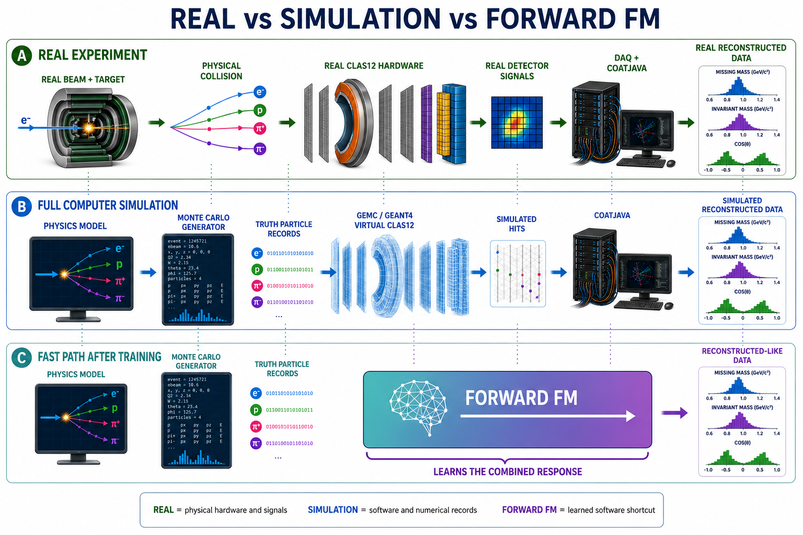

The current Step 1 network learns only the highlighted conditional response
factor for selected FD hadrons:

$$
P(\Delta_i,\widehat s_i
\mid x_i,T=1,C_i=\mathrm{FD},F_i=1).
$$

Here:

- $x_i$ is the generated truth state of hadron $i$;
- $T\in\{0,1\}$ is the event-level valid-trigger-electron outcome;
- $C_i$ is the particle reconstruction outcome or detector region;
- $F_i$ denotes the current fiducial and data-quality selection;
- $\Delta_i$ is the reconstructed-minus-generated kinematic residual;
- $\widehat s_i$ is the PID assigned by reconstruction.

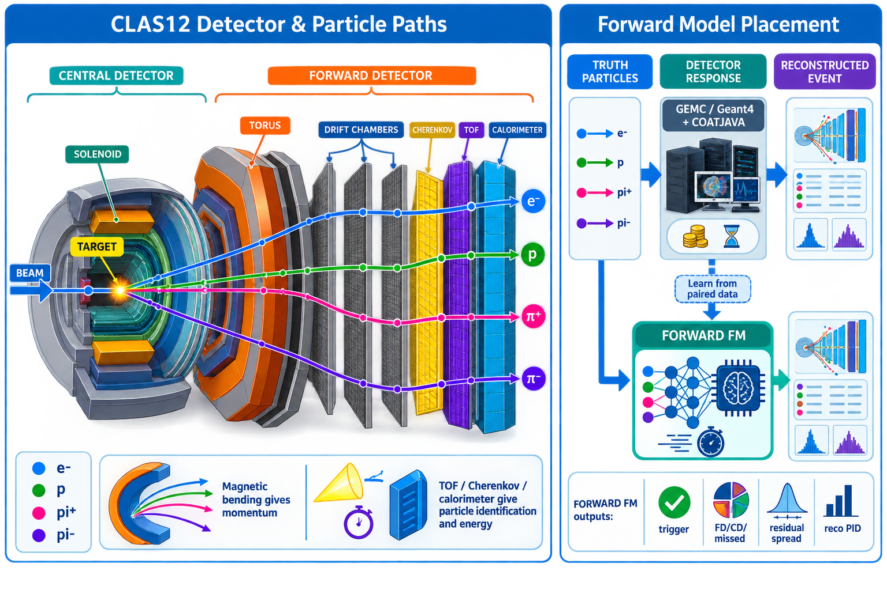

The model does **not** presently learn:

- whether a generated event triggers;
- whether a generated particle is reconstructed;
- whether it is reconstructed in FD, CD, FT, or nowhere;
- the electron response;
- correlations among particles in a complete event;
- time-dependent detector conditions.

## 2. Event rows, particle rows, and trigger electrons

The Aug17-26 phase-space sample contains 5,000,000 generated events and
20,000,000 generated-particle rows. In this production, each event contains
exactly four generated particles:

$$
e^-,\qquad \pi^+,\qquad \pi^-,\qquad p.
$$

Thus one event contributes four rows:

| Row in one event | Generated PID | Particle |
|---|---:|---|
| 1 | 11 | electron |
| 2 | 211 | $\pi^+$ |
| 3 | -211 | $\pi^-$ |
| 4 | 2212 | proton |

Consequently, the statement “one generated event gives one generated-electron
row” means exactly **one electron particle record per event**, not a row
containing several electrons.

A trigger electron is a reconstructed electron candidate satisfying the
experiment's trigger-related detector and quality conditions. At the data-model
level,

$$
T=
\begin{cases}
1,&\text{a valid trigger electron is present},\\
0,&\text{no valid trigger electron is present}.
\end{cases}
$$

This is a supervised label because a future model must learn the trigger
efficiency

$$
P(T=1\mid x_e),
$$

using both triggered and untriggered generated events. If only $T=1$ events
were retained, the denominator of the efficiency would be absent.

Step 1 does not train this trigger model. Its hadron rows are already
conditioned on $T=1$.

The composite event identifier is

```text
(source_file_id, event_id)
```

because `event_id` alone is only locally unique within a source file. All
particles from the same event are assigned to the same train, validation, or
test partition.

## 3. One Step 1 supervised example

One training row represents **one generated hadron**, together with its matched
reconstructed FD candidate. It is not a complete event.

The physical truth state is

$$
x_i^{\mathrm{phys}}
=(p_i^{\mathrm{gen}},\theta_i^{\mathrm{gen}},
\phi_i^{\mathrm{gen}},s_i^{\mathrm{gen}})
\in
(0,\infty)\times[0,\pi]\times S^1\times\mathcal S,
$$

where

$$
\mathcal S=\{-211,211,2212\}
=\{\pi^-,\pi^+,p\}.
$$

The physical response label is

$$
\Delta_i^{\mathrm{phys}}
=(\Delta p_i,\Delta\theta_i,\Delta\phi_i)\in\mathbb R^3,
$$

with

$$
\Delta p_i=p_i^{\mathrm{rec}}-p_i^{\mathrm{gen}},
\qquad
\Delta\theta_i=\theta_i^{\mathrm{rec}}-
\theta_i^{\mathrm{gen}},
$$

$$
\Delta\phi_i=
\mathrm{wrap}_{[-\pi,\pi)}\,
(\phi_i^{\mathrm{rec}}-\phi_i^{\mathrm{gen}}).
$$

The reconstructed PID label $\widehat s_i$ is allowed to differ from the
generated PID. Such rows describe physical/reconstruction contamination and
must not automatically be deleted as corrupted data.

## 4. Correct computational input to the network

The code does **not** pass the raw tuple
`(gen_p, gen_theta, gen_phi, gen_pid)` as one four-dimensional tensor.

### 4.1 Continuous feature map

The raw kinematics are mapped to

$$
\Phi(p,\theta,\phi)
=\left[
\log(1+p),\ \theta,\ \sin\phi,\ \cos\phi
\right]\in\mathbb R^4.
$$

In the data, momentum is numerically stored in GeV and angles in radians. The
logarithm compresses the momentum range. The pair
$(\sin\phi,\cos\phi)$ respects the circular topology of azimuth and removes
the artificial discontinuity between $-\pi$ and $+\pi$.

The implementation is:

```python
CONTINUOUS_FEATURES = (
    "log1p_gen_p",
    "gen_theta",
    "sin_gen_phi",
    "cos_gen_phi",
)

def _feature_matrix(frame):
    phi = frame["gen_phi"].to_numpy(dtype=np.float64)
    return np.column_stack(
        [
            np.log1p(frame["gen_p"].to_numpy(dtype=np.float64)),
            frame["gen_theta"].to_numpy(dtype=np.float64),
            np.sin(phi),
            np.cos(phi),
        ]
    ).astype(np.float32)
```

Each feature is standardized using training-set statistics only:

$$
z_j=\frac{\Phi_j-\mu_j^{\mathrm{train}}}
{\sigma_j^{\mathrm{train}}}.
$$

For a minibatch of size $B$, the continuous input is therefore

$$
\mathtt{continuous}\in\mathbb R^{B\times4}.
$$

For the development configuration, $B=2048$:

```python
continuous.shape
# torch.Size([2048, 4])
```

Its columns are

```text
continuous[:, 0] = standardized log(1 + gen_p)
continuous[:, 1] = standardized gen_theta
continuous[:, 2] = standardized sin(gen_phi)
continuous[:, 3] = standardized cos(gen_phi)
```

### 4.2 Generated species is a separate categorical input

The generated particle identity is encoded separately:

```python
SPECIES = (-211, 211, 2212)
species_to_index = {pid: i for i, pid in enumerate(SPECIES)}
```

Hence

| `species_index` | Generated PID | Particle |
|---:|---:|---|
| 0 | -211 | $\pi^-$ |
| 1 | 211 | $\pi^+$ |
| 2 | 2212 | proton |

For a batch,

$$
\mathtt{species\_index}\in\{0,1,2\}^{B}.
$$

The network maps this integer to a learned embedding

$$
E_s:\{0,1,2\}\longrightarrow\mathbb R^{d_s}
$$

and concatenates it with the continuous features:

```python
species = self.species_embedding(species_index)   # [B, d_s]
network_input = torch.cat([continuous, species], dim=-1)
# shape: [B, 4 + d_s]
```

For the seed configuration, $d_s=8$, so the first backbone layer receives
12 numbers per particle. For the full configuration, $d_s=16$, so it
receives 20.

The actual model input is therefore the pair

$$
(\mathtt{continuous},\mathtt{species\_index})
\in\mathbb R^{B\times4}\times\{0,1,2\}^{B},
$$

not a single raw four-vector called `x`.

## 5. Correct training labels

### 5.1 Continuous response target

The three raw residuals are standardized using training-only statistics:

$$
z_{\Delta,j}
=\frac{\Delta_j-\mu_{\Delta,j}^{\mathrm{train}}}
{\sigma_{\Delta,j}^{\mathrm{train}}}.
$$

Thus

$$
\mathtt{targets}\in\mathbb R^{B\times3}.
$$

For example:

```python
targets.shape
# torch.Size([2048, 3])

targets[0]
# tensor([-2.7308, 0.8157, -1.7413])
```

The three columns are standardized
$(\Delta p,\Delta\theta,\Delta\phi)$, not reconstructed
$(p,\theta,\phi)$ and not values directly in GeV/radians. The first example
means that its $\Delta p$ lies 2.7308 training standard deviations below the
training mean, and similarly for the two angles.

Physical residuals are recovered through the inverse affine map:

```python
physical_residuals = target_scaler.inverse(targets.cpu().numpy())

delta_p     = physical_residuals[:, 0]  # GeV
delta_theta = physical_residuals[:, 1]  # rad
delta_phi   = physical_residuals[:, 2]  # rad
```

### 5.2 Reconstructed PID target

`rec_pid_index` contains one integer class label per particle, taking values in

$$
\{0,\ldots,C-1\}^{B}.
$$

It therefore has shape `[B]`, not `[B, C]`:

```python
rec_pid_index.shape
# torch.Size([2048])

rec_pid_index
# tensor([9, 10, 7, ..., 9, 10, 7], device="mps:0")
```

These integers are vocabulary positions, not raw PDG/CLAS PID codes. The
vocabulary is discovered from the training split, sorted, and saved in the
checkpoint:

```python
rec_pid_vocabulary = sorted(train_frame["rec_pid"].unique())
rec_pid_to_index = {
    pid: index for index, pid in enumerate(rec_pid_vocabulary)
}
unknown_index = len(rec_pid_vocabulary)
```

For the saved full run discussed in this repository, the observed mapping is:

| Class index | Raw reconstructed PID | Interpretation |
|---:|---:|---|
| 0 | -2212 | antiproton |
| 1 | -321 | $K^-$ |
| 2 | -211 | $\pi^-$ |
| 3 | -11 | positron |
| 4 | 11 | electron |
| 5 | 22 | photon |
| 6 | 45 | deuteron code used by the reconstruction convention |
| 7 | 211 | $\pi^+$ |
| 8 | 321 | $K^+$ |
| 9 | 2112 | neutron |
| 10 | 2212 | proton |
| 11 | `OTHER` | PID absent from the training vocabulary |

Therefore the displayed prefix

```text
[9, 10, 7]
```

decodes to

```text
[neutron, proton, pi+]
```

for those three reconstructed rows. Their generated identities cannot be
deduced from `rec_pid_index`; those are stored separately in `species_index`.

Always decode from the checkpoint rather than hard-coding this table:

```python
checkpoint = torch.load("runs/fd_response_seed/model.pt", map_location="cpu")
pid_labels = [*checkpoint["rec_pid_vocabulary"], "OTHER"]

decoded_targets = [
    pid_labels[int(i)] for i in rec_pid_index.detach().cpu().tolist()
]
```

## 6. Correct model outputs and tensor shapes

The neural network does not directly output one vector
`(delta_p, delta_theta, delta_phi, rec_pid)`.

It returns parameters of two probability distributions:

1. a Gaussian mixture distribution for the standardized residual vector;
2. a categorical distribution for reconstructed PID.

Let

- $B$ be batch size;
- $K$ be the number of Gaussian-mixture components;
- $D=3$ be the residual dimension;
- $C$ be the number of reconstructed-PID classes.

The returned object is

```python
@dataclass
class ModelOutput:
    mixture_logits: torch.Tensor  # [B, K]
    means: torch.Tensor           # [B, K, 3]
    log_scales: torch.Tensor      # [B, K, 3]
    pid_logits: torch.Tensor      # [B, C]
```

### 6.1 Residual distribution head

For standardized residuals $z_\Delta\in\mathbb R^3$, the implemented MDN is

$$
q_\vartheta(z_\Delta\mid z_x,s)
=\sum_{k=1}^{K}\pi_k(z_x,s)
\prod_{j=1}^{3}
\mathcal N\!\left(
z_{\Delta,j};\mu_{kj}(z_x,s),\sigma_{kj}^2(z_x,s)
\right),
$$

where

$$
\pi=\mathrm{softmax}\,(\mathtt{mixture\_logits}),
\qquad
\sigma=\exp(\mathtt{log\_scales}).
$$

The component covariance matrices are diagonal. Dependence among the three
residual coordinates can nevertheless be represented through shared mixture
membership, although this remains less expressive than full-covariance or
flow-based components.

### 6.2 Reconstructed-PID head

The categorical probabilities are

$$
q_\vartheta(\widehat s=c\mid z_x,s)
=\mathrm{softmax}\,(\mathtt{pid\_logits})_c.
$$

For the displayed development batch,

```python
output.pid_logits.shape
# torch.Size([2048, 12])
```

This means:

- 2,048 particle rows;
- 12 raw scores per particle, one for each possible reconstructed-PID class.

Logits are not probabilities. Convert them with

```python
pid_probabilities = torch.softmax(output.pid_logits, dim=-1)
# pid_probabilities.shape == [2048, 12]
# pid_probabilities[i].sum() == 1, up to floating-point error
```

If `rec_pid_index[0] == 9`, the correct-class probability for row zero is

```python
pid_probabilities[0, 9]
```

### 6.3 Shape inspection snippet

```python
continuous, species_index, targets, rec_pid_index = next(iter(loader))

continuous = continuous.to(device)
species_index = species_index.to(device)
targets = targets.to(device)
rec_pid_index = rec_pid_index.to(device)

output = model(continuous, species_index)

print("continuous       ", continuous.shape)          # [B, 4]
print("species_index    ", species_index.shape)       # [B]
print("targets          ", targets.shape)             # [B, 3]
print("rec_pid_index    ", rec_pid_index.shape)       # [B]
print("mixture_logits   ", output.mixture_logits.shape) # [B, K]
print("means            ", output.means.shape)        # [B, K, 3]
print("log_scales       ", output.log_scales.shape)   # [B, K, 3]
print("pid_logits       ", output.pid_logits.shape)   # [B, C]
```

For `configs/fd_response_seed.yaml`, normally

```text
B = 2048, K = 5, C = 12
```

so the usual shapes are

```text
continuous       [2048, 4]
species_index    [2048]
targets          [2048, 3]
rec_pid_index    [2048]
mixture_logits   [2048, 5]
means            [2048, 5, 3]
log_scales       [2048, 5, 3]
pid_logits       [2048, 12]
```

For the full configuration, $B=8192$ and $K=8$; for the searched
configuration of section 12, $B=4096$ and $K=8$ with a 768-wide six-layer
backbone. Because the loader uses `drop_last=False`, the final batch of an epoch
can contain fewer than $B$ rows.

`device="mps:0"` only means that the tensor is stored on the first Apple Metal
device. It is not a tensor dimension and has no physics interpretation.

## 7. What probability distribution is actually modeled?

The current network uses a shared backbone followed by two separate heads. Its
implemented factorization is

$$
q_\vartheta(z_\Delta,c\mid z_x,s,T=1,C=\mathrm{FD},F=1)
=q_\vartheta(z_\Delta\mid z_x,s)
q_\vartheta(c\mid z_x,s).
$$

This is a conditional-independence assumption:

$$
z_\Delta\perp c\mid(z_x,s)
\quad\text{within the output parameterization}.
$$

The two predictions share learned hidden features, but after conditioning on
those features, residual sampling and PID sampling are independent. Therefore,
the present model does **not** explicitly learn that a particular
misidentification class may have a different residual distribution.

A more expressive future model could use

$$
q(c\mid z_x,s)\,q(z_\Delta\mid z_x,s,c),
$$

or a single joint generative model for $(z_\Delta,c)$.

This distinction is central: the model outputs distribution parameters, then
sampling produces one reconstructed-like outcome.

## 8. Training objective

The DataLoader produces tensors in the following order:

```python
TensorDataset(
    continuous,       # [B, 4]
    species_index,    # [B]
    targets,          # [B, 3]
    rec_pid_index,    # [B]
)
```

The implemented training step is:

```python
output = model(continuous, species_index)

# -log q_theta(z_Delta | z_x, species)
nll = mixture_nll(output, targets)

# -log q_theta(rec_pid_index | z_x, species)
pid_ce = torch.nn.functional.cross_entropy(
    output.pid_logits,
    rec_pid_index,
)

loss = nll + pid_loss_weight * pid_ce
```

Mathematically,

$$
\mathcal L(\vartheta)
=-\frac1B\sum_{i=1}^{B}
\log q_\vartheta(z_{\Delta,i}\mid z_{x,i},s_i)
-\frac{\lambda_{\mathrm{PID}}}{B}
\sum_{i=1}^{B}
\log q_\vartheta(c_i\mid z_{x,i},s_i),
$$

The weight $\lambda_{\mathrm{PID}}$ is `pid_loss_weight` in the configuration
files. It is 0.20 in the original hand-written configurations and 0.3975 in the
searched configuration of section 12. Section 13.4 measures what this weight
actually controls: over the whole range 0.05 to 10 it barely moves the PID
cross entropy, while values above about 1 clearly damage the residual density.

Cross entropy expects

```text
pid_logits:     floating tensor [B, C]
rec_pid_index:  integer tensor  [B]
```

and for row $i$ selects the log-probability at class
`rec_pid_index[i]`.

## 9. Sampling reconstructed-like particles

Inference first samples a mixture component and standardized residual:

$$
k_i\sim\mathrm{Categorical}\,(\pi_i),
\qquad
\epsilon_i\sim\mathcal N(0,I_3),
$$

$$
z_{\Delta,i}=\mu_{i,k_i}+\sigma_{i,k_i}\odot\epsilon_i.
$$

The code then inverts target standardization and samples reconstructed PID:

```python
with torch.no_grad():
    output = model(continuous, species_index)

    standardized_residuals = sample_standardized_residuals(output)
    physical_residuals = target_scaler.inverse(
        standardized_residuals.cpu().numpy()
    )

    pid_probabilities = torch.softmax(output.pid_logits, dim=-1)
    sampled_pid_index = torch.multinomial(pid_probabilities, 1).squeeze(1)
```

Finally,

$$
p^{\mathrm{sample}}_{\mathrm{rec}}
=p_{\mathrm{gen}}+\Delta p,
$$

$$
\theta^{\mathrm{sample}}_{\mathrm{rec}}
=\theta_{\mathrm{gen}}+\Delta\theta,
$$

$$
\phi^{\mathrm{sample}}_{\mathrm{rec}}
=\mathrm{wrap}_{[-\pi,\pi)}\,
(\phi_{\mathrm{gen}}+\Delta\phi).
$$

The sampler flags draws with $p_{\mathrm{rec}}\leq0$ or
$\theta_{\mathrm{rec}}\notin[0,\pi]$ rather than silently clipping them.

## 10. Dataset selection and scope

The source Parquet data are not stored in this repository. The current response
sample selects

$$
T=1,\qquad C=\mathrm{FD},\qquad
\theta_{\mathrm{rec}}<33^\circ,
$$

$$
-5.5<z_{\mathrm{gen}}<-0.5\ \mathrm{cm},
$$

together with reciprocal matching and explicit PID, beta, and residual-quality
requirements.

| Generated species | PDG code | Selected rows |
|---|---:|---:|
| $\pi^-$ | -211 | 458,373 |
| $\pi^+$ | 211 | 571,241 |
| proton | 2212 | 559,627 |
| **Total** |  | **1,589,241** |

| Split | Rows |
|---|---:|
| Train | 1,270,698 |
| Validation | 159,558 |
| Test | 158,985 |

These counts describe particle rows, not event counts.

## 11. Held-out results of the hand-written baseline

This section reports the original hand-tuned recipe. Every hyper-parameter in it
was assumed rather than searched; section 12 searches them and section 13 shows
what that is worth on the same held-out split.

The saved full experiment used one NVIDIA H100 GPU, $K=8$ mixture
components, a four-layer width-256 backbone, and 222,324 trainable parameters.

| Metric | Development seed | Full training |
|---|---:|---:|
| Residual negative log likelihood | -4.0789 | **-4.7581** |
| Reconstructed-PID cross entropy | 1.2794 | **1.1774** |
| Reconstructed-PID top-1 accuracy | 66.62% | **67.22%** |
| Maximum PID marginal discrepancy | 0.692% | **0.426%** |
| Physical sampled $(p,\theta)$ fraction | 95.67% | **97.13%** |
| Test evaluation throughput | -- | **112,434 examples/s** |

Negative log likelihood evaluates a conditional density, so its absolute sign
depends on coordinate scaling and density units. It should be interpreted by
comparing models evaluated under the same target transformation.

### Residual-distribution closure

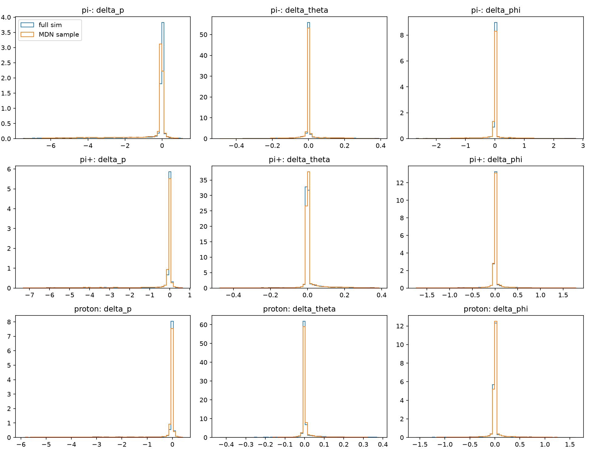

### Residual-width closure

Each heatmap cell is

$$
\frac{\mathrm{Std}\,(\Delta)_{\mathrm{model}}}
{\mathrm{Std}\,(\Delta)_{\mathrm{full\ simulation}}}.
$$

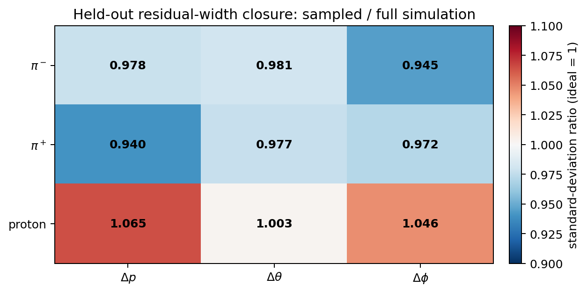

Aggregate agreement is necessary but not sufficient. Physics validation must
also examine conditional response versus generated kinematics, PID confusion,
residual correlations, tails, and eventually event-level observables.

## 12. Hyper-parameter search

Every hyper-parameter used in sections 1-11 was chosen by hand and never
searched: a four-layer width-256 backbone, $K=8$ mixture components, thirty
epochs, a constant learning rate of $10^{-3}$, and
$\lambda_{\mathrm{PID}}=0.20$. This section replaces those assumptions with a
recorded Optuna study on the same deterministic, event-disjoint splits. The full
write-up, with every table and figure, is in
[`runs/optuna_analysis/OPTUNA_TUNING_REPORT.md`](runs/optuna_analysis/OPTUNA_TUNING_REPORT.md).

### 12.1 What is optimized, and why not the training loss

The training objective

$$
\mathcal L=\mathcal L_{\mathrm R}
+\lambda_{\mathrm{PID}}\mathcal L_{\mathrm{PID}}
$$

cannot rank trials, because $\lambda_{\mathrm{PID}}$ is itself a search
dimension: a trial could lower $\mathcal L$ by putting less weight on the PID
term rather than by describing the data better. Trials are ranked instead by the
validation **joint negative log likelihood**

$$
J=-\frac1N\sum_i\log q_\vartheta(z_{\Delta,i}\mid z_{x,i},s_i)
-\frac1N\sum_i\log q_\vartheta(c_i\mid z_{x,i},s_i)
=\mathrm{NLL}_\Delta+\mathrm{CE}_{\mathrm{PID}},
$$

which is the unweighted log density of the factorized model
$q(z_\Delta\mid z_x,s)\,q(c\mid z_x,s)$ that is actually being fitted. It
contains no $\lambda_{\mathrm{PID}}$, so every trial is measured on one scale.
The checkpoint *inside* each trial is selected by the same quantity, through the
`training.selection_metric: joint_nll` option, for the same reason.

Because $J$ is a density in standardized target coordinates, and that
standardization is fitted on the training split, it is comparable only between
runs that share the seed and the split boundaries. The search therefore does not
subsample, and the analysis refuses a reference run whose split settings differ.

### 12.2 Why the likelihood alone does not choose the model

A single scalar is convenient for search but wrong for the final choice. The
deliverables are two -- reconstructed-PID response closure and residual moment
closure -- and the study showed directly, not hypothetically, that they do not
peak together. The trial with the best likelihood in the whole study had roughly
three times worse closure on both axes than the trial that was selected:

| trial | $J$ | PID closure | moment closure |
|---|---:|---:|---:|
| 47, best $J$ | **-4.7001** | 0.02959 | 0.04854 |
| 41, selected | -4.3748 | **0.01018** | **0.01555** |

A diagonal Gaussian mixture can buy log likelihood with heavy tails that cost
very little density while visibly distorting the sampled
$\mathrm{Std}\,(\Delta)$.

Two dimensionless closure statistics are therefore recorded for every trial, on
the validation split. The PID closure is the particle-weighted mean
total-variation distance from the COATJAVA teacher, over generated species $s$
and fixed 1 GeV generated-momentum bins $b$,

$$
\mathrm{TV}\,(s,b)=\frac12\sum_r
\left|P_{\mathrm{FM}}(r\mid s,b)-P_{\mathrm{CJ}}(r\mid s,b)\right|,
$$

and the moment closure is a first- and second-moment error made unit-free so
that GeV and radian targets can be averaged,

$$
\frac19\sum_{s}\sum_{t\in\{\Delta p,\Delta\theta,\Delta\phi\}}
\left[
\frac{\left|\mathrm E[t]_{\mathrm{model}}-\mathrm E[t]_{\mathrm{obs}}\right|}
{\mathrm{Std}\,(t)_{\mathrm{obs}}}
+\left|\frac{\mathrm{Std}\,(t)_{\mathrm{model}}}
{\mathrm{Std}\,(t)_{\mathrm{obs}}}-1\right|
\right].
$$

The final checkpoint is chosen by the closure composite **inside a likelihood
floor**:

$$
\text{feasible}=\{\text{trial}:J\le J_{\mathrm{floor}}\},
$$

$$
\text{selected}=\arg\min_{\text{feasible}}
\left[
\frac{\text{PID closure}}{\mathrm{median}\,(\text{PID closure})}
+\frac{\text{moment closure}}{\mathrm{median}\,(\text{moment closure})}
\right].
$$

$J_{\mathrm{floor}}=-3.63200$ is not a tuned constant. It is the best validation
$J$ of the published baseline run in `runs/tara_gpu_full`, which shares the seed
and split boundaries and is therefore in the same units, so the rule reads: *the
tuned model must fit the joint density at least as well as the recipe it
replaces, and among all such models it must have the best physics closure.* 27
of 29 completed trials cleared the floor. A configuration dominated on both
closure axes can never minimize the composite, so the selected trial always lies
on the closure Pareto front, here trials {37, 41, 42}.

### 12.3 Search space and protocol

| Hyper-parameter | Hand-written value | Searched over | Selected |
|---|---:|---|---:|
| `hidden_width` | 256 | 128, 256, 384, 512, 768, 1024 | 768 |
| `hidden_layers` | 4 | 3-8 | 6 |
| `pid_embedding_dim` | 16 | 8, 16, 32 | 8 |
| `mixture_components` | 8 | 5, 8, 12, 16, 24 | 8 |
| `dropout` | 0.03 | 0.0-0.15 | 0.1418 |
| `epochs` | 30 | 40, 70, 100 | 70 |
| `batch_size` | 8192 | 4096, 8192, 16384 | 4096 |
| `learning_rate` | 0.001 | $2\times10^{-4}$-$4\times10^{-3}$, log | 0.002958 |
| `weight_decay` | 0.00001 | $10^{-8}$-$10^{-3}$, log | 0.0001495 |
| `pid_loss_weight` | 0.20 | 0.05-10, log | 0.3975 |
| `lr_schedule` | constant | constant, cosine | cosine |
| trainable parameters | 222,324 | -- | 3,024,476 |

90 trials on two RTX 2080 Ti, one worker per GPU with independent sampler seeds:
29 completed, 61 pruned, none failed, 5,059 GPU-seconds in total. Sampling uses
a multivariate TPE sampler and a median pruner with a twelve-epoch warm-up.
Every trial uses the same seed, so score differences are attributable to the
hyper-parameters rather than to initialization noise; seed sensitivity of the
selected point is measured separately in section 13.3.

Pruning a search in which the epoch budget is itself a dimension can bias the
result, because a trial on a long cosine schedule is deliberately still at a
high learning rate when a short-schedule trial is already converging. This was
checked rather than assumed: pruning rates were close to balanced across epoch
budgets and across the two schedules, so no correction was applied.

**The test split was never used during the search.** Trials are scored on
validation only, and so is the $\lambda_{\mathrm{PID}}$ scan of section 13.4,
because a scan is itself a selection procedure. Held-out test numbers appear
only in section 13.

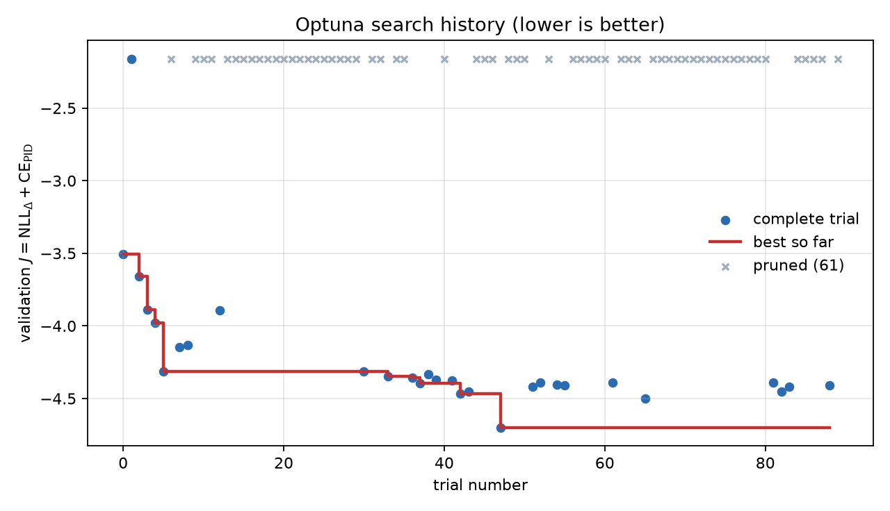

### 12.4 What actually mattered

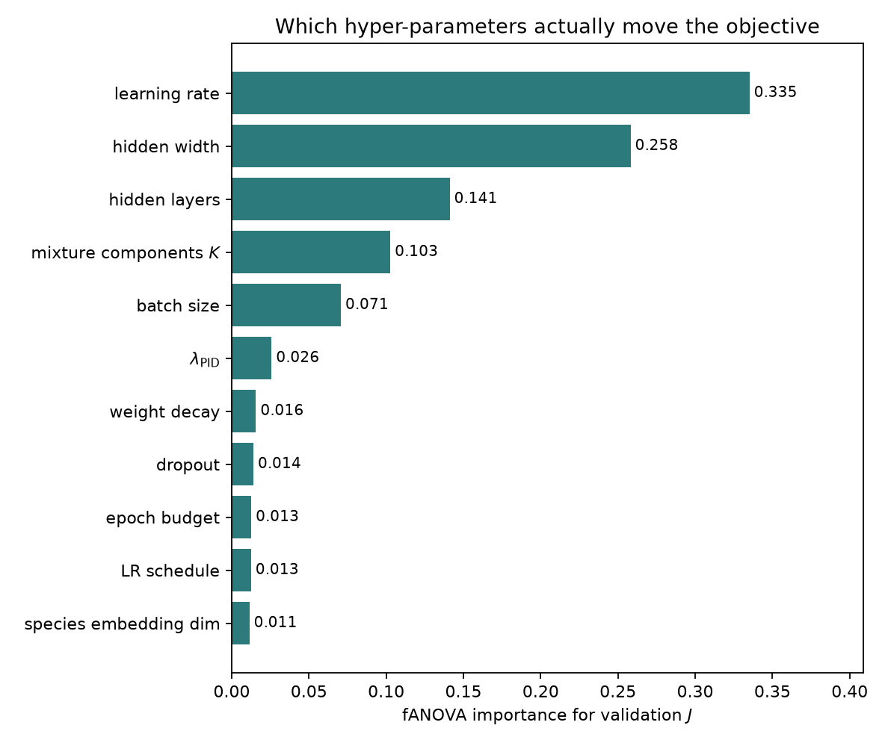

The learning rate dominates. The hand-written $10^{-3}$ sits well below the
productive region, which the search places at $2$-$4\times10^{-3}$ together with
a smaller batch and a cosine decay. Width is second in importance and does move
up from 256, so the expectation that a bigger network would help is partly
borne out -- but not monotonically: the 1024-wide configurations did not win,
and depth beyond about six layers did not help.

$\lambda_{\mathrm{PID}}$ ranks sixth of eleven, at 0.026. Section 13.4 shows why.

The importance of the epoch budget and of the schedule is *understated* by this
statistic and should not be read as "they do not matter". fANOVA explains
variance over the observed distribution of completed trials, and TPE
concentrated on cosine schedules with a 70-epoch budget, which leaves little
variance in those dimensions left to explain. Of the eight best trials by
closure composite, eight of eight used cosine and seven of eight used a
70-epoch budget.

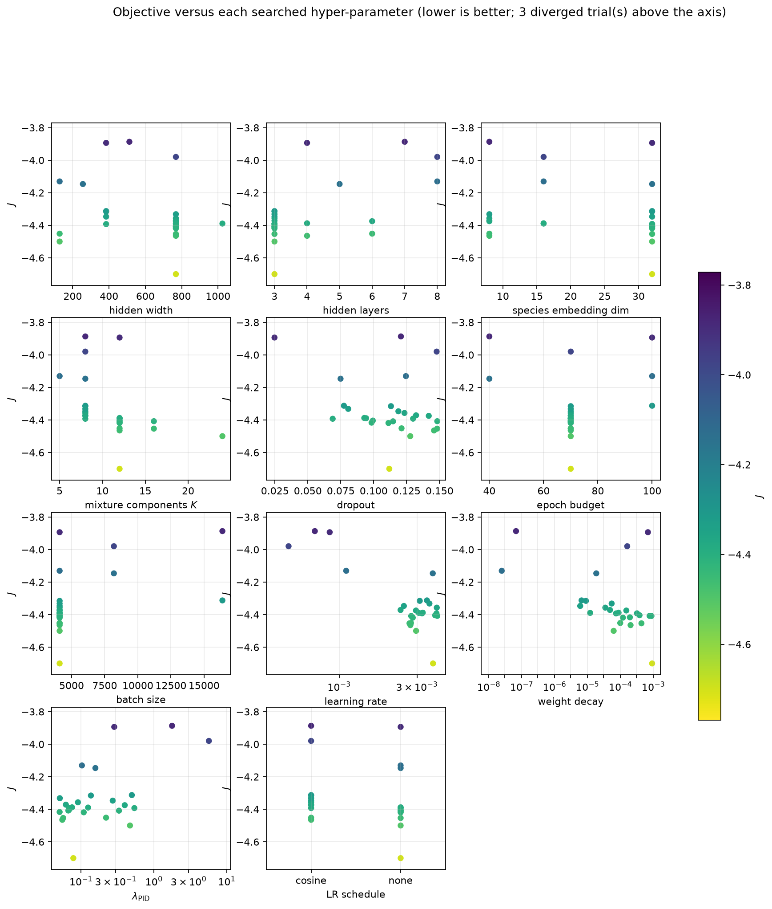

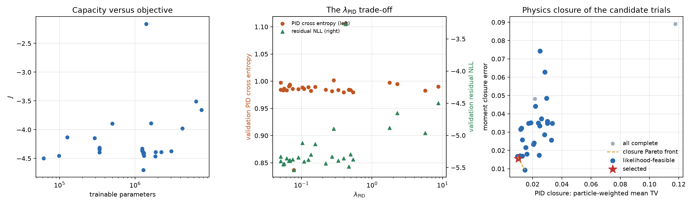

## 13. Held-out results of the searched configuration

Both recipes were retrained to completion on the same two RTX 2080 Ti and
evaluated on the untouched 158,985-row test split. The search never saw these
rows.

### 13.1 Headline metrics

| Metric | Published `tara_gpu_full` | Baseline reproduction | **Tuned** |
|---|---:|---:|---:|
| Residual negative log likelihood | -4.7581 | -4.5304 | **-5.3365** |
| Reconstructed-PID cross entropy | 1.1774 | 1.0294 | **0.9806** |
| Joint negative log likelihood $J$ | -3.5808 | -3.5011 | **-4.3559** |
| Reconstructed-PID top-1 accuracy | 67.22% | 67.50% | **67.93%** |
| Maximum PID marginal discrepancy | 0.426% | 0.291% | **0.200%** |
| PID closure, particle-weighted mean TV | -- | 0.04423 | **0.01001** |
| PID closure, worst momentum bin | -- | 0.16402 | **0.05039** |
| Moment closure error | 0.05291 | 0.05614 | **0.03152** |
| Physical sampled $(p,\theta)$ fraction | 97.13% | 96.11% | **99.08%** |
| Trainable parameters | 222,324 | 222,324 | 3,024,476 |

The published run and the reproduction are two draws of the same recipe on
different hardware, and the reproduction lies inside the baseline seed spread of
section 13.3. The two dashes are quantities that the published run predates.

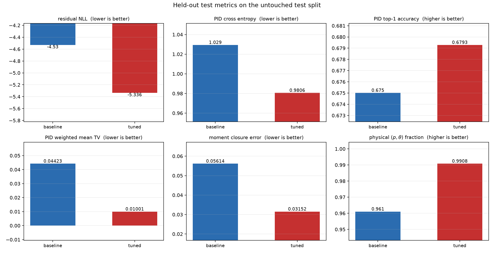

### 13.2 Physics closure

The single most useful figure is the conditional PID response against the
COATJAVA teacher. This is a distributional closure test, not top-1 accuracy: it
compares the empirical reconstructed-class fraction with the mean PID-head
softmax probability in each fixed 1 GeV generated-momentum bin.

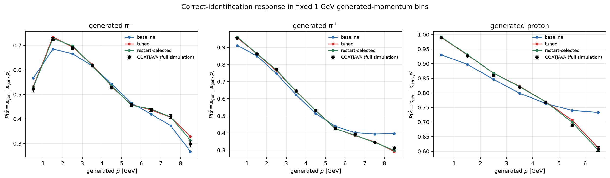

The hand-written baseline departs from the teacher at both ends of the momentum
range, and in opposite directions for the two pion charges. Above about 6 GeV it
over-predicts correct identification for protons and $\pi^+$, by up to +0.125
for protons in the 6-7 GeV bin and +0.085 for $\pi^+$ in the 8-9 GeV bin, while
under-predicting it for $\pi^-$ by about -0.035. At the lowest momenta it
under-predicts for $\pi^+$ and protons, by -0.043 and -0.058 in the 0-1 GeV bin,
and over-predicts for $\pi^-$ by +0.044. The tuned model stays within $\pm0.031$
everywhere and within $\pm0.010$ in all but three of the twenty-five bins,
tracking the teacher inside its statistical error bars over almost the whole
range.

| Generated species | Baseline mean TV | Tuned mean TV | Baseline worst bin | Tuned worst bin |
|---|---:|---:|---|---|
| $\pi^-$ | 0.04193 | **0.01085** | 0.10337 (0-1 GeV) | 0.05039 (8-9 GeV) |
| $\pi^+$ | 0.05397 | **0.01122** | 0.16402 (8-9 GeV) | 0.02867 (8-9 GeV) |
| proton | 0.03620 | **0.00807** | 0.12816 (6-7 GeV) | 0.01916 (5-6 GeV) |

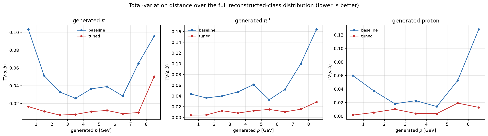

The tuned model has a smaller total-variation distance than the baseline in
*every* momentum bin of *every* species.

For the moment variables, the sampled/observed width ratio should be 1 and the
bias in units of the observed $\sigma$ should be 0.

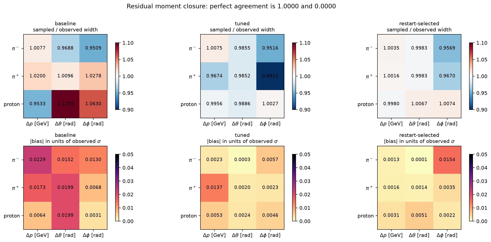

Biases shrink everywhere, and the baseline's worst width error -- proton
$\Delta\theta$ sampled 12.6% too wide -- is corrected to 1.1%. Two honest
caveats belong with this figure:

- The tuned run's $\pi^+$ $\Delta\phi$ width, 0.8912, is the one cell that looks
  worse than the baseline. It is a single-run fluctuation: the other two tuned
  seeds give 1.0015 and 0.9893.
- The $\pi^-$ $\Delta\phi$ width is about 6% too narrow in **all six** runs,
  hand-written and searched alike (0.9509, 0.9420, 0.9374 against 0.9516,
  0.9433, 0.9439). This is a property of the diagonal mixture parameterization,
  not of the hyper-parameters, and tuning does not reach it. See limitation 4.

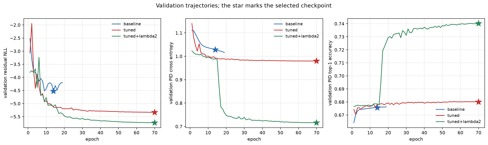

### 13.3 Seed repeats

A single seed cannot separate an architectural gain from run-to-run luck, so
both recipes were retrained at seeds 20260823 and 20260824. In this project the
seed drives the model initialization *and* the deterministic hash that assigns
events to train/validation/test, so a repeat varies the data partition as well.
That makes the spread a measure of total run-to-run variability, and it makes
the two recipes exactly paired: at a given seed both saw the same events.

| Metric | Baseline mean $\pm$ s.d. | Tuned mean $\pm$ s.d. | Paired difference | Same sign in all 3 |
|---|---:|---:|---:|:--:|
| Residual NLL | $-4.6388\pm0.0949$ | $-5.3350\pm0.0421$ | $-0.6961$ | yes |
| PID cross entropy | $1.0351\pm0.0204$ | $0.9817\pm0.0032$ | $-0.0534$ | yes |
| Joint NLL $J$ | $-3.6037\pm0.0950$ | $-4.3533\pm0.0452$ | $-0.7496$ | yes |
| PID top-1 accuracy | $0.67537\pm0.00031$ | $0.67916\pm0.00057$ | $+0.00379$ | yes |
| PID weighted mean TV | $0.0495\pm0.0158$ | $0.0105\pm0.0005$ | $-0.0390$ | yes |
| PID worst-bin TV | $0.1346\pm0.0581$ | $0.0361\pm0.0124$ | $-0.0985$ | yes |
| Moment closure error | $0.0416\pm0.0127$ | $0.0240\pm0.0073$ | $-0.0175$ | yes |
| Physical sample fraction | $0.9769\pm0.0138$ | $0.9911\pm0.0004$ | $+0.0143$ | yes |

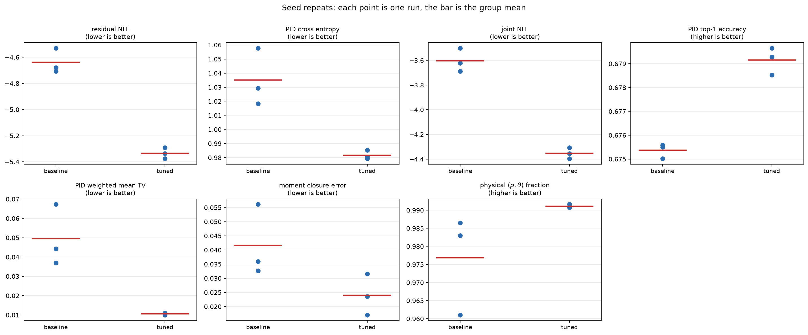

Every metric improves, with the same sign in all three paired seeds. Three seeds
are too few for a hypothesis test, but the joint likelihood and the PID closure
separate by far more than the observed spread. The tuned recipe is also
substantially *more stable*: its standard deviation is smaller than the
baseline's on every quantity, by a factor of about thirty for the PID closure
and the physical-sample fraction.

## 14. Installation and execution

```bash
git clone https://github.com/HHTseng/QuantumMC_Forward_Foundation_Model.git
cd QuantumMC_Forward_Foundation_Model

conda create -n QuantumMC python=3.12 -y
conda activate QuantumMC
python -m pip install -r requirements.txt

python -m unittest discover -s tests -v
```

Expected data layout when commands are run from the repository root:

```text
QuantumMC_Simulations/
|-- QuantumMC_Forward_Foundation_Model/
`-- phase-space_parquet-Aug17-26/
    `-- particle_responses/*.parquet
```

Smoke test:

```bash
python train.py --config configs/fd_response_seed.yaml --smoke
```

Development-scale training with automatic CPU/CUDA/MPS selection:

```bash
python train.py --config configs/fd_response_seed.yaml
```

Full selected-population training with the hand-written recipe:

```bash
CUDA_VISIBLE_DEVICES=0 python train.py --config configs/gpu_full.yaml
```

Training with the searched configuration of section 12:

```bash
python train.py --config configs/gpu_optuna_best.yaml --device cuda:0
```

Reproducing the entire tuning study, which expects two GPUs and takes a few
hours:

```bash
experiments/run_tuning_pipeline.sh
```

Individual stages can be re-run by number, for example the analysis and the
held-out comparison only:

```bash
experiments/run_tuning_pipeline.sh 2 6
```

Sample conditional FD response from generated hadrons:

```bash
python sample.py \
  --checkpoint runs/fd_response_seed/model.pt \
  --input example_generated_hadrons.csv \
  --output sampled_fd_response.csv
```

The input CSV must contain

```text
gen_pid, gen_p, gen_theta, gen_phi
```

with momentum in GeV and angles in radians. This command assumes that trigger
and FD reconstruction-outcome decisions have already been made; it cannot turn
arbitrary generated events into complete detector events.

## 15. Repository map

```text
configs/                 training configurations
configs/gpu_optuna_search.yaml  base configuration for the search
configs/gpu_optuna_best.yaml    searched configuration, written by the analysis
forwardfm_step1/data.py  selection, feature construction, labels, scaling
forwardfm_step1/model.py conditional MDN and PID-classification head
forwardfm_step1/training.py likelihoods, optimization, schedules, loaders
forwardfm_step1/evaluation.py held-out statistical closure
experiments/run_tuning_pipeline.sh  the whole study, one stage per number
experiments/tune_hyperparameters.py Optuna search driver, one worker per GPU
experiments/analyze_tuning.py       study analysis and configuration selection
experiments/scan_pid_weight.py      controlled lambda_PID scan
experiments/compare_final_models.py held-out comparison tables and figures
experiments/summarize_seed_repeats.py seed-repeat statistics
tests/                   scaling, leakage, likelihood, loader, and sampling tests
docs/figures/            process diagrams and result figures
runs/                    versioned metrics and reports
runs/optuna_analysis/    search results, comparison figures, tuning report
runs/optuna_best/        the tuned checkpoint and its evaluation
train.py                 training entry point
sample.py                stochastic inference entry point
```

## 16. Known modeling limitations

1. **Conditional population only.** The training set contains selected,
   triggered, reconstructed FD hadrons. It cannot determine trigger or
   reconstruction efficiency.

2. **Particle-level rather than event-level.** Hadrons are modeled one row at a
   time. Energy-momentum correlations and shared detector conditions across an
   event are not generated jointly.

3. **Residual/PID conditional independence.** Separate output heads implement
   $q(\Delta\mid x)q(\widehat s\mid x)$, not
   $q(\Delta,\widehat s\mid x)$ with explicit coupling.

4. **Diagonal components.** Each Gaussian mixture component has diagonal
   covariance. Mixture membership provides some joint structure but may be
   insufficient for strongly correlated tails. Section 13 gives direct evidence
   that this is now a binding limit rather than a hypothetical one: the sampled
   $\Delta\phi$ width for generated $\pi^-$ is about 6% too narrow in all six
   trained runs, hand-written and searched alike, so it is a property of the
   parameterization that hyper-parameter tuning does not reach.

5. **`OTHER` has no positive training examples by construction.** Because the
   vocabulary is built from all PIDs observed in the training split, its extra
   unknown class is mainly a validation/test fallback. Open-set PID prediction
   requires deliberate training examples or a different open-set objective.

6. **No detector-condition inputs.** Run period, magnetic-field configuration,
   calibration state, occupancy, and other detector conditions are absent.

7. **Simulation closure is not data closure.** Agreement with held-out
   GEMC/COATJAVA output does not demonstrate agreement with real CLAS12 data.

8. **Physical support is not enforced by construction.** Invalid sampled
   momentum or polar angle is flagged after sampling; a constrained
   parameterization would be preferable for a production model. Tuning raises
   the physical fraction from 97.7% to 99.1% averaged over seeds, but it cannot
   make it exactly one.

9. **The search is over hyper-parameters, not over the model family.** Section
   12 varies width, depth, mixture count, embedding size, regularization, and
   the optimization schedule. It does not vary the feature map, the diagonal
   mixture parameterization, or the residual/PID conditional-independence
   factorization, so the limits in items 3 and 4 are outside its reach by
   construction.

10. **The tuned epoch budget is binding.** The selected configuration's best
    validation epoch is the last epoch of its 70-epoch cosine schedule, so the
    schedule had not stopped improving. The reported numbers are a lower bound
    on what this architecture can reach, not a converged optimum.

## 17. Roadmap to the full forward foundation model

The intended event-level factorization is

$$
P(Y\mid X)
=P(T\mid x_e)
\prod_{i\in\mathrm{hadrons}}
P(C_i\mid x_i,T)
P(R_i\mid x_i,C_i,T),
$$

where $R_i$ contains reconstructed kinematics and PID when a response exists.

### Stage A: trigger-electron factor

Train

$$
P(T\mid x_e)
$$

using one generated-electron row from every generated event, including both
$T=1$ and $T=0$. Validate efficiency as a function of generated electron
momentum, direction, and vertex.

### Stage B: particle reconstruction outcome

Train

$$
P(C_i\mid x_i,T),
\qquad
C_i\in\{\text{unreconstructed},\mathrm{FD},\mathrm{CD},\mathrm{FT},\ldots\},
$$

using every generated particle, including failures. Central Detector
reconstruction must be a distinct outcome, not labeled as failure.

### Stage C: regional conditional response

Extend the present model to

$$
P(R_i\mid x_i,C_i,T)
$$

for FD, CD, and other relevant regions. Couple PID and kinematic response when
closure shows that the present conditional-independence approximation is
insufficient.

### Stage D: event context and detector conditions

Condition particle responses on a permutation-aware event representation and
detector-state tokens. Candidate architectures include Deep Sets, graph neural
networks, attention-based set models, conditional flows, and diffusion/flow
matching models.

### Stage E: physics validation gates

Before physics use, require held-out closure for:

- trigger and reconstruction efficiencies;
- conditional bias, resolution, tails, and PID confusion;
- multiplicities and inter-particle correlations;
- invariant masses, missing mass, missing energy, and missing transverse
  momentum;
- analysis-specific observables and uncertainty propagation;
- robustness across detector configurations and phase-space boundaries.

The Step 1 MDN is valuable as a transparent stochastic baseline. Its role is to
establish a correct data contract, likelihood, sampling path, and closure suite
before scaling toward a full event-level foundation model.
