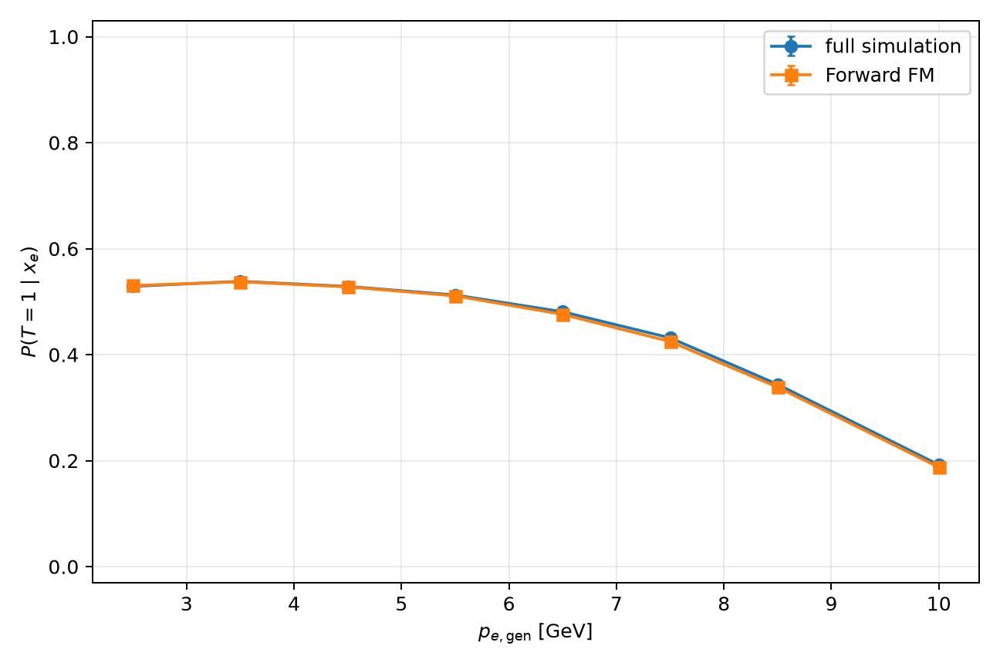
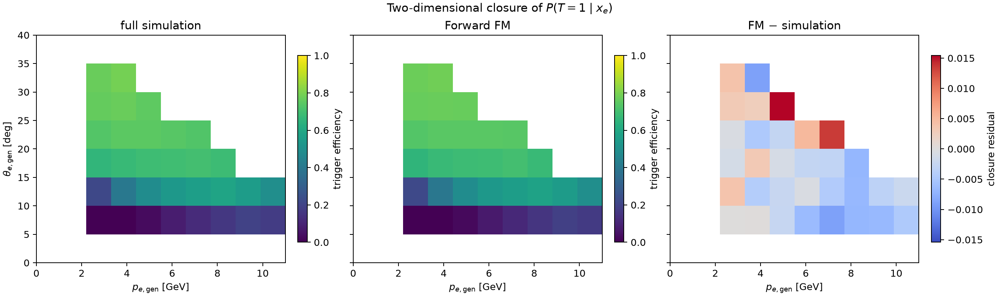
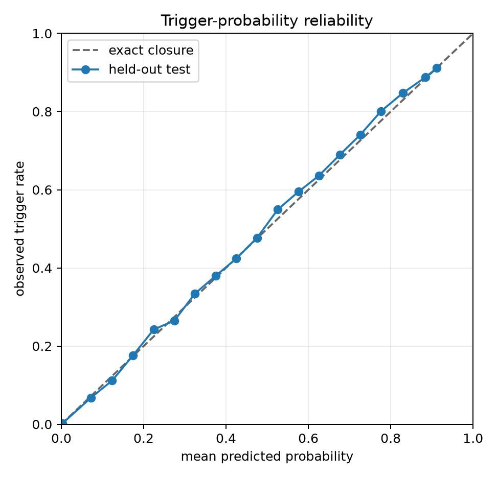

# QuantumMC Forward Foundation Model

<code>feature/trigger-electron-efficiency</code> implements 2 detector factors:
trigger-electron efficiency and conditional Forward Detector (FD) hadron
response.

## 1. Mathematical object

Let

$$
\mathcal S:=\{-211,211,2212\}=\{\pi^-,\pi^+,p\}
$$

be the generated-species set. Let $\mathcal V_{\rm train}$ be the sorted
training PID vocabulary and

$$
\mathcal R:=\mathcal V_{\rm train}\cup\{{\rm OTHER}\}.
$$

Define

$$
\Sigma_{n-1}:=
\left\lbrace u\in[0,1]^n:\sum_{j=1}^{n}u_j=1\right\rbrace
$$

the probability simplex. The trigger map is

$$
G_\psi:\mathbb R^5\longrightarrow(0,1),
\qquad
G_\psi(z_e)=\widehat\epsilon_e(z_e)\simeq P(T=1\mid z_e),
$$

For accepted events and selected reconstructed hadrons, the β-informed map is

$$
F_\vartheta:
\mathbb R^5\times\mathcal S
\longrightarrow
\Sigma_{K-1}\times(\mathbb R^4)^K
\times(\mathbb R_{>0}^4)^K\times\Sigma_{C-1},
$$

where $K$ is the Gaussian-component count and $C:=|\mathcal R|$. Its output is

$$
F_\vartheta(z,s)=
\left(\pi,\{\mu_k,\sigma_k\}_{k=1}^{K},\rho\right),
$$

with mixture weights $\pi$, component parameters $(\mu_k,\sigma_k)$, and PID
probabilities $\rho$. Equivalently,

$$
q_\vartheta:
\mathbb R^5\times\mathcal S
\longrightarrow
\mathcal P(\mathbb R^4\times\mathcal R),
$$

where $\mathcal P(A)$ is the set of probability measures on $A$, and

$$
q_\vartheta(\delta,r\mid z,s)=
\left[
\sum_{k=1}^{K}\pi_k(z,s)
\prod_{j=1}^{4}
\mathcal N\!\left(\delta_j;\mu_{kj}(z,s),\sigma_{kj}^2(z,s)\right)
\right]\rho_r(z,s).
$$

Thus the output is a distribution, not one reconstructed particle.

## 2. Physics coordinates

For the generated event electron, define

$$
x_e=(p_e,\theta_e,\phi_e,v_{z,e}),
$$

$$
\Phi_e(x_e)=
\left[
\log(1+p_e),\theta_e,\sin\phi_e,\cos\phi_e,v_{z,e}
\right]\in\mathbb R^5.
$$

The trigger model uses only standardized generated quantities. Its denominator
is every generated PID-11 row, including failures.

Define the generated-particle space

$$
\mathcal X:=
\mathbb R_{>0}\times[0,\pi]\times
(\mathbb R/2\pi\mathbb Z)\times\mathcal S,
$$

$$
x=(p_{\rm gen},\theta_{\rm gen},\phi_{\rm gen},s_{\rm gen})\in\mathcal X.
$$

Momentum $p$ is in GeV; angles are in radians. For species $s$ with mass $m_s$,

$$
\beta_{\rm gen}(p,s):=
\frac{p}{\sqrt{p^2+m_s^2}}.
$$

| $s$ | PDG | $m_s$ [GeV] |
|---|---:|---:|
| $\pi^-$ | -211 | 0.13957039 |
| $\pi^+$ | 211 | 0.13957039 |
| $p$ | 2212 | 0.93827208816 |

The 5-feature map is

$$
\Phi_\beta:\mathcal X\longrightarrow\mathbb R^5\times\mathcal S,
$$

$$
\Phi_\beta(x)=
\left(
\left[
\log(1+p_{\rm gen}),
\theta_{\rm gen},
\sin\phi_{\rm gen},
\cos\phi_{\rm gen},
\beta_{\rm gen}
\right],
s_{\rm gen}
\right).
$$

Numerically, $p_{\rm gen}$ is expressed in GeV before <code>log1p</code>.
The $(\sin\phi,\cos\phi)$ pair represents
$\mathbb R/2\pi\mathbb Z$ without a cut at $\pm\pi$.

Only the $\mathbb R^5$ component is standardized:

$$
z_j:=\frac{\Phi_{\beta,j}-\mu_j^{\rm train}}{\sigma_j^{\rm train}},
\qquad j=1,\ldots,5.
$$

Species remains categorical. The input is therefore

$$
(z,s)\in\mathbb R^5\times\mathcal S,
$$

not $\mathbb R^4$, and not one $\mathbb R^6$ vector.

## 3. Response variables

For a matched reconstructed particle,

$$
\Delta p:=p_{\rm rec}-p_{\rm gen},
\qquad
\Delta\theta:=\theta_{\rm rec}-\theta_{\rm gen},
$$

$$
\Delta\phi:=
\mathrm{wrap}_{[-\pi,\pi)}
(\phi_{\rm rec}-\phi_{\rm gen}),
\qquad
\Delta\beta:=\beta_{\rm rec}-\beta_{\rm gen}.
$$

Define

$$
\Delta:=(\Delta p,\Delta\theta,\Delta\phi,\Delta\beta)\in\mathbb R^4.
$$

Training uses $\delta:=Z_\Delta(\Delta)\in\mathbb R^4$ and
$r:=s_{\rm rec}\in\mathcal R$. PID mismatches are labels, not rejected rows.

A draw $(\widehat\Delta,\widehat s_{\rm rec})$ is mapped back by

$$
\widehat p_{\rm rec}=p_{\rm gen}+\widehat{\Delta p},
\qquad
\widehat\theta_{\rm rec}=\theta_{\rm gen}+\widehat{\Delta\theta},
$$

$$
\widehat\phi_{\rm rec}=\mathrm{wrap}_{[-\pi,\pi)}
(\phi_{\rm gen}+\widehat{\Delta\phi}),
\qquad
\widehat\beta_{\rm rec}=\beta_{\rm gen}+\widehat{\Delta\beta}.
$$

## 4. Conditional scope

The fitted law is

$$
P(\Delta,s_{\rm rec}\mid x,T=1,C={\rm FD},F=1),
$$

where $T=1$ means valid trigger electron, $C={\rm FD}$ means matched FD
reconstruction, and $F=1$ means the stated fiducial/quality selection.

The selected set satisfies

$$
s_{\rm gen}\in\mathcal S,\quad
\theta_{\rm rec}<33^\circ,\quad -5.5<z_{\rm gen}<-0.5\ {\rm cm},
$$

$$
|\Delta p|\leq10\ {\rm GeV},\quad
0<\beta_{\rm rec}\leq1.2,
$$

plus reciprocal matching, finite residuals, nonzero reconstructed PID, and
<code>usable_for_hadron_response_training</code>.

The split unit is the event key $E$, represented in the data by
`(source_file_id, event_id)`. Event-disjointness means

$$
E_a\cap E_b=\varnothing
\qquad
(a\neq b;\ a,b\in\{{\rm train},{\rm val},{\rm test}\}).
$$

Let $R_e$ denote electron-candidate existence and $Q_e$ response quality.  The
Parquet production supplies $T$ through <code>has_valid_trigger_electron</code>;
the loader independently constructs

$$
R_e:=\mathbf 1\{\mathrm{reconstructed}=1,\ \mathrm{matched\ index}\geq0\}.
$$

The unique electron row defines $T(E)$; an explicit many-to-one join broadcasts
the same $T(E)$ to every generated particle in event $E$.

The intended factorization is

$$
P(Y\mid X)=
P(T\mid x_e)
P(y_e\mid x_e,T=1)
\prod_i P(R_i\mid x_i,s_i,T=1)
P(y_i\mid x_i,s_i,R_i=1,T=1).
$$

This branch learns the 1st factor and the final factor restricted to matched FD
hadrons with $F=1$:

$$
G_\psi\simeq P(T=1\mid x_e),
\qquad
q_\vartheta\simeq
P(\Delta,s_{\rm rec}\mid x,T=1,C={\rm FD},F=1).
$$


## 5. Objective

The trigger loss is unweighted Bernoulli cross-entropy,

$$
\mathcal L_T(\psi)=
-\frac1N\sum_{i=1}^{N}
\left[
T_i\log\widehat\epsilon_{e,i}
+(1-T_i)\log(1-\widehat\epsilon_{e,i})
\right].
$$

No class weight is used: $G_\psi$ estimates the physical probability itself.
The checkpoint minimizes validation $\mathcal L_T$.

For $\lambda_{\rm PID}>0$,

$$
\mathcal L(\vartheta)=-\mathbb E_{\rm train}
\log q_\vartheta(\delta\mid z,s)
{}-\lambda_{\rm PID}\,
\mathbb E_{\rm train}
\log q_\vartheta(r\mid z,s).
$$

The recommended configuration is

$$
\dim z=5,\qquad
\dim\delta=4,\qquad
\lambda_{\rm PID}=1.
$$

Its checkpoint minimizes validation PID cross-entropy. Test data are used only
after selection.

## 6. Closure

For an electron phase-space bin $b$,

$$
\epsilon_{\rm MC}(b):=
\frac1{N_b}\sum_{i\in b}T_i,
\qquad
\epsilon_{\rm FM}(b):=
\frac1{N_b}\sum_{i\in b}\widehat\epsilon_e(x_{e,i}).
$$

Efficiency closure is evaluated in $p_e$, $\theta_e$, $\phi_e$, $v_{z,e}$,
and $(p_e,\theta_e)$, together with BCE, Brier score, and reliability.

For generated species $s$, momentum bin $b$, and reconstructed class $r$,

$$
P_{\rm CJ}(r\mid s,b)
:=
\frac{1}{N_{s,b}}
\sum_{i\in(s,b)}\mathbf 1(r_i=r),
$$

$$
P_{\rm FM}(r\mid s,b)
:=
\frac{1}{N_{s,b}}
\sum_{i\in(s,b)}\rho_r(z_i,s_i).
$$

This compares stochastic PID response, not top-1 accuracy. Define

$$
{\rm MAE}_s
:=
\frac{1}{|\mathcal B_s|}
\sum_{b\in\mathcal B_s}
\left|
P_{\rm FM}(s\mid s,b)-P_{\rm CJ}(s\mid s,b)
\right|,
$$

$$
{\rm TV}_{s,b}
:=
\frac12\sum_{r\in\mathcal R}
\left|
P_{\rm FM}(r\mid s,b)-P_{\rm CJ}(r\mid s,b)
\right|.
$$

Both vanish at exact PID closure.

## 7. Trigger-efficiency result

The event-disjoint 80/10/10 split contains

| Split | $N$ | $T=1$ | $T=0$ | $\epsilon_{\rm MC}$ |
|---|---:|---:|---:|---:|
| Train | 3,999,385 | 1,976,265 | 2,023,120 | 0.494142 |
| Validation | 500,177 | 247,871 | 252,306 | 0.495567 |
| Test | 500,438 | 247,407 | 253,031 | 0.494381 |

On test data,

| Quantity | Value |
|---|---:|
| $N_{\rm test}$ | 500,438 |
| $\epsilon_{\rm MC}$ | 0.494381 |
| $\epsilon_{\rm FM}$ | 0.492637 |
| $\epsilon_{\rm FM}-\epsilon_{\rm MC}$ | -0.001744 |
| BCE | 0.228773 |
| Brier | 0.066687 |
| ECE | 0.003053 |
| ROC AUC | 0.946061 |

| Binning | Weighted MAE | Maximum gap |
|---|---:|---:|
| $p_e$ | 0.002375 | 0.006859 |
| $\theta_e$ | 0.002702 | 0.004518 |
| $\phi_e$ | 0.004537 | 0.006394 |
| $v_{z,e}$ | 0.001990 | 0.013652 |
| $(p_e,\theta_e)$ | 0.003638 | 0.015423 |

The largest $v_z$ gap occurs in a sparse $N=1{,}220$ bin and is smaller than
its binomial standard error, $0.014313$. The 2D maximum occurs at
$4\leq p_e<5$ GeV, $25^\circ\leq\theta_e<30^\circ$, with $N=5{,}976$.







Machine-readable results and the checkpoint are in
[<code>runs/trigger_electron_efficiency/</code>](runs/trigger_electron_efficiency/).
This is a 1-seed baseline; no seed-robust comparative claim is made.

## 8. β/PID result

The matched ablation varies

$$
I_\beta:=\mathbf 1(\beta_{\rm gen}\ {\rm input}),\qquad
T_\beta:=\mathbf 1(\Delta\beta\ {\rm target}),\qquad
\lambda_{\rm PID}.
$$

| Model | $(I_\beta,T_\beta,\lambda_{\rm PID})$ | $(\dim z,\dim\delta)$ | Macro TV | Correct-ID MAE |
|---|---:|---:|---:|---:|
| A | $(0,0,0.2)$ | $(4,3)$ | $0.03440\pm0.00541$ | $0.01851\pm0.00405$ |
| B | $(1,0,0.2)$ | $(5,3)$ | $0.03413\pm0.00445$ | $0.01813\pm0.00279$ |
| C | $(0,1,0.2)$ | $(4,4)$ | $0.03509\pm0.00682$ | $0.01880\pm0.00307$ |
| $D_{0.2}$ | $(1,1,0.2)$ | $(5,4)$ | $0.03593\pm0.00738$ | $0.01941\pm0.00630$ |
| $D_1$ | $(1,1,1)$ | $(5,4)$ | **$0.02418\pm0.00160$** | **$0.01202\pm0.00102$** |

At $\lambda_{\rm PID}=0.2$, no seed-stable PID gain is attributable to
$\beta_{\rm gen}$. The stable contrast is

$$
D_{0.2}\longrightarrow D_1:
\qquad
\Delta\mathrm{TV}=0.01175,\quad
\mathrm{CI}_{0.95}=[0.00688,0.01662].
$$

It improves every matched run. Correct-ID MAE changes by species:

$$
\pi^+:\ 1.85\longrightarrow1.19,
\qquad
p:\ 2.46\longrightarrow1.19.
$$

Values are percentage points.


For β response,

$$
W_1(C)=0.00475,\qquad
W_1(D_{0.2})=0.00499,\qquad
W_1(D_1)=0.00534.
$$

Thus $\lambda_{\rm PID}=1$ improves PID closure, not β closure.


Full tables:
[<code>runs/gpu_beta_gen_factorial/summary/</code>](runs/gpu_beta_gen_factorial/summary/).

## 9. Minimal use

Train and sample $G_\psi$:

```bash
python train_trigger_efficiency.py \
  --config configs/trigger_electron_efficiency.yaml \
  --device cuda:0

python sample_trigger_electron.py \
  --checkpoint runs/trigger_electron_efficiency/model.pt \
  --input example_generated_electrons.csv \
  --output artifacts/example_trigger_electrons.csv \
  --device cuda:0
```

Train $D_1$ and sample $q_\vartheta$:

```bash
python train.py \
  --config configs/gpu_beta_factorial_D_beta_input_target_pid1.yaml \
  --device cuda:0 \
  --run-dir runs/beta_informed_pid1
```

Sample from columns <code>gen_pid,gen_p,gen_theta,gen_phi</code>:

```bash
python sample.py \
  --checkpoint runs/beta_informed_pid1/model.pt \
  --input example_generated_hadrons.csv \
  --output artifacts/example_beta_informed_response.csv \
  --device cuda:0
```

The checkpoint determines feature/target order, scaling, masses, and PID
vocabulary.

## 10. Limitations

1. Electron resolution $P(y_e\mid x_e,T=1)$ is not learned.
2. Hadron reconstruction efficiency $P(R_i\mid x_i,s_i,T=1)$ is not learned.
3. The hadron-response sample remains conditioned on $T=1$, $C={\rm FD}$,
   and $F=1$.
4. $\mathcal S=\{\pi^-,\pi^+,p\}$; generated $K^\pm$ are absent.
5. The trigger baseline has 1 training seed.
6. Particles are independent rows; event correlations are absent.
7. $\Delta$ and $s_{\rm rec}$ are conditionally factorized.
8. Each Gaussian component has diagonal covariance.
9. Simulation closure does not imply experimental-data closure.

## Appendix A. Network constants

These are hadron-response implementation choices, not the mathematical
definition:

| Quantity | Value |
|---|---:|
| $K$ | 8 |
| Hidden width | 256 |
| Hidden layers | 4 |
| Activation | SiLU |
| Normalization | LayerNorm |
| Dropout | 0.03 |
| Species-embedding dimension | 16 |
| Batch size | 8192 |
| Epoch budget | 30 |

For batch size $B$:

| Output | Shape |
|---|---|
| <code>mixture_logits</code> | $B\times K$ |
| <code>means</code> | $B\times K\times4$ |
| <code>log_scales</code> | $B\times K\times4$ |
| <code>pid_logits</code> | $B\times C$ |

Saved checkpoints:

- <code>model.pt</code>: configured primary validation metric;
- <code>model_min_validation_pid_cross_entropy.pt</code>: minimum validation PID loss;
- <code>model_min_validation_total_loss.pt</code>: minimum validation joint loss.

Each stores architecture, feature/target order, scalers, masses, vocabularies,
selection SQL, data fingerprint, seeds, and checkpoint provenance.

For $G_\psi$: width 256, 4 hidden layers, SiLU, LayerNorm, dropout 0.03,
batch size 16,384, at most 30 epochs. The reported checkpoint selected epoch 14
by validation BCE.

## Appendix B. Experiment provenance

Section 8 summarizes $10$ paired seeds,

$$
20260822,\ldots,20260831,
$$

with one teacher population and event split:

| Split | $\pi^-$ | $\pi^+$ | $p$ | Total |
|---|---:|---:|---:|---:|
| Train | 364,925 | 455,246 | 446,432 | 1,266,603 |
| Validation | 45,893 | 57,048 | 56,131 | 159,072 |
| Test | 45,817 | 56,774 | 55,891 | 158,482 |

All runs use 30 epochs and validation PID cross-entropy for checkpoint
selection. In each paired 4/5-input comparison, the added β column starts with
zero first-layer weight; both models therefore represent the same initial
function.

The collaborator-supplied β-informed endpoints agree within
$0.11$–$0.31$ percentage points. The no-β controls do not: their reported
$\pi^+$ and proton errors exceed ours by $16.34$ and $21.21$ points.
Attribution requires identical checkpoints, particle keys, and bins.

Section 7 uses seed 20260822. The 40 Parquet files contain 5,000,000 events and
have metadata SHA-256
<code>6a7245cb0ec4125610b9dcd8c1635d70a7773eeb2b29d146dd80d5f149eb43ab</code>.
The trigger checkpoint SHA-256 is
<code>032a868e35776d2bfad5b004143f1ca9ed013165e15dda239fe34a0eff80cfbf</code>.

## Appendix C. Reproduction

```bash
git clone https://github.com/HHTseng/QuantumMC_Forward_Foundation_Model.git
cd QuantumMC_Forward_Foundation_Model
git switch feature/trigger-electron-efficiency

conda create -n QuantumMC python=3.11 -y
conda activate QuantumMC
python -m pip install -r requirements.txt
python -m unittest discover -s tests -v
```

Default data:

```text
../phase-space_parquet-Aug17-26/particle_responses/*.parquet
```

2-epoch CPU check:

```bash
python train_trigger_efficiency.py \
  --config configs/trigger_electron_efficiency.yaml \
  --smoke \
  --device cpu \
  --run-dir runs/smoke_trigger

python train.py \
  --config configs/gpu_beta_factorial_D_beta_input_target_pid1.yaml \
  --smoke \
  --device cpu \
  --run-dir runs/smoke_beta_informed
```

Full matched experiment:

```bash
python experiments/run_beta_gen_factorial.py \
  --device cuda:0 \
  --parquet-glob '/path/to/particle_responses/*.parquet'

python experiments/analyze_beta_gen_factorial.py
```

Per-run checkpoint:

```text
runs/gpu_beta_gen_factorial/seed_<seed>/<condition>/model.pt
```

| Path | Definition |
|---|---|
| <code>forwardfm_full/data.py</code> | $\Phi_e$, all-event denominator, split, scaling |
| <code>forwardfm_full/labels.py</code> | $T$, $R_e$, $Q_e$ |
| <code>forwardfm_full/efficiency.py</code> | $G_\psi$, $\mathcal L_T$, validation checkpoint |
| <code>forwardfm_full/evaluation.py</code> | calibration and 1D/2D efficiency closure |
| <code>train_trigger_efficiency.py</code> | trigger training/evaluation |
| <code>sample_trigger_electron.py</code> | trigger inference and sampling |
| <code>forwardfm_step1/data.py</code> | $\Phi_\beta$, $\Delta$, selection, split, scaling |
| <code>forwardfm_step1/model.py</code> | $F_\vartheta$ |
| <code>forwardfm_step1/training.py</code> | $\mathcal L$, checkpoints |
| <code>forwardfm_step1/evaluation.py</code> | closure |
| <code>train.py</code> | training/evaluation |
| <code>sample.py</code> | sampling |
| <code>experiments/</code> | paired runs, aggregate analysis |
