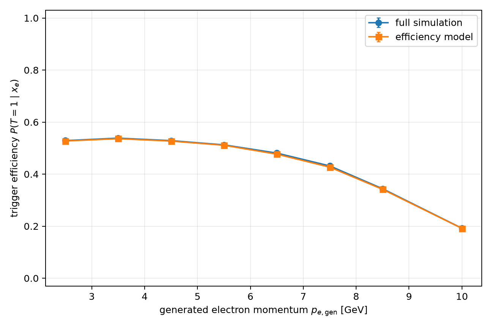
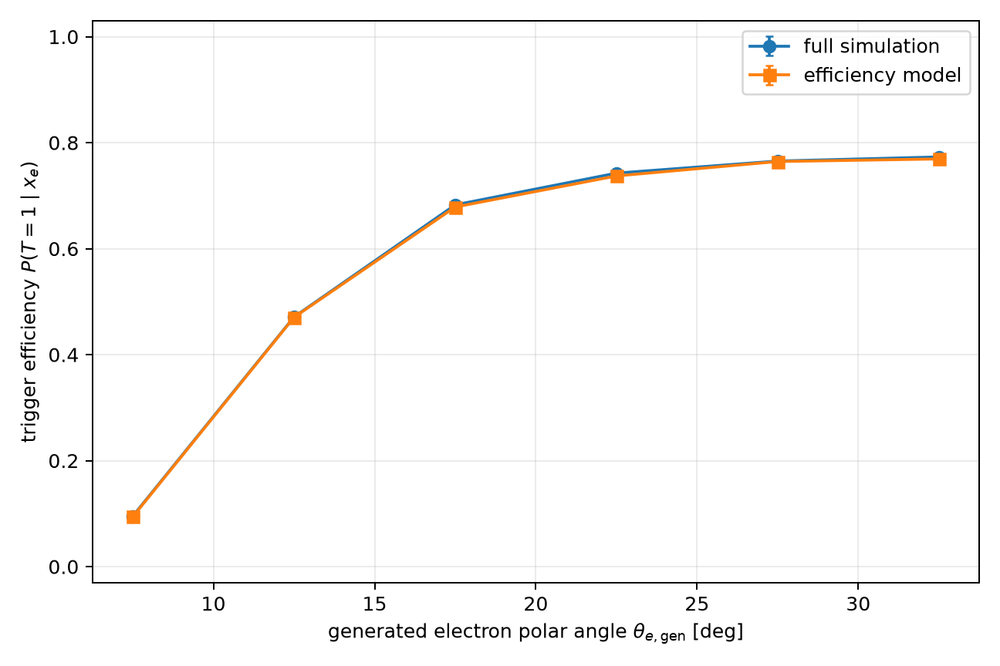
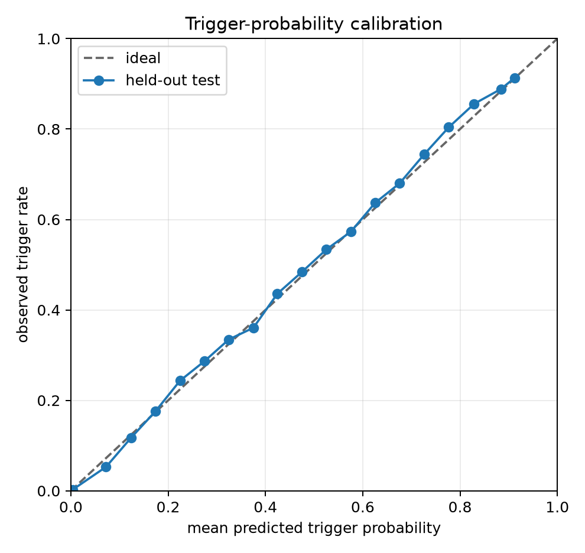
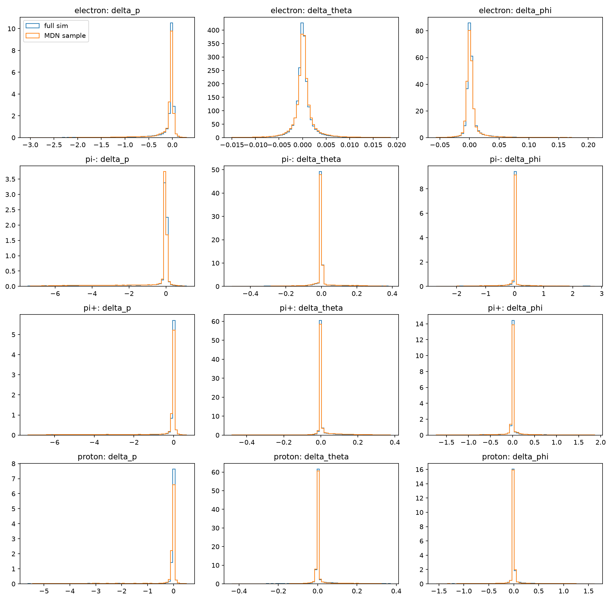
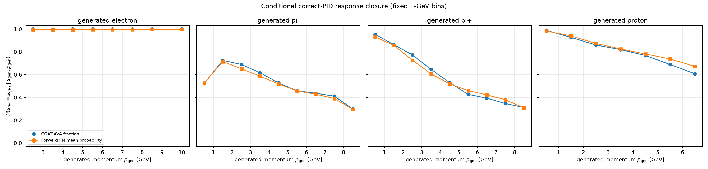

# QuantumMC Forward Foundation Model

A staged neural surrogate for selected parts of the CLAS12 simulation and
COATJAVA reconstruction chain.

This branch, `feature/trigger-electron-efficiency-four-species`, adds two
reproducible baselines:

1. an all-event trigger-electron acceptance/reconstruction efficiency model;
2. a conditional Forward Detector (FD) response model shared by generated
   electrons, $\pi^-$, $\pi^+$, and protons.

These are complementary models. The efficiency model decides whether the
generated event electron yields the valid trigger electron. The response model
then describes reconstructed kinematic residuals and PID only for particles
already in the selected, triggered, FD-reconstructed population.

## 1. Physics scope

The full simulation path is

```text
physics event generator
        |
        v
generated truth event X
        |
        v
GEMC / GEANT4 detector transport
        |
        v
simulated detector signals
        |
        v
COATJAVA reconstruction
        |
        v
reconstructed event Y
```

The eventual forward foundation model should approximate

$$
K(Y\mid X)=P(\text{reconstructed event }Y\mid\text{truth event }X).
$$


A useful staged factorization is

$$
P(Y\mid X)
=P(T\mid x_e)
\prod_i P(C_i\mid x_i,T)
P(R_i\mid x_i,T,C_i),
$$

where:

- $x_e$ is the generated event-electron truth state;
- $T\in\{0,1\}$ is the valid-trigger-electron outcome;
- $C_i$ is the reconstruction outcome or detector region of particle $i$;
- $R_i$ is the reconstructed response when it exists.

This branch implements

$$
\widehat\eta_T(x_e)\approx P(T=1\mid x_e)
$$

and

$$
q_\theta(\Delta_i,\widehat s_i
\mid x_i,T=1,C_i=\mathrm{FD},F_i=1),
$$

where $F_i$ is the current fiducial/quality selection. It does **not** yet
learn the general particle outcome factor $P(C_i\mid x_i,T)$.


## 2. Data contract and the electron-denominator audit

The Aug17-26 Parquet sample contains 5,000,000 events and 20,000,000 particle
rows. Every event contains exactly one row for each generated species:

| Generated PID | Particle | Rows |
|---:|---|---:|
| 11 | electron | 5,000,000 |
| -211 | $\pi^-$ | 5,000,000 |
| 211 | $\pi^+$ | 5,000,000 |
| 2212 | proton | 5,000,000 |

The event key is `(source_file_id, event_id)`. A deterministic hash of this
composite key creates event-disjoint 80/10/10 train/validation/test splits.

### Critical audit result

The all-event efficiency denominator is

```sql
WHERE gen_pid = 11
```

and not `is_generated_trigger_electron`. In this production,
`is_generated_trigger_electron` is true only for successful trigger electrons,
so using it would remove every failure and make efficiency undefined.

The audit established:

| Quantity | Count |
|---|---:|
| Events / generated PID-11 rows | 5,000,000 / 5,000,000 |
| Valid-trigger successes | 2,471,543 |
| Trigger failures | 2,528,457 |
| Positive rows with `trigger_mcindex != mcindex` | 0 |
| Event-split overlaps | 0 |

The executable audit is `audit_trigger_electrons.py`; its tables are saved with
the full efficiency run.

## 3. Trigger-electron efficiency model

### Inputs and labels

The physical input is generated truth only:

$$
x_e=(p_e^{\rm gen},\theta_e^{\rm gen},\phi_e^{\rm gen},
v_{x,e}^{\rm gen},v_{y,e}^{\rm gen},v_{z,e}^{\rm gen}).
$$

The audit found $v_x=v_y=0$ for every training row, so those two constant
columns are recorded but removed before training. The active numerical feature
map is

$$
f_e(x_e)=
\left[
\log(1+p_e^{\rm gen}),\theta_e^{\rm gen},
\sin\phi_e^{\rm gen},\cos\phi_e^{\rm gen},v_{z,e}^{\rm gen}
\right].
$$

Each feature is standardized with training-split statistics only. No
reconstructed variable is an input.

The trigger target is

$$
y_T=\mathbf 1\{\text{event has a valid trigger electron}\}.
$$

The network outputs a trigger logit $z_T$ and

$$
\widehat\eta_T(x_e)=\sigma(z_T).
$$

It also has a categorical reconstruction-outcome head over
`unreconstructed`, `FD`, `FT`, `CD`, and `other`. In this dataset all failures
are encoded as `unreconstructed` and all successes as `FD`; the second head is
therefore equivalent to the trigger label here, not a general reconstruction
model.

### Objective

The calibrated baseline uses unweighted binary cross entropy:

$$
\mathcal L_T
=-\frac{1}{N}\sum_i
\left[y_i\log\widehat\eta_i
+(1-y_i)\log(1-\widehat\eta_i)\right],
$$

plus categorical cross entropy for the outcome head. Class weighting is not
used because it would change the probability target without recalibration.

## 4. Four-species conditional FD response

One response row is one selected generated particle and its matched
reconstructed FD candidate. The generated-species embedding order is saved in
the checkpoint:

| Embedding index | Generated PID | Particle |
|---:|---:|---|
| 0 | 11 | electron |
| 1 | -211 | $\pi^-$ |
| 2 | 211 | $\pi^+$ |
| 3 | 2212 | proton |

The continuous input remains

$$
f(x_i)=
\left[\log(1+p_i^{\rm gen}),\theta_i^{\rm gen},
\sin\phi_i^{\rm gen},\cos\phi_i^{\rm gen}\right],
$$

with generated species supplied separately through a learned categorical
embedding.

The physical residual target is

$$
\Delta_i=(\Delta p_i,\Delta\theta_i,\Delta\phi_i),
$$

$$
\Delta p_i=p_i^{\rm rec}-p_i^{\rm gen},\qquad
\Delta\theta_i=\theta_i^{\rm rec}-\theta_i^{\rm gen},
$$

$$
\Delta\phi_i=
\operatorname{wrap}_{[-\pi,\pi)}
(\phi_i^{\rm rec}-\phi_i^{\rm gen}).
$$

The residual head is a conditional Gaussian mixture:

$$
q_\theta(\Delta\mid x,s)
=\sum_{k=1}^{K}\pi_k(x,s)
\prod_{j\in\{p,\theta,\phi\}}
\mathcal N(\Delta_j;\mu_{kj}(x,s),\sigma_{kj}^2(x,s)).
$$

A softmax head models the stochastic reconstructed-PID response
$q_\theta(\widehat s\mid x,s)$. The joint training loss is

$$
\mathcal L
=-\mathbb E[\log q_\theta(\Delta\mid x,s)]
+\lambda_{\rm PID}\,
\mathcal L_{\rm CE}(\widehat s).
$$

Electron PID loss is enabled automatically because six reconstructed PID codes
occur for selected training electrons. Electron correct PID is nevertheless
nearly fixed by the trigger selection, so electron top-1 PID performance is
not evidence for a general electron-identification model.

### Selected conditional population

All response rows satisfy the common FD, fiducial, residual, and quality cuts.
Hadrons retain the legacy `usable_for_hadron_response_training` definition;
electrons use an explicit positive trigger association.

| Generated species | Selected rows | Test rows |
|---|---:|---:|
| electron | 1,675,790 | 167,659 |
| $\pi^-$ | 458,373 | 45,981 |
| $\pi^+$ | 571,241 | 56,999 |
| proton | 559,627 | 56,005 |
| **Total** | **3,265,031** | **326,644** |

## 5. Full-run results

Both models used one GPU, deterministic seeds, event-disjoint splits, and
early stopping. Detailed CSV/JSON outputs and checkpoints are in `runs/`.

### 5.1 Trigger-efficiency probability closure

The full efficiency model has 202,502 trainable parameters and selected epoch
12. The held-out test set contains 500,438 generated electrons.

| Metric | Held-out result |
|---|---:|
| Observed trigger rate | 49.4381% |
| Mean predicted probability | 49.2075% |
| Difference | -0.2306 percentage points |
| Binary log loss | 0.228603 |
| Brier score | 0.066686 |
| Expected calibration error | 0.004085 |
| ROC AUC | 0.946356 |
| Average precision | 0.908242 |

The closure comparison in each bin is the observed efficiency

$$
\widehat\epsilon_{\rm data}(B)=\frac{1}{N_B}\sum_{i\in B}y_i
$$

against the mean predicted probability

$$
\widehat\epsilon_{\rm FM}(B)=
\frac{1}{N_B}\sum_{i\in B}\widehat\eta_T(x_{e,i}).
$$

| Conditioning variable | Largest absolute bin difference |
|---|---:|
| $p_{e,\rm gen}$ | 0.482 percentage points |
| $\theta_{e,\rm gen}$ | 0.529 percentage points |
| $\phi_{e,\rm gen}$ | 0.868 percentage points |
| $v_{z,e}^{\rm gen}$ | 1.050 percentage points |

The largest $v_z$ difference occurs in the sparse 4–6 cm bin ($N=1,220$),
whose observed binomial standard error is 1.431 percentage points. The model
also reproduces the strong physical phase-space trend: efficiency rises from
9.54% at 5–10 degrees to 77.31% at 30–35 degrees, while it falls from 52.89%
at 2–3 GeV to 19.20% at 9–11 GeV.

| Momentum closure | Polar-angle closure |
|---|---|
|  |  |



### 5.2 Four-species residual and PID closure

The four-species response model has 222,340 trainable parameters, selected
epoch 17, and gives:

| Overall metric | Held-out result |
|---|---:|
| Residual NLL in standardized coordinates | -5.162882 |
| PID cross entropy | 0.489958 |
| PID top-1 accuracy | 84.25% |
| Physical sampled $(p,\theta)$ fraction | 99.338% |

Top-1 PID accuracy is inflated by the dominant, nearly fixed electron class.
Per-species probability closure is more informative.

| Species | $W_1(\Delta p)$ | $W_1(\Delta\theta)$ | $W_1(\Delta\phi)$ | Width-ratio range |
|---|---:|---:|---:|---:|
| electron | 0.01476 | 0.000252 | 0.001362 | 1.006–1.029 |
| $\pi^-$ | 0.06463 | 0.003255 | 0.01791 | 0.942–1.013 |
| $\pi^+$ | 0.07198 | 0.003733 | 0.01888 | 1.002–1.054 |
| proton | 0.02743 | 0.002238 | 0.01799 | 1.002–1.085 |

Here $W_1$ is the one-dimensional empirical Wasserstein distance in the
physical target units (GeV for $\Delta p$, radians for angular residuals).

| Generated species | Teacher correct-PID fraction | FM mean correct probability | Difference | Worst fixed-bin PID TV |
|---|---:|---:|---:|---:|
| electron | 99.9869% | 99.5822% | -0.4046 pp | 0.0059 |
| $\pi^-$ | 55.0184% | 53.4365% | -1.5819 pp | 0.0587 |
| $\pi^+$ | 59.1098% | 58.6805% | -0.4294 pp | 0.0605 |
| proton | 81.2642% | 83.2070% | +1.9429 pp | 0.0660 |





The one-dimensional electron closure is good, but the sampled electron
residual-correlation matrix still differs from the teacher (Frobenius distance
0.404, versus 0.073–0.139 for the three hadrons). This is a clear target for a
full-covariance mixture or conditional flow. The hadron PID discrepancies also
remain visible at the 0.06–0.066 worst-bin total-variation level.

### 5.3 Previous three-species baseline

The earlier three-species result figures remain available for comparison. They
use the original conditional hadron-only configuration and are not mixed with
the new efficiency metric.


## 6. Installation and execution

```bash
git clone https://github.com/HHTseng/QuantumMC_Forward_Foundation_Model.git
cd QuantumMC_Forward_Foundation_Model

conda create -n QuantumMC python=3.12 -y
conda activate QuantumMC
python -m pip install -r requirements.txt

python -m unittest discover -s tests -v
```

Expected data layout when commands are run from the repository root:

```text
QuantumMC_Simulations/
|-- QuantumMC_Forward_Foundation_Model/
`-- phase-space_parquet-Aug17-26/
    `-- particle_responses/*.parquet
```

Run the blocking electron audit:

```bash
python audit_trigger_electrons.py \
  --parquet-glob '../phase-space_parquet-Aug17-26/particle_responses/*.parquet' \
  --output-dir runs/electron_data_audit
```

Efficiency smoke test and full one-GPU training:

```bash
python train_electron_efficiency.py \
  --config configs/electron_efficiency_seed.yaml --smoke

CUDA_VISIBLE_DEVICES=0 python train_electron_efficiency.py \
  --config configs/gpu_electron_efficiency_full.yaml
```

Four-species response smoke test and full one-GPU training:

```bash
python train.py --config configs/fd_response_four_species.yaml --smoke

CUDA_VISIBLE_DEVICES=0 python train.py \
  --config configs/gpu_four_species_full.yaml
```

Predict and sample the trigger decision for generated electron rows:

```bash
python sample_trigger_electron.py \
  --checkpoint runs/gpu_electron_efficiency_full/model.pt \
  --input example_generated_electrons.csv \
  --output sampled_trigger_decisions.csv
```

The input requires `gen_pid=11`, `gen_p`, `gen_theta`, `gen_phi`, and `gen_vz`.
Angles are in radians and momentum is in GeV. `gen_vx` and `gen_vy` are
optional because the audit removed these constant features from the checkpoint.
This command does not fabricate reconstructed kinematics.

Sample conditional FD residuals/PID for all four supported species:

```bash
python sample.py \
  --checkpoint runs/gpu_four_species_full/model.pt \
  --input example_generated_particles.csv \
  --output sampled_fd_response.csv
```

This second command assumes the trigger and FD reconstruction outcome have
already been selected. Until $P(C_i\mid x_i,T)$ is implemented, it must not be
used to declare every generated particle reconstructed.

## 7. Repository map

```text
configs/                         development and full-run configurations
forwardfm_electron/              all-event electron efficiency package
forwardfm_step1/                 conditional residual/PID response package
audit_trigger_electrons.py       denominator and label audit
train_electron_efficiency.py     efficiency training entry point
sample_trigger_electron.py       trigger-probability inference
train.py                         conditional response training
sample.py                        conditional response sampling
tests/                           data-contract, leakage, model, and closure tests
runs/                            checkpoints, CSV/JSON metrics, plots, model cards
```

The complete experiment interpretation is in
`ELECTRON_EFFICIENCY_FOUR_SPECIES_REPORT.md`.

## 8. Known limitations and next steps

1. **General reconstruction efficiency is still missing.** The current
   outcome head is binary-equivalent to the trigger label. A dataset with
   independently encoded unreconstructed/FD/CD/FT outcomes is needed for
   $P(C_i\mid x_i,T)$.
2. **Response training is conditional.** Residual/PID rows exclude failures
   and must never be used as an efficiency denominator.
3. **Particle responses are independent.** The model does not yet generate
   correlations among particles in a complete event.
4. **Residual/PID heads are conditionally factorized.** They implement
   $q(\Delta\mid x,s)q(\widehat s\mid x,s)$ rather than an explicitly coupled
   joint response.
5. **Mixture components are diagonal.** This is especially visible in the
   electron residual-correlation discrepancy.
6. **No detector-condition inputs.** Run period, field configuration,
   calibration state, and occupancy are absent.
7. **Simulation closure is not data closure.** Agreement with held-out
   GEMC/COATJAVA output does not establish agreement with real CLAS12 data.

The next highest-value extension is the true particle-level outcome model
$P(C_i\mid x_i,T)$, followed by coupled regional response and event context.
