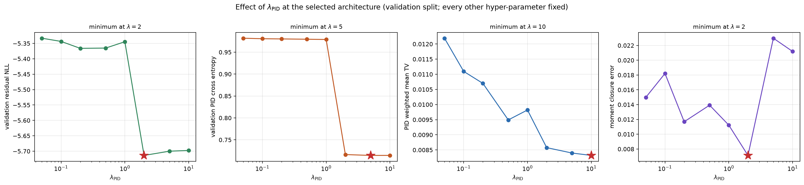
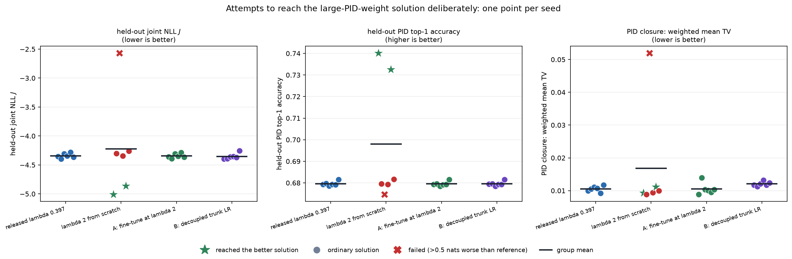
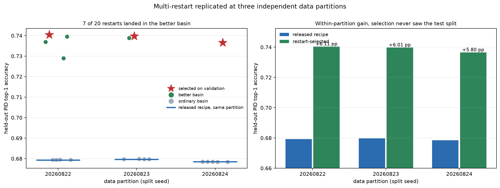

# QuantumMC Forward Foundation Model

A conditional stochastic surrogate for one selected component of the CLAS12
simulation and reconstruction chain.

The present implementation learns the reconstructed response of a generated
hadron **after** the event has a valid trigger electron and **after** that
hadron has been successfully reconstructed in the Forward Detector (FD). It is
therefore a first response-modeling baseline, not yet a complete detector or
event foundation model.

This README distinguishes three objects that must not be conflated:

1. the physical generated-particle state;
2. the tensors actually passed to PyTorch;
3. the parameters of the probability distributions predicted by the network.

Sections 1-11 describe the model and the original hand-written training recipe.
Sections 12 and 13 replace that recipe's assumed hyper-parameters with a
recorded search and report what it is worth on the held-out split: the searched
configuration lowers the held-out joint negative log likelihood by 0.75 nats and
improves the reconstructed-PID response closure against the COATJAVA teacher by
about a factor of five, reproducibly across seeds. Propositions 13.4-13.8 report
a separate and larger effect from the PID loss weight, worth about six points of
reconstructed-PID top-1 accuracy: not obtainable as a single-run setting, but
obtainable as a restart search at about 3.5 training runs per usable model.

## 1. Where this model sits in the physics workflow

The full simulation path is

```text
physics event generator
        |
        v
generated truth event X
        |
        v
GEMC / GEANT4 detector transport
        |
        v
simulated detector signals
        |
        v
COATJAVA reconstruction
        |
        v
reconstructed event Y
```

The eventual forward foundation model should approximate the expensive map

$$
K(Y\mid X)=P(\text{reconstructed event }Y\mid\text{truth event }X).
$$


The current Step 1 network learns only the highlighted conditional response
factor for selected FD hadrons:

$$
P(\Delta_i,\widehat s_i
\mid x_i,T=1,C_i=\mathrm{FD},F_i=1).
$$

Here:

- $x_i$ is the generated truth state of hadron $i$;
- $T\in\{0,1\}$ is the event-level valid-trigger-electron outcome;
- $C_i$ is the particle reconstruction outcome or detector region;
- $F_i$ denotes the current fiducial and data-quality selection;
- $\Delta_i$ is the reconstructed-minus-generated kinematic residual;
- $\widehat s_i$ is the PID assigned by reconstruction.


The model does **not** presently learn:

- whether a generated event triggers;
- whether a generated particle is reconstructed;
- whether it is reconstructed in FD, CD, FT, or nowhere;
- the electron response;
- correlations among particles in a complete event;
- time-dependent detector conditions.

## 2. Event rows, particle rows, and trigger electrons

The Aug17-26 phase-space sample contains 5,000,000 generated events and
20,000,000 generated-particle rows. In this production, each event contains
exactly four generated particles:

$$
e^-,\qquad \pi^+,\qquad \pi^-,\qquad p.
$$

Thus one event contributes four rows:

| Row in one event | Generated PID | Particle |
|---|---:|---|
| 1 | 11 | electron |
| 2 | 211 | $\pi^+$ |
| 3 | -211 | $\pi^-$ |
| 4 | 2212 | proton |

Consequently, the statement “one generated event gives one generated-electron
row” means exactly **one electron particle record per event**, not a row
containing several electrons.

A trigger electron is a reconstructed electron candidate satisfying the
experiment's trigger-related detector and quality conditions. At the data-model
level,

$$
T=
\begin{cases}
1,&\text{a valid trigger electron is present},\\
0,&\text{no valid trigger electron is present}.
\end{cases}
$$

This is a supervised label because a future model must learn the trigger
efficiency

$$
P(T=1\mid x_e),
$$

using both triggered and untriggered generated events. If only $T=1$ events
were retained, the denominator of the efficiency would be absent.

Step 1 does not train this trigger model. Its hadron rows are already
conditioned on $T=1$.

The composite event identifier is

```text
(source_file_id, event_id)
```

because `event_id` alone is only locally unique within a source file. All
particles from the same event are assigned to the same train, validation, or
test partition.

## 3. One Step 1 supervised example

One training row represents **one generated hadron**, together with its matched
reconstructed FD candidate. It is not a complete event.

The physical truth state is

$$
x_i^{\mathrm{phys}}
=(p_i^{\mathrm{gen}},\theta_i^{\mathrm{gen}},
\phi_i^{\mathrm{gen}},s_i^{\mathrm{gen}})
\in
(0,\infty)\times[0,\pi]\times S^1\times\mathcal S,
$$

where

$$
\mathcal S=\{-211,211,2212\}
=\{\pi^-,\pi^+,p\}.
$$

The physical response label is

$$
\Delta_i^{\mathrm{phys}}
=(\Delta p_i,\Delta\theta_i,\Delta\phi_i)\in\mathbb R^3,
$$

with

$$
\Delta p_i=p_i^{\mathrm{rec}}-p_i^{\mathrm{gen}},
\qquad
\Delta\theta_i=\theta_i^{\mathrm{rec}}-
\theta_i^{\mathrm{gen}},
$$

$$
\Delta\phi_i=
\mathrm{wrap}_{[-\pi,\pi)}\,
(\phi_i^{\mathrm{rec}}-\phi_i^{\mathrm{gen}}).
$$

The reconstructed PID label $\widehat s_i$ is allowed to differ from the
generated PID. Such rows describe physical/reconstruction contamination and
must not automatically be deleted as corrupted data.

## 4. Correct computational input to the network

The code does **not** pass the raw tuple
`(gen_p, gen_theta, gen_phi, gen_pid)` as one four-dimensional tensor.

### 4.1 Continuous feature map

The raw kinematics are mapped to

$$
\Phi(p,\theta,\phi)
=\left[
\log(1+p),\ \theta,\ \sin\phi,\ \cos\phi
\right]\in\mathbb R^4.
$$

In the data, momentum is numerically stored in GeV and angles in radians. The
logarithm compresses the momentum range. The pair
$(\sin\phi,\cos\phi)$ respects the circular topology of azimuth and removes
the artificial discontinuity between $-\pi$ and $+\pi$.

The implementation is:

```python
CONTINUOUS_FEATURES = (
    "log1p_gen_p",
    "gen_theta",
    "sin_gen_phi",
    "cos_gen_phi",
)

def _feature_matrix(frame):
    phi = frame["gen_phi"].to_numpy(dtype=np.float64)
    return np.column_stack(
        [
            np.log1p(frame["gen_p"].to_numpy(dtype=np.float64)),
            frame["gen_theta"].to_numpy(dtype=np.float64),
            np.sin(phi),
            np.cos(phi),
        ]
    ).astype(np.float32)
```

Each feature is standardized using training-set statistics only:

$$
z_j=\frac{\Phi_j-\mu_j^{\mathrm{train}}}
{\sigma_j^{\mathrm{train}}}.
$$

For a minibatch of size $B$, the continuous input is therefore

$$
\mathtt{continuous}\in\mathbb R^{B\times4}.
$$

For the development configuration, $B=2048$:

```python
continuous.shape
# torch.Size([2048, 4])
```

Its columns are

```text
continuous[:, 0] = standardized log(1 + gen_p)
continuous[:, 1] = standardized gen_theta
continuous[:, 2] = standardized sin(gen_phi)
continuous[:, 3] = standardized cos(gen_phi)
```

### 4.2 Generated species is a separate categorical input

The generated particle identity is encoded separately:

```python
SPECIES = (-211, 211, 2212)
species_to_index = {pid: i for i, pid in enumerate(SPECIES)}
```

Hence

| `species_index` | Generated PID | Particle |
|---:|---:|---|
| 0 | -211 | $\pi^-$ |
| 1 | 211 | $\pi^+$ |
| 2 | 2212 | proton |

For a batch,

$$
\mathtt{species\_index}\in\{0,1,2\}^{B}.
$$

The network maps this integer to a learned embedding

$$
E_s:\{0,1,2\}\longrightarrow\mathbb R^{d_s}
$$

and concatenates it with the continuous features:

```python
species = self.species_embedding(species_index)   # [B, d_s]
network_input = torch.cat([continuous, species], dim=-1)
# shape: [B, 4 + d_s]
```

For the seed configuration, $d_s=8$, so the first backbone layer receives
12 numbers per particle. For the full configuration, $d_s=16$, so it
receives 20.

The actual model input is therefore the pair

$$
(\mathtt{continuous},\mathtt{species\_index})
\in\mathbb R^{B\times4}\times\{0,1,2\}^{B},
$$

not a single raw four-vector called `x`.

## 5. Correct training labels

### 5.1 Continuous response target

The three raw residuals are standardized using training-only statistics:

$$
z_{\Delta,j}
=\frac{\Delta_j-\mu_{\Delta,j}^{\mathrm{train}}}
{\sigma_{\Delta,j}^{\mathrm{train}}}.
$$

Thus

$$
\mathtt{targets}\in\mathbb R^{B\times3}.
$$

For example:

```python
targets.shape
# torch.Size([2048, 3])

targets[0]
# tensor([-2.7308, 0.8157, -1.7413])
```

The three columns are standardized
$(\Delta p,\Delta\theta,\Delta\phi)$, not reconstructed
$(p,\theta,\phi)$ and not values directly in GeV/radians. The first example
means that its $\Delta p$ lies 2.7308 training standard deviations below the
training mean, and similarly for the two angles.

Physical residuals are recovered through the inverse affine map:

```python
physical_residuals = target_scaler.inverse(targets.cpu().numpy())

delta_p     = physical_residuals[:, 0]  # GeV
delta_theta = physical_residuals[:, 1]  # rad
delta_phi   = physical_residuals[:, 2]  # rad
```

### 5.2 Reconstructed PID target

`rec_pid_index` contains one integer class label per particle, taking values in

$$
\{0,\ldots,C-1\}^{B}.
$$

It therefore has shape `[B]`, not `[B, C]`:

```python
rec_pid_index.shape
# torch.Size([2048])

rec_pid_index
# tensor([9, 10, 7, ..., 9, 10, 7], device="mps:0")
```

These integers are vocabulary positions, not raw PDG/CLAS PID codes. The
vocabulary is discovered from the training split, sorted, and saved in the
checkpoint:

```python
rec_pid_vocabulary = sorted(train_frame["rec_pid"].unique())
rec_pid_to_index = {
    pid: index for index, pid in enumerate(rec_pid_vocabulary)
}
unknown_index = len(rec_pid_vocabulary)
```

For the saved full run discussed in this repository, the observed mapping is:

| Class index | Raw reconstructed PID | Interpretation |
|---:|---:|---|
| 0 | -2212 | antiproton |
| 1 | -321 | $K^-$ |
| 2 | -211 | $\pi^-$ |
| 3 | -11 | positron |
| 4 | 11 | electron |
| 5 | 22 | photon |
| 6 | 45 | deuteron code used by the reconstruction convention |
| 7 | 211 | $\pi^+$ |
| 8 | 321 | $K^+$ |
| 9 | 2112 | neutron |
| 10 | 2212 | proton |
| 11 | `OTHER` | PID absent from the training vocabulary |

Therefore the displayed prefix

```text
[9, 10, 7]
```

decodes to

```text
[neutron, proton, pi+]
```

for those three reconstructed rows. Their generated identities cannot be
deduced from `rec_pid_index`; those are stored separately in `species_index`.

Always decode from the checkpoint rather than hard-coding this table:

```python
checkpoint = torch.load("runs/fd_response_seed/model.pt", map_location="cpu")
pid_labels = [*checkpoint["rec_pid_vocabulary"], "OTHER"]

decoded_targets = [
    pid_labels[int(i)] for i in rec_pid_index.detach().cpu().tolist()
]
```

## 6. Correct model outputs and tensor shapes

The neural network does not directly output one vector
`(delta_p, delta_theta, delta_phi, rec_pid)`.

It returns parameters of two probability distributions:

1. a Gaussian mixture distribution for the standardized residual vector;
2. a categorical distribution for reconstructed PID.

Let

- $B$ be batch size;
- $K$ be the number of Gaussian-mixture components;
- $D=3$ be the residual dimension;
- $C$ be the number of reconstructed-PID classes.

The returned object is

```python
@dataclass
class ModelOutput:
    mixture_logits: torch.Tensor  # [B, K]
    means: torch.Tensor           # [B, K, 3]
    log_scales: torch.Tensor      # [B, K, 3]
    pid_logits: torch.Tensor      # [B, C]
```

### 6.1 Residual distribution head

For standardized residuals $z_\Delta\in\mathbb R^3$, the implemented MDN is

$$
q_\vartheta(z_\Delta\mid z_x,s)
=\sum_{k=1}^{K}\pi_k(z_x,s)
\prod_{j=1}^{3}
\mathcal N\!\left(
z_{\Delta,j};\mu_{kj}(z_x,s),\sigma_{kj}^2(z_x,s)
\right),
$$

where

$$
\pi=\mathrm{softmax}\,(\mathtt{mixture\_logits}),
\qquad
\sigma=\exp(\mathtt{log\_scales}).
$$

The component covariance matrices are diagonal. Dependence among the three
residual coordinates can nevertheless be represented through shared mixture
membership, although this remains less expressive than full-covariance or
flow-based components.

### 6.2 Reconstructed-PID head

The categorical probabilities are

$$
q_\vartheta(\widehat s=c\mid z_x,s)
=\mathrm{softmax}\,(\mathtt{pid\_logits})_c.
$$

For the displayed development batch,

```python
output.pid_logits.shape
# torch.Size([2048, 12])
```

This means:

- 2,048 particle rows;
- 12 raw scores per particle, one for each possible reconstructed-PID class.

Logits are not probabilities. Convert them with

```python
pid_probabilities = torch.softmax(output.pid_logits, dim=-1)
# pid_probabilities.shape == [2048, 12]
# pid_probabilities[i].sum() == 1, up to floating-point error
```

If `rec_pid_index[0] == 9`, the correct-class probability for row zero is

```python
pid_probabilities[0, 9]
```

### 6.3 Shape inspection snippet

```python
continuous, species_index, targets, rec_pid_index = next(iter(loader))

continuous = continuous.to(device)
species_index = species_index.to(device)
targets = targets.to(device)
rec_pid_index = rec_pid_index.to(device)

output = model(continuous, species_index)

print("continuous       ", continuous.shape)          # [B, 4]
print("species_index    ", species_index.shape)       # [B]
print("targets          ", targets.shape)             # [B, 3]
print("rec_pid_index    ", rec_pid_index.shape)       # [B]
print("mixture_logits   ", output.mixture_logits.shape) # [B, K]
print("means            ", output.means.shape)        # [B, K, 3]
print("log_scales       ", output.log_scales.shape)   # [B, K, 3]
print("pid_logits       ", output.pid_logits.shape)   # [B, C]
```

For `configs/fd_response_seed.yaml`, normally

```text
B = 2048, K = 5, C = 12
```

so the usual shapes are

```text
continuous       [2048, 4]
species_index    [2048]
targets          [2048, 3]
rec_pid_index    [2048]
mixture_logits   [2048, 5]
means            [2048, 5, 3]
log_scales       [2048, 5, 3]
pid_logits       [2048, 12]
```

For the full configuration, $B=8192$ and $K=8$; for the searched
configuration of section 12, $B=4096$ and $K=8$ with a 768-wide six-layer
backbone. Because the loader uses `drop_last=False`, the final batch of an epoch
can contain fewer than $B$ rows.

`device="mps:0"` only means that the tensor is stored on the first Apple Metal
device. It is not a tensor dimension and has no physics interpretation.

## 7. What probability distribution is actually modeled?

The current network uses a shared backbone followed by two separate heads. Its
implemented factorization is

$$
q_\vartheta(z_\Delta,c\mid z_x,s,T=1,C=\mathrm{FD},F=1)
=q_\vartheta(z_\Delta\mid z_x,s)
q_\vartheta(c\mid z_x,s).
$$

This is a conditional-independence assumption:

$$
z_\Delta\perp c\mid(z_x,s)
\quad\text{within the output parameterization}.
$$

The two predictions share learned hidden features, but after conditioning on
those features, residual sampling and PID sampling are independent. Therefore,
the present model does **not** explicitly learn that a particular
misidentification class may have a different residual distribution.

A more expressive future model could use

$$
q(c\mid z_x,s)\,q(z_\Delta\mid z_x,s,c),
$$

or a single joint generative model for $(z_\Delta,c)$.

This distinction is central: the model outputs distribution parameters, then
sampling produces one reconstructed-like outcome.

## 8. Training objective

The DataLoader produces tensors in the following order:

```python
TensorDataset(
    continuous,       # [B, 4]
    species_index,    # [B]
    targets,          # [B, 3]
    rec_pid_index,    # [B]
)
```

The implemented training step is:

```python
output = model(continuous, species_index)

# -log q_theta(z_Delta | z_x, species)
nll = mixture_nll(output, targets)

# -log q_theta(rec_pid_index | z_x, species)
pid_ce = torch.nn.functional.cross_entropy(
    output.pid_logits,
    rec_pid_index,
)

loss = nll + pid_loss_weight * pid_ce
```

Mathematically,

$$
\mathcal L(\vartheta)
=-\frac1B\sum_{i=1}^{B}
\log q_\vartheta(z_{\Delta,i}\mid z_{x,i},s_i)
-\frac{\lambda_{\mathrm{PID}}}{B}
\sum_{i=1}^{B}
\log q_\vartheta(c_i\mid z_{x,i},s_i),
$$

The weight $\lambda_{\mathrm{PID}}$ is `pid_loss_weight` in the configuration
files. It is 0.20 in the original hand-written configurations and 0.3975 in the
searched configuration of section 12. Proposition 13.4 measures what this weight
actually controls, and 13.6-13.8 why its most useful setting is a search rather
than a value.

Cross entropy expects

```text
pid_logits:     floating tensor [B, C]
rec_pid_index:  integer tensor  [B]
```

and for row $i$ selects the log-probability at class
`rec_pid_index[i]`.

## 9. Sampling reconstructed-like particles

Inference first samples a mixture component and standardized residual:

$$
k_i\sim\mathrm{Categorical}\,(\pi_i),
\qquad
\epsilon_i\sim\mathcal N(0,I_3),
$$

$$
z_{\Delta,i}=\mu_{i,k_i}+\sigma_{i,k_i}\odot\epsilon_i.
$$

The code then inverts target standardization and samples reconstructed PID:

```python
with torch.no_grad():
    output = model(continuous, species_index)

    standardized_residuals = sample_standardized_residuals(output)
    physical_residuals = target_scaler.inverse(
        standardized_residuals.cpu().numpy()
    )

    pid_probabilities = torch.softmax(output.pid_logits, dim=-1)
    sampled_pid_index = torch.multinomial(pid_probabilities, 1).squeeze(1)
```

Finally,

$$
p^{\mathrm{sample}}_{\mathrm{rec}}
=p_{\mathrm{gen}}+\Delta p,
$$

$$
\theta^{\mathrm{sample}}_{\mathrm{rec}}
=\theta_{\mathrm{gen}}+\Delta\theta,
$$

$$
\phi^{\mathrm{sample}}_{\mathrm{rec}}
=\mathrm{wrap}_{[-\pi,\pi)}\,
(\phi_{\mathrm{gen}}+\Delta\phi).
$$

The sampler flags draws with $p_{\mathrm{rec}}\leq0$ or
$\theta_{\mathrm{rec}}\notin[0,\pi]$ rather than silently clipping them.

## 10. Dataset selection and scope

The source Parquet data are not stored in this repository. The current response
sample selects

$$
T=1,\qquad C=\mathrm{FD},\qquad
\theta_{\mathrm{rec}}<33^\circ,
$$

$$
-5.5<z_{\mathrm{gen}}<-0.5\ \mathrm{cm},
$$

together with reciprocal matching and explicit PID, beta, and residual-quality
requirements.

| Generated species | PDG code | Selected rows |
|---|---:|---:|
| $\pi^-$ | -211 | 458,373 |
| $\pi^+$ | 211 | 571,241 |
| proton | 2212 | 559,627 |
| **Total** |  | **1,589,241** |

| Split | Rows |
|---|---:|
| Train | 1,270,698 |
| Validation | 159,558 |
| Test | 158,985 |

These counts describe particle rows, not event counts.

## 11. Held-out results of the hand-written baseline

This section reports the original hand-tuned recipe. Every hyper-parameter in it
was assumed rather than searched; section 12 searches them and section 13 shows
what that is worth on the same held-out split.

The saved full experiment used one NVIDIA H100 GPU, $K=8$ mixture
components, a four-layer width-256 backbone, and 222,324 trainable parameters.

| Metric | Development seed | Full training |
|---|---:|---:|
| Residual negative log likelihood | -4.0789 | **-4.7581** |
| Reconstructed-PID cross entropy | 1.2794 | **1.1774** |
| Reconstructed-PID top-1 accuracy | 66.62% | **67.22%** |
| Maximum PID marginal discrepancy | 0.692% | **0.426%** |
| Physical sampled $(p,\theta)$ fraction | 95.67% | **97.13%** |
| Test evaluation throughput | -- | **112,434 examples/s** |

Negative log likelihood evaluates a conditional density, so its absolute sign
depends on coordinate scaling and density units. It should be interpreted by
comparing models evaluated under the same target transformation.

### Residual-distribution closure


### Residual-width closure

Each heatmap cell is

$$
\frac{\mathrm{Std}\,(\Delta)_{\mathrm{model}}}
{\mathrm{Std}\,(\Delta)_{\mathrm{full\ simulation}}}.
$$


Aggregate agreement is necessary but not sufficient. Physics validation must
also examine conditional response versus generated kinematics, PID confusion,
residual correlations, tails, and eventually event-level observables.

## 12. Hyper-parameter search: definitions

Sections 1-11 fix the model; their hyper-parameters were assumed. This section
defines what was optimized, section 13 states what was measured. Full tables,
figures and provenance:
[`runs/optuna_analysis/OPTUNA_TUNING_REPORT.md`](runs/optuna_analysis/OPTUNA_TUNING_REPORT.md).

**12.1 Definition** (*search objective*). For a fitted model,

$$
J:=\mathrm{NLL}_\Delta+\mathrm{CE}_{\mathrm{PID}}
=-\frac1N\sum_i\log q_\vartheta(z_{\Delta,i}\mid z_{x,i},s_i)
-\frac1N\sum_i\log q_\vartheta(c_i\mid z_{x,i},s_i).
$$

**12.2 Remark.** $J$ is the log density of $q(z_\Delta\mid z_x,s)\,q(c\mid z_x,s)$
and is free of $\lambda_{\mathrm{PID}}$. The training loss
$\mathcal L=\mathrm{NLL}_\Delta+\lambda_{\mathrm{PID}}\mathrm{CE}_{\mathrm{PID}}$
is not, hence cannot rank trials when $\lambda_{\mathrm{PID}}$ is searched.
Checkpoint selection inside a trial uses $J$
(`training.selection_metric: joint_nll`). $J$ is a density in a standardization
fitted on the training split, so it is comparable only within one partition.

**12.3 Definition** (*closure functionals*). For generated species $s$,
reconstructed class $r$, and fixed 1 GeV generated-momentum bins $b$,

$$
\mathrm{TV}(s,b):=\tfrac12\sum_r\bigl|P_{\mathrm{FM}}(r\mid s,b)-P_{\mathrm{CJ}}(r\mid s,b)\bigr|,
\qquad
T:=\frac{\sum_{s,b}N(s,b)\,\mathrm{TV}(s,b)}{\sum_{s,b}N(s,b)},
$$

$$
M:=\frac19\sum_{s}\sum_{t\in\{\Delta p,\Delta\theta,\Delta\phi\}}
\left[\frac{\bigl|\mathrm E[t]_{\mathrm{mod}}-\mathrm E[t]_{\mathrm{obs}}\bigr|}{\sigma_{\mathrm{obs}}(t)}
+\left|\frac{\sigma_{\mathrm{mod}}(t)}{\sigma_{\mathrm{obs}}(t)}-1\right|\right].
$$

$T$ is PID response closure against the COATJAVA teacher, $M$ first- and
second-moment closure of the residuals; both dimensionless, both lower-better.

**12.4 Definition** (*final selection*). With $J_0:=-3.63200$ the published
baseline's validation $J$ and $F:=\{\text{trial}:J\le J_0\}$,

$$
\text{selected}:=\underset{F}{\arg\min}\ \Bigl[T/\operatorname{med}_F T+M/\operatorname{med}_F M\Bigr].
$$

**12.5 Remark.** Minimizing $J$ alone is unsafe: heavy mixture tails buy log
density while distorting $\sigma_{\mathrm{mod}}$. The trial with least $J$ had
$(T,M)=(0.0296,0.0485)$ against $(0.0102,0.0156)$ for the selected trial 41.
A point dominated in both coordinates cannot minimize the composite, so the
selection lies on the $(T,M)$ Pareto front.

**12.6 Experiments.** All held-out numbers in section 13 are on the untouched
test split; searches and scans use validation only.

| | design | scale |
|---|---|---|
| E1 | TPE search over 11 dimensions, median pruner | 90 trials (29 complete, 61 pruned, 5,059 GPU s) |
| E2 | seed repeats, baseline and tuned, paired | 3 + 6 runs |
| E3 | $\lambda_{\mathrm{PID}}$ scan, all else fixed | 8 values |
| E4 | re-sampling of a fixed checkpoint | 10 draws $\times$ 2 runs |
| E5 | $\lambda_{\mathrm{PID}}{=}2$, seed repeats | 6 runs |
| E6 | $\lambda_{\mathrm{PID}}{=}2$ + 5-epoch per-step warm-up | 6 runs |
| E7 | $\lambda_{\mathrm{PID}}{=}2$ by fine-tune; by trunk LR $\times0.25$ | 6 + 6 runs |
| E8 | restart pools, partition pinned, validation-only selection | 4 pools, 28 runs |

## 13. Results

**13.1 Parameter choices.** Released configuration
`configs/gpu_optuna_best.yaml` (E1, trial 41); 222,324 $\to$ 3,024,476 parameters.

| Parameter | Assumed | Final | Established by |
|---|---:|---:|---|
| `learning_rate` | 0.001 | **0.002958** | E1; fANOVA 0.333, the dominant dimension |
| `hidden_width` | 256 | **768** | E1; fANOVA 0.260, non-monotone (1024 loses) |
| `hidden_layers` | 4 | **6** | E1; fANOVA 0.141, flat beyond 6 |
| `mixture_components` $K$ | 8 | **8** | E1; fANOVA 0.103, assumption confirmed |
| `batch_size` | 8192 | **4096** | E1; fANOVA 0.071 |
| `lr_schedule` | constant | **cosine** | E1; 8/8 of the best trials by closure |
| `epochs` | 30 | **70** | E1; 7/8 of the best trials; budget binding (13.9) |
| `dropout` | 0.03 | **0.1418** | E1; fANOVA 0.014 |
| `weight_decay` | $10^{-5}$ | **$1.495\times10^{-4}$** | E1; fANOVA 0.016 |
| `pid_embedding_dim` | 16 | **8** | E1; fANOVA 0.011 |
| `pid_loss_weight` | 0.20 | **0.3975** | E1; fANOVA 0.026, but see 13.4-13.8 |


**13.2 Proposition.** *The released configuration dominates the assumed one on
every held-out quantity, reproducibly.* (E2)

Marginals over $n{=}3$ baseline and $n{=}6$ tuned runs; the paired column is over
the 3 seeds common to both.

| | baseline ($n{=}3$) | tuned ($n{=}6$) | paired $\Delta$, sign in all 3 |
|---|---:|---:|---|
| $J$ | $-3.6037\pm0.0950$ | $\mathbf{-4.3417\pm0.0416}$ | $-0.750$, yes |
| $A$ | $0.6754\pm0.0003$ | $\mathbf{0.6796\pm0.0010}$ | $+0.0038$, yes |
| $T$ | $0.0495\pm0.0158$ | $\mathbf{0.0105\pm0.0008}$ | $-0.0390$, yes |
| $M$ | $0.0416\pm0.0127$ | $\mathbf{0.0235\pm0.0065}$ | $-0.0175$, yes |
| physical $(p,\theta)$ | $0.9769\pm0.0138$ | $\mathbf{0.9910\pm0.0005}$ | $+0.0143$, yes |

Single-partition values (20260822): $J$ $-3.5011\to-4.3559$, $A$ $0.6750\to0.6793$,
$T$ $0.04423\to0.01001$, $M$ $0.05614\to0.03152$. The tuned recipe is also the
more stable: smaller s.d. on every row.


**13.3 Corollary.** $T$ improves in *every* momentum bin of every species; the
baseline's largest correct-identification errors, $+0.125$ (proton, 6-7 GeV) and
$+0.085$ ($\pi^+$, 8-9 GeV), fall below $\pm0.031$ everywhere.

**13.4 Proposition.** *$\lambda_{\mathrm{PID}}$ acts by a step at
$\lambda\approx2$, not smoothly.* (E3, validation)

| $\lambda_{\mathrm{PID}}$ | 0.05 | 0.1 | 0.2 | 0.5 | 1 | **2** | 5 | 10 |
|---|---:|---:|---:|---:|---:|---:|---:|---:|
| $\mathrm{NLL}_\Delta$ | -5.333 | -5.344 | -5.366 | -5.365 | -5.345 | **-5.714** | -5.700 | -5.698 |
| $\mathrm{CE}$ | 0.982 | 0.981 | 0.980 | 0.980 | 0.979 | **0.716** | 0.714 | 0.715 |
| $A$ | 0.6801 | 0.6800 | 0.6800 | 0.6801 | 0.6802 | **0.7399** | 0.7403 | 0.7400 |
| $T$ | 0.0122 | 0.0111 | 0.0107 | 0.0095 | 0.0098 | 0.0086 | 0.0084 | **0.0083** |



**13.5 Remark.** Both loss terms improve together across the step, so this is
not re-weighting: the run reaches a different solution. E1 ranked
$\lambda_{\mathrm{PID}}$ sixth of eleven because TPE concentrated on small
values and never paired a large one with the selected architecture; fANOVA
measures variance over the trials actually run.

**13.6 Proposition.** *The step is not usable as a single-run setting.* (E5)
Over 6 seeds at $\lambda_{\mathrm{PID}}{=}2$: $J=-4.224\pm0.870$ against
$-4.353\pm0.045$; 2 of 6 reach the better solution, 1 of 6 destabilizes and is
early-stopped at epoch 12 with $T=0.052$, worse than the assumed baseline.

**13.7 Proposition.** *Every intervention that stabilizes it removes it.*
(E6, E7; 6 seeds each)

| | reached better | destabilized | $J$ | $A$ |
|---|---:|---:|---:|---:|
| $\lambda{=}2$ | 2/6 | 1/6 | $-4.224\pm0.870$ | $0.6980\pm0.0299$ |
| $+$ warm-up | **1/6** | 0/6 | $-4.306\pm0.294$ | $0.6876\pm0.0194^{\dagger}$ |
| $+$ fine-tune | **0/6** | 0/6 | $-4.343\pm0.040$ | $0.6796\pm0.0011$ |
| $+$ trunk LR $\times0.25$ | **0/6** | 0/6 | $-4.355\pm0.053$ | $0.6796\pm0.0010$ |

$^{\dagger}$ one seed reaches 0.7271, five remain at $\approx0.679$.
Fine-tuning and decoupling reproduce the released $A=0.6796\pm0.0010$ to four
decimals. Hence the better solution is a distinct basin, entered only by a large
undamped early perturbation of the shared trunk, and unreachable by descent from
the released optimum.



**13.8 Proposition.** *The basin is reliably obtainable as a search.* (E8)
Restarts share one partition (`data.split_seed`); selection reads validation only.

| Partition | Restarts | Landed | $A$ released $\to$ selected | Gain |
|---|---:|---:|---:|---:|
| 20260822 | 8 | 4 | $0.6793\to\mathbf{0.7404}$ | $+6.11$ pp |
| 20260823 | 6 | 2 | $0.6797\to\mathbf{0.7398}$ | $+6.01$ pp |
| 20260824 | 6 | 1 | $0.6785\to\mathbf{0.7365}$ | $+5.80$ pp |
| 20260828$^{\ast}$ | 8 | 1 | $0.6797\to\mathbf{0.7400}$ | $+6.03$ pp |

$^{\ast}$ partition used by no other experiment here; Option A on it gives
$J=-4.3601$, $A=0.6797$, inside the E2 band.

Pooled: 8 of 28, rate $0.286$, Wilson 95% $[0.15,0.47]$, i.e. $\approx3.5$ runs
per usable model; a pool of 8 succeeds with probability 0.93, of 6 only 0.87.
Validation selection chose a better-basin run in 4 of 4 pools with oracle regret
exactly $0$, the two basins being $\approx0.5$ nats apart in validation $J$.
On 20260822 the selected model gives $J=-4.991$, $A=0.7404$, $T=0.00822$,
$M=0.01493$, physical fraction $0.9918$: better than the released recipe in every
coordinate.



**13.9 Remarks** (*limits of the above*).

1. *Resolution.* (E4) $T$ is a function of mean softmax probabilities, hence
   exactly reproducible under re-sampling ($\sigma=0$). $M$ carries
   $\sigma\approx0.003$; differences $\lesssim0.006$ in $M$ are not meaningful.
2. *Epoch budget binding.* The selected checkpoint is epoch 70 of 70; the
   reported figures are a lower bound for this architecture.
3. *Structural limit.* The sampled $\Delta\phi$ width for $\pi^-$ is
   $0.945\pm0.005$ of the observed value in all runs, assumed and searched alike;
   this is the diagonal-mixture parameterization (limitation 4), outside the
   reach of hyper-parameter choice.
4. *Unexplained.* Why the basin of 13.7-13.8 exists is not known.

## 14. Installation and execution

```bash
git clone https://github.com/HHTseng/QuantumMC_Forward_Foundation_Model.git
cd QuantumMC_Forward_Foundation_Model

conda create -n QuantumMC python=3.12 -y
conda activate QuantumMC
python -m pip install -r requirements.txt

python -m unittest discover -s tests -v
```

Expected data layout when commands are run from the repository root:

```text
QuantumMC_Simulations/
|-- QuantumMC_Forward_Foundation_Model/
`-- phase-space_parquet-Aug17-26/
    `-- particle_responses/*.parquet
```

Smoke test:

```bash
python train.py --config configs/fd_response_seed.yaml --smoke
```

Development-scale training with automatic CPU/CUDA/MPS selection:

```bash
python train.py --config configs/fd_response_seed.yaml
```

Full selected-population training with the hand-written recipe:

```bash
CUDA_VISIBLE_DEVICES=0 python train.py --config configs/gpu_full.yaml
```

### 14.1 The two supported ways to train a model

**Option A, one deterministic run.** Reproducible in a single run, smallest
seed-to-seed spread of anything measured here:

```bash
python train.py --config configs/gpu_optuna_best.yaml --device cuda:0
```

**Option B, the restart search of proposition 13.8.** About six points more
reconstructed-PID top-1 accuracy, for about 3.5 training runs per usable model;
eight restarts give a 93% chance of at least one success. Set
`RESTART_SPLIT_SEED` to the partition you intend to release on, so that every
restart shares one train/validation/test split:

```bash
RESTART_SPLIT_SEED=20260822 RESTART_SEEDS="101 102 103 104 105 106 107 108" experiments/run_tuning_pipeline.sh 10
```

The winner is named in `runs/optuna_analysis/restart_selection.json`, chosen on
validation only. Proposition 13.8 compares the two options, including at a
partition used by no other experiment.

Reproducing the entire tuning study, which expects two GPUs and takes a few
hours:

```bash
experiments/run_tuning_pipeline.sh
```

Individual stages can be re-run by number, for example the analysis and the
held-out comparison only:

```bash
experiments/run_tuning_pipeline.sh 2 6
```

Sample conditional FD response from generated hadrons:

```bash
python sample.py \
  --checkpoint runs/fd_response_seed/model.pt \
  --input example_generated_hadrons.csv \
  --output sampled_fd_response.csv
```

The input CSV must contain

```text
gen_pid, gen_p, gen_theta, gen_phi
```

with momentum in GeV and angles in radians. This command assumes that trigger
and FD reconstruction-outcome decisions have already been made; it cannot turn
arbitrary generated events into complete detector events.

## 15. Repository map

```text
configs/                 training configurations
configs/gpu_optuna_search.yaml  base configuration for the search
configs/gpu_optuna_best.yaml    searched configuration, written by the analysis
forwardfm_step1/data.py  selection, feature construction, labels, scaling
forwardfm_step1/model.py conditional MDN and PID-classification head
forwardfm_step1/training.py likelihoods, optimization, schedules, loaders
forwardfm_step1/evaluation.py held-out statistical closure
experiments/run_tuning_pipeline.sh  the whole study, one stage per number
experiments/tune_hyperparameters.py Optuna search driver, one worker per GPU
experiments/analyze_tuning.py       study analysis and configuration selection
experiments/scan_pid_weight.py      controlled lambda_PID scan
experiments/compare_final_models.py held-out comparison tables and figures
experiments/summarize_seed_repeats.py seed-repeat statistics
experiments/plot_pid_weight_stability.py  seed-by-seed view of the lambda finding
experiments/compare_pid_strategies.py     strategies for reaching that solution
experiments/select_restart.py             restart search, validation-only selection
experiments/summarize_restart_pools.py    landing rate across restart pools
experiments/closure_sampling_uncertainty.py  resolution floor of the closure metrics
tests/                   scaling, leakage, likelihood, loader, and sampling tests
docs/figures/            process diagrams and result figures
runs/                    versioned metrics and reports
runs/optuna_analysis/    search results, comparison figures, tuning report
runs/optuna_best/        the tuned checkpoint and its evaluation
train.py                 training entry point
sample.py                stochastic inference entry point
```

## 16. Known modeling limitations

1. **Conditional population only.** The training set contains selected,
   triggered, reconstructed FD hadrons. It cannot determine trigger or
   reconstruction efficiency.

2. **Particle-level rather than event-level.** Hadrons are modeled one row at a
   time. Energy-momentum correlations and shared detector conditions across an
   event are not generated jointly.

3. **Residual/PID conditional independence.** Separate output heads implement
   $q(\Delta\mid x)q(\widehat s\mid x)$, not
   $q(\Delta,\widehat s\mid x)$ with explicit coupling.

4. **Diagonal components.** Each Gaussian mixture component has diagonal
   covariance. Mixture membership provides some joint structure but may be
   insufficient for strongly correlated tails. Remark 13.9.3 makes this a
   measured rather than hypothetical limit: the sampled $\Delta\phi$ width for
   generated $\pi^-$ is $0.945\pm0.005$ of the observed value in every run,
   assumed and searched alike.

5. **`OTHER` has no positive training examples by construction.** Because the
   vocabulary is built from all PIDs observed in the training split, its extra
   unknown class is mainly a validation/test fallback. Open-set PID prediction
   requires deliberate training examples or a different open-set objective.

6. **No detector-condition inputs.** Run period, magnetic-field configuration,
   calibration state, occupancy, and other detector conditions are absent.

7. **Simulation closure is not data closure.** Agreement with held-out
   GEMC/COATJAVA output does not demonstrate agreement with real CLAS12 data.

8. **Physical support is not enforced by construction.** Invalid sampled
   momentum or polar angle is flagged after sampling; a constrained
   parameterization would be preferable for a production model. Tuning raises
   the physical fraction from 97.7% to 99.1% averaged over seeds, but it cannot
   make it exactly one.

9. **The search is over hyper-parameters, not over the model family.** Section
   12 varies width, depth, mixture count, embedding size, regularization, and
   the optimization schedule. It does not vary the feature map, the diagonal
   mixture parameterization, or the residual/PID conditional-independence
   factorization, so the limits in items 3 and 4 are outside its reach by
   construction.

10. **The tuned epoch budget is binding.** The selected configuration's best
    validation epoch is the last epoch of its 70-epoch cosine schedule, so the
    schedule had not stopped improving. The reported numbers are a lower bound
    on what this architecture can reach, not a converged optimum.

11. **The best PID solution is reached by luck, so obtaining it costs several
    training runs.** Propositions 13.4-13.8: $\lambda_{\mathrm{PID}}\ge2$ can
    reach a solution about six points better in reconstructed-PID top-1
    accuracy, but only sometimes; warm-up, fine-tuning and a smaller trunk
    learning rate each stabilize training and each remove the gain; a restart
    search obtains it at about 3.5 training runs per usable model. Why the basin
    exists is not known, and no single-run setting reaches it.

## 17. Roadmap to the full forward foundation model

The intended event-level factorization is

$$
P(Y\mid X)
=P(T\mid x_e)
\prod_{i\in\mathrm{hadrons}}
P(C_i\mid x_i,T)
P(R_i\mid x_i,C_i,T),
$$

where $R_i$ contains reconstructed kinematics and PID when a response exists.

### Stage A: trigger-electron factor

Train

$$
P(T\mid x_e)
$$

using one generated-electron row from every generated event, including both
$T=1$ and $T=0$. Validate efficiency as a function of generated electron
momentum, direction, and vertex.

### Stage B: particle reconstruction outcome

Train

$$
P(C_i\mid x_i,T),
\qquad
C_i\in\{\text{unreconstructed},\mathrm{FD},\mathrm{CD},\mathrm{FT},\ldots\},
$$

using every generated particle, including failures. Central Detector
reconstruction must be a distinct outcome, not labeled as failure.

### Stage C: regional conditional response

Extend the present model to

$$
P(R_i\mid x_i,C_i,T)
$$

for FD, CD, and other relevant regions. Couple PID and kinematic response when
closure shows that the present conditional-independence approximation is
insufficient.

### Stage D: event context and detector conditions

Condition particle responses on a permutation-aware event representation and
detector-state tokens. Candidate architectures include Deep Sets, graph neural
networks, attention-based set models, conditional flows, and diffusion/flow
matching models.

### Stage E: physics validation gates

Before physics use, require held-out closure for:

- trigger and reconstruction efficiencies;
- conditional bias, resolution, tails, and PID confusion;
- multiplicities and inter-particle correlations;
- invariant masses, missing mass, missing energy, and missing transverse
  momentum;
- analysis-specific observables and uncertainty propagation;
- robustness across detector configurations and phase-space boundaries.

The Step 1 MDN is valuable as a transparent stochastic baseline. Its role is to
establish a correct data contract, likelihood, sampling path, and closure suite
before scaling toward a full event-level foundation model.
