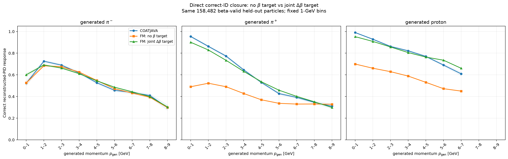
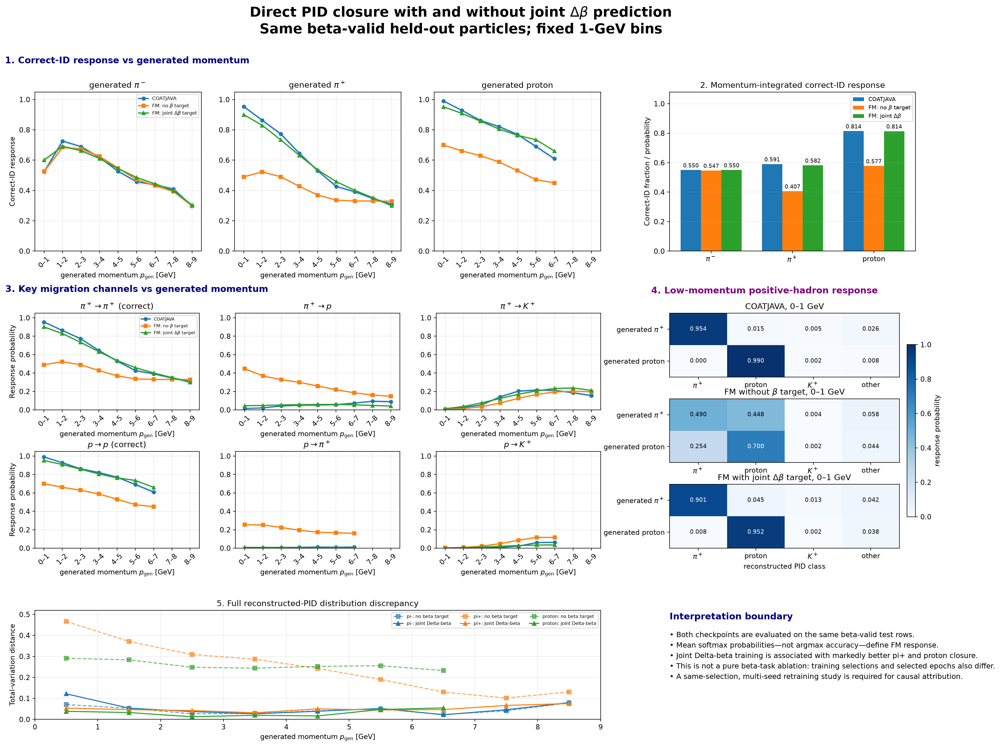
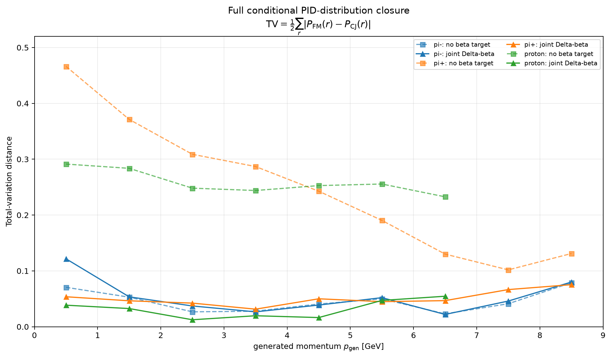

# Same-test PID closure: with and without joint beta prediction

## Definition and scope

For generated species $s$, reconstructed class $r$, and generated-momentum bin $b$:

$$
P_{\mathrm{CJ}}(r\mid s,b)=\frac{N(s,b,r)}{N(s,b)},
\qquad
P_{\mathrm{FM}}(r\mid s,b)=\frac{1}{N(s,b)}\sum_{i\in(s,b)}q_\theta(r\mid x_i).
$$

Here $q_\theta$ is the direct PID-head softmax. No argmax labels or sampled PID draws are used. Full-distribution closure is summarized by

$$
\mathrm{TV}(s,b)=\frac{1}{2}\sum_r
\left|P_{\mathrm{FM}}(r\mid s,b)-P_{\mathrm{CJ}}(r\mid s,b)\right|.
$$

Both checkpoints are evaluated on the same 158,482 beta-valid held-out particles and fixed 1-GeV bins. The no-beta checkpoint (epoch 16) has SHA-256 `22dde8fe78c5bec337e5014be46e4c8037673015bc88d4fbe812c05bebcffe11`; the joint-$\Delta\beta$ checkpoint (epoch 14) has SHA-256 `31e2c65ac417081123c87edf3fc7d874e618739b8b7cdd061c2ef3f92a102078`.

## Dr. Joo-style figures







## Momentum-integrated closure

| Generated species | N | COATJAVA correct | No-beta FM | Joint-$\Delta\beta$ FM | No-beta abs. error | Joint-$\Delta\beta$ abs. error | Error reduction | No-beta TV | Joint-$\Delta\beta$ TV |
|---|---:|---:|---:|---:|---:|---:|---:|---:|---:|
| pi- | 45,817 | 0.549971 | 0.546963 | 0.550227 | 0.003007 | 0.000257 | 0.002750 | 0.008525 | 0.002682 |
| pi+ | 56,774 | 0.590640 | 0.406701 | 0.582493 | 0.183939 | 0.008147 | 0.175792 | 0.236906 | 0.009410 |
| proton | 55,891 | 0.814299 | 0.577392 | 0.813916 | 0.236907 | 0.000383 | 0.236524 | 0.253707 | 0.002973 |

## Fixed-bin full-distribution closure

The weighted mean uses the particle count in each momentum bin. The maximum identifies the worst single fixed bin for each checkpoint.

| Generated species | No-beta weighted TV | Joint-$\Delta\beta$ weighted TV | Reduction | No-beta maximum TV (bin GeV) | Joint-$\Delta\beta$ maximum TV (bin GeV) |
|---|---:|---:|---:|---:|---:|
| pi- | 0.039209 | 0.042680 | -0.003471 | 0.078814 (8-9) | 0.121610 (0-1) |
| pi+ | 0.248669 | 0.047245 | 0.201425 | 0.466220 (0-1) | 0.075327 (8-9) |
| proton | 0.257262 | 0.027650 | 0.229612 | 0.291261 (0-1) | 0.054570 (6-7) |

### Six bins with the largest no-beta discrepancy

| Generated species | Momentum [GeV] | N | No-beta TV | Joint-$\Delta\beta$ TV | Reduction |
|---|---:|---:|---:|---:|---:|
| pi+ | 0–1 | 3,116 | 0.466220 | 0.053629 | 0.412591 |
| pi+ | 1–2 | 7,417 | 0.371263 | 0.046414 | 0.324849 |
| pi+ | 2–3 | 7,822 | 0.308778 | 0.042252 | 0.266526 |
| proton | 0–1 | 3,726 | 0.291261 | 0.038536 | 0.252726 |
| pi+ | 3–4 | 8,115 | 0.286855 | 0.031427 | 0.255428 |
| proton | 1–2 | 9,189 | 0.283649 | 0.032526 | 0.251123 |

## Low-momentum positive-hadron response (0–1 GeV)

| Generated | Reconstructed | COATJAVA | No-beta FM | Joint-$\Delta\beta$ FM |
|---|---|---:|---:|---:|
| pi+ | pi+ | 0.953787 | 0.490285 | 0.900530 |
| pi+ | proton | 0.015083 | 0.447594 | 0.045256 |
| pi+ | K+ | 0.005456 | 0.003879 | 0.012655 |
| pi+ | other | 0.025674 | 0.058242 | 0.041559 |
| proton | pi+ | 0.000268 | 0.253837 | 0.007795 |
| proton | proton | 0.990070 | 0.699536 | 0.952248 |
| proton | K+ | 0.002147 | 0.002196 | 0.002128 |
| proton | other | 0.007515 | 0.044432 | 0.037830 |

The `other` column sums every reconstructed class except $\pi^+$, proton, and $K^+$.

## Interpretation boundary

On this common test population, the joint-$\Delta\beta$ checkpoint is associated with substantially smaller direct PID closure errors for generated $\pi^+$ and protons, including the low-momentum cross-migration channels emphasized by Dr. Joo. The $\pi^-$ correct-ID closure also improves when integrated, although its worst low-momentum full-distribution bin remains visibly imperfect.

This comparison is controlled at evaluation time, not training time. The checkpoints share the architecture width/depth, PID loss weight, dataset fingerprint, event-split seed, and evaluation rows, but the no-beta model was trained with the older `rec_beta > -99` selection and three continuous targets; the beta model used $0<\beta_{\mathrm{rec}}\leq1.2$ and four continuous targets. They also selected different early-stopping epochs. Consequently, the plots establish an association, not that the auxiliary beta task alone caused the improvement. A same-selection no-beta retraining and multiple seeds are still required.

## Reproduce

```bash
python runs/gpu_beta_baseline/pid_beta_ablation_validation/pid_beta_ablation_validation.py
```

Machine-readable tables and metadata are stored beside this report.
