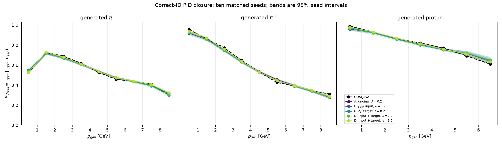
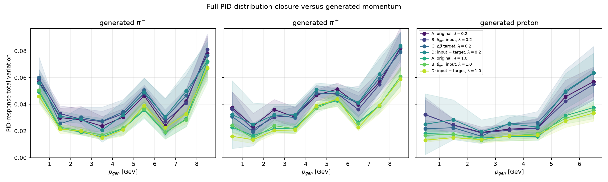
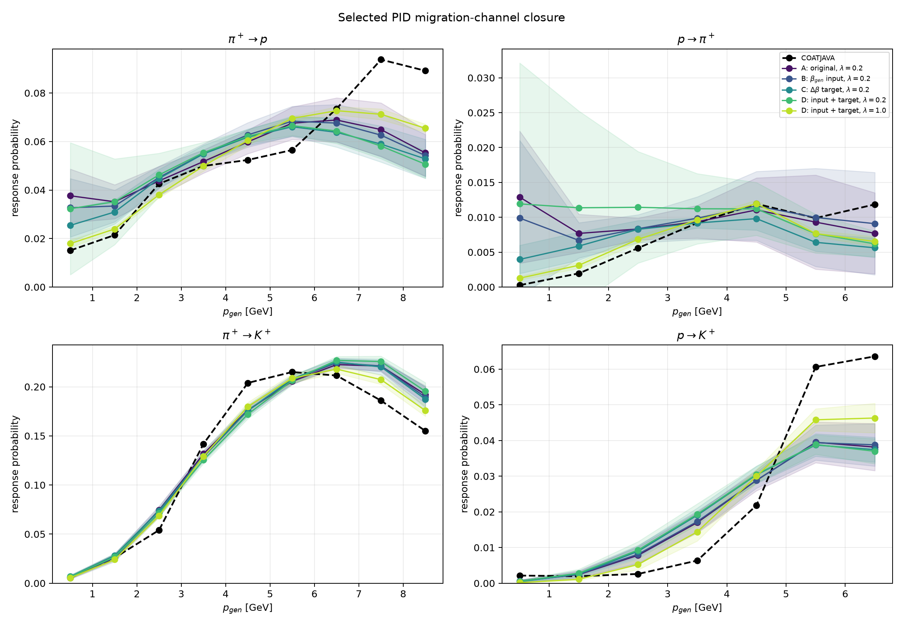

# Physics-informed beta-gen factorial study

All conditions use the same beta-valid teacher rows and event-disjoint split. The locked test checkpoint minimizes validation PID cross-entropy.

## Condition summary

| Condition | Macro TV | Correct-ID MAE | Test PID CE | Test PID accuracy |
|---|---:|---:|---:|---:|
| A_original | 0.03440 ± 0.00541 | 0.01851 ± 0.00405 | 1.00605 ± 0.00717 | 0.6768 ± 0.0005 |
| B_beta_input | 0.03413 ± 0.00445 | 0.01813 ± 0.00279 | 1.00572 ± 0.00623 | 0.6769 ± 0.0004 |
| C_beta_target | 0.03509 ± 0.00682 | 0.01880 ± 0.00307 | 1.00551 ± 0.00853 | 0.6770 ± 0.0005 |
| D_input_target_pid02 | 0.03593 ± 0.00738 | 0.01941 ± 0.00630 | 1.00603 ± 0.00776 | 0.6771 ± 0.0004 |
| D_input_target_pid1 | 0.02418 ± 0.00160 | 0.01202 ± 0.00102 | 0.99293 ± 0.00136 | 0.6775 ± 0.0002 |

## Interpretation

At $\lambda_{\rm PID}=0.2$, adding $\beta_{\rm gen}$ alone changed macro TV by +0.00027 (95% CI [-0.00179, +0.00234]); with $\Delta\beta$ already present, the corresponding change was -0.00085 ([-0.00490, +0.00321]). Neither input contrast is seed-stable.

Increasing $\lambda_{\rm PID}$ from 0.2 to 1.0 is the robust effect: macro TV falls by 0.01175 ([0.00688, 0.01662]) in 10/10 seeds (exact $p=0.001953$). Correct-ID MAE falls from 1.85% to 1.19% for $\pi^+$ and from 2.46% to 1.19% for protons.

The original condition already gives 2.06% $\pi^+$ and 2.09% proton MAE, so this controlled study does not reproduce the reported $18.4\%\rightarrow1.6\%$ and $23.3\%\rightarrow2.6\%$ $\beta_{\rm gen}$ improvements. The present result uses a beta-valid 158,482-particle test sample and a validation-PID checkpoint; exact reconciliation requires matching the checkpoint, selected population, and bin definition.

## Comparison with supplied figure values

| Species | Supplied no beta | Our A | Supplied beta, 0.2 | Our D, 0.2 | Supplied beta, 1.0 | Our D, 1.0 |
|---|---:|---:|---:|---:|---:|---:|
| $\pi^+$ | 18.4% | 2.06 ± 0.65% | 1.6% | 1.85 ± 0.80% | 1.3% | 1.19 ± 0.25% |
| Proton | 23.3% | 2.09 ± 0.59% | 2.6% | 2.46 ± 1.07% | 1.5% | 1.19 ± 0.28% |

The beta-informed endpoints agree within 0.11--0.31 percentage points. The no-beta controls differ by 16.34 and 21.21 points for $\pi^+$ and protons. Our condition C also gives only 1.79% and 2.34%, so whether the supplied no-beta model retained the $\Delta\beta$ target does not resolve the discrepancy.

## Paired primary contrasts

Positive improvement favors the treatment because both metrics are lower-is-better.

| Contrast | Metric | Mean improvement [95% CI] | Median | Favorable pairs | Exact p |
|---|---|---:|---:|---:|---:|
| beta_input_without_target | macro_weighted_bin_tv | 0.00027 [-0.00179, 0.00234] | -0.00007 | 5/10 | 0.771484 |
| beta_input_without_target | macro_correct_mae_unweighted | 0.00039 [-0.00191, 0.00268] | -0.00019 | 5/10 | 0.707031 |
| delta_beta_target_without_input | macro_weighted_bin_tv | -0.00068 [-0.00546, 0.00410] | 0.00022 | 6/10 | 0.748047 |
| delta_beta_target_without_input | macro_correct_mae_unweighted | -0.00029 [-0.00378, 0.00320] | -0.00108 | 4/10 | 0.853516 |
| combined_vs_original | macro_weighted_bin_tv | -0.00153 [-0.00583, 0.00277] | -0.00154 | 5/10 | 0.439453 |
| combined_vs_original | macro_correct_mae_unweighted | -0.00090 [-0.00539, 0.00360] | -0.00212 | 4/10 | 0.669922 |
| beta_input_with_target | macro_weighted_bin_tv | -0.00085 [-0.00490, 0.00321] | 0.00052 | 7/10 | 0.796875 |
| beta_input_with_target | macro_correct_mae_unweighted | -0.00061 [-0.00492, 0.00371] | 0.00173 | 6/10 | 0.921875 |
| delta_beta_target_with_input | macro_weighted_bin_tv | -0.00180 [-0.00639, 0.00278] | -0.00036 | 4/10 | 0.386719 |
| delta_beta_target_with_input | macro_correct_mae_unweighted | -0.00129 [-0.00654, 0.00397] | 0.00003 | 5/10 | 0.652344 |
| pid_weight_0.2_to_1.0 | macro_weighted_bin_tv | 0.01175 [0.00688, 0.01662] | 0.00976 | 10/10 | 0.001953 |
| pid_weight_0.2_to_1.0 | macro_correct_mae_unweighted | 0.00739 [0.00277, 0.01201] | 0.00738 | 9/10 | 0.003906 |
| factorial_interaction_beta_input_by_beta_target | macro_weighted_bin_tv | -0.00112 [-0.00593, 0.00369] | 0.00094 | 6/10 | 0.732422 |
| factorial_interaction_beta_input_by_beta_target | macro_correct_mae_unweighted | -0.00099 [-0.00667, 0.00468] | 0.00146 | 8/10 | 0.867188 |

## Dr. Joo-aligned correct-ID MAE

Values are unweighted momentum-bin MAE in percent, averaged over seeds.

| Species | A original | B beta input only | C beta target only | D input + target, 0.2 | D input + target, 1.0 |
|---|---:|---:|---:|---:|---:|
| $\pi^-$ | 1.40 ± 0.45% | 1.56 ± 0.46% | 1.51 ± 0.36% | 1.52 ± 0.42% | 1.22 ± 0.24% |
| $\pi^+$ | 2.06 ± 0.65% | 1.92 ± 0.28% | 1.79 ± 0.37% | 1.85 ± 0.80% | 1.19 ± 0.25% |
| proton | 2.09 ± 0.59% | 1.96 ± 0.65% | 2.34 ± 0.60% | 2.46 ± 1.07% | 1.19 ± 0.28% |

## Continuous beta response

| Condition | Mean beta W1 across species |
|---|---:|
| C_beta_target | 0.00475 ± 0.00065 |
| D_input_target_pid02 | 0.00499 ± 0.00112 |
| D_input_target_pid1 | 0.00534 ± 0.00067 |

Machine-readable results: `per_run_metrics.csv`, `condition_summary.csv`, and `paired_contrasts.csv`.
