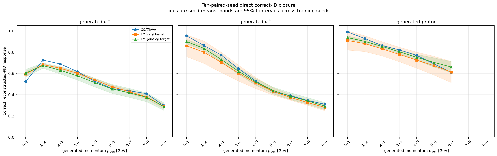
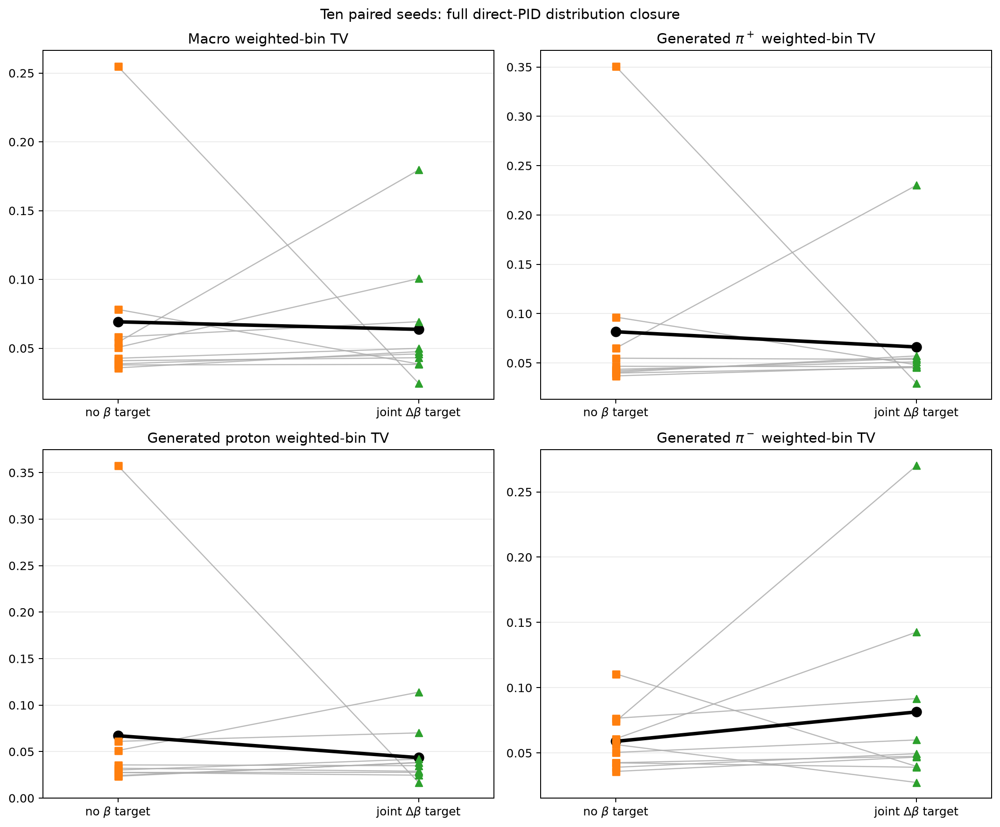
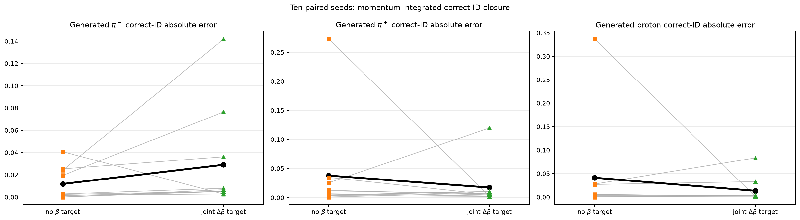

# Ten-paired-seed beta auxiliary-task ablation

## Confirmatory design

Twenty full-data models were trained as ten matched pairs with model/training seeds `20260822` through `20260831`. Every run uses the same 158,482-particle beta-valid held-out population, event split seed `20260822`, query-order seed `20260822`, shared architecture, optimizer, PID loss weight, batch size, and early-stopping policy.

Within a seed pair, component-specific initialization streams make the species embedding, shared backbone, mixture-weight head, and direct PID head exactly identical at epoch zero. The treatment adds only the fourth continuous target

$$
\Delta\beta=\beta_{\mathrm{rec}}-
\frac{p_{\mathrm{gen}}}{\sqrt{p_{\mathrm{gen}}^2+m_s^2}}.
$$

Training order was alternated between variants across pairs. All teacher fixed-bin fractions, selected row counts, selection SQL, and dataset fingerprints were verified identical.

## Primary paired outcomes

Positive paired improvement means that the joint-$\Delta\beta$ model closes better. Intervals are two-sided 95% Student-$t$ intervals over the ten paired improvements. The $p$ value is an exact two-sided paired sign-flip randomization test over all $2^{10}=1024$ sign assignments.

| Metric | No-beta mean ± SD | Joint-$\Delta\beta$ mean ± SD | Paired improvement [95% CI] | Better pairs | Exact $p$ |
|---|---:|---:|---:|---:|---:|
| Macro weighted-bin TV | 0.069213 ± 0.066470 | 0.063732 ± 0.045725 | 0.005481 [-0.058887, 0.069848] | 2/10 | 0.876953 |
| Macro correct-ID MAE | 0.030145 ± 0.061366 | 0.019845 ± 0.029424 | 0.010299 [-0.040877, 0.061476] | 6/10 | 0.845703 |

For macro TV, the mean improvement is 0.005481, but the median is -0.007215 and joint beta is better in only 2/10 pairs. For correct-ID MAE, the mean improvement is 0.010299, the median is 0.000146, and joint beta is better in 6/10 pairs. Both 95% intervals include zero, and neither exact test rejects a no-effect explanation.

Therefore this controlled study does **not** reproduce the earlier large single-checkpoint PID improvement as a reliable auxiliary-task effect. The means reflect a mixture of occasional rescued and degraded optimization runs, not a uniform shift across seeds.

The macro weighted-bin total-variation endpoint is

$$
\overline{\mathrm{TV}}_{\mathrm{macro}}=
\frac{1}{3}\sum_s
\frac{\sum_b N_{s,b}\,\mathrm{TV}(s,b)}{\sum_b N_{s,b}},
\qquad
\mathrm{TV}(s,b)=\frac{1}{2}\sum_r
\left|P_{\mathrm{FM}}(r\mid s,b)-P_{\mathrm{CJ}}(r\mid s,b)\right|.
$$

## Closure by generated species

| Generated species | Metric | No-beta mean ± SD | Joint-$\Delta\beta$ mean ± SD | Paired improvement [95% CI] | Better pairs | Exact $p$ |
|---|---|---:|---:|---:|---:|---:|
| $\pi^-$ | weighted-bin TV | 0.058897 ± 0.023013 | 0.081413 ± 0.074340 | -0.022516 [-0.073888, 0.028856] | 3/10 | 0.378906 |
| $\pi^-$ | integrated correct-ID abs. error | 0.011802 ± 0.014464 | 0.028971 ± 0.046078 | -0.017169 [-0.047182, 0.012844] | 1/10 | 0.251953 |
| $\pi^+$ | weighted-bin TV | 0.081660 ± 0.096159 | 0.066238 ± 0.058105 | 0.015422 [-0.070869, 0.101713] | 4/10 | 0.751953 |
| $\pi^+$ | integrated correct-ID abs. error | 0.037686 ± 0.083266 | 0.017225 ± 0.036188 | 0.020461 [-0.046586, 0.087508] | 6/10 | 0.632812 |
| proton | weighted-bin TV | 0.067082 ± 0.102772 | 0.043546 ± 0.028532 | 0.023536 [-0.057368, 0.104440] | 4/10 | 0.972656 |
| proton | integrated correct-ID abs. error | 0.040946 ± 0.104399 | 0.013340 ± 0.026443 | 0.027606 [-0.050799, 0.106011] | 4/10 | 0.837891 |

## Figures







## Secondary diagnostics

| Metric | No-beta mean ± SD | Joint-$\Delta\beta$ mean ± SD | Paired improvement [95% CI] | Exact $p$ |
|---|---:|---:|---:|---:|
| Worst fixed-bin TV | 0.167273 ± 0.125855 | 0.161926 ± 0.084393 | 0.005347 [-0.116345, 0.127039] | 0.925781 |
| Test PID cross entropy | 1.055002 ± 0.084806 | 1.050459 ± 0.057639 | 0.004543 [-0.077628, 0.086715] | 0.917969 |
| Test top-1 PID accuracy | 0.660142 ± 0.048276 | 0.674739 ± 0.001529 | 0.014597 [-0.020501, 0.049694] | 0.949219 |

## Training summary and interpretation

The no-beta models have 222,324 parameters and selected epochs 9–22; joint-$\Delta\beta$ models have 226,436 parameters and selected epochs 10–27.

The current early-stopping rule minimizes the combined validation response loss, not PID closure alone. This matters for the observed outliers. The worst no-beta PID-closure run (seed `20260826`) selected epoch 15, where validation PID accuracy was 0.5235; its lowest validation PID cross entropy occurred at epoch 20, where PID accuracy was 0.6754. The worst joint-beta run (seed `20260824`) likewise selected epoch 11 instead of its PID-cross-entropy optimum at epoch 16. This makes optimization and checkpoint selection a plausible source of the large paired swings; the study does not isolate a purely physical representation benefit from $\Delta\beta$.

The paired statistics quantify sensitivity to model initialization and shuffled training order on one fixed data split. They do not quantify uncertainty from new simulated datasets, alternative detector conditions, hyperparameter choices, or a changed event split. The ten seeds are independent training replicates, while particles within a held-out event are not treated as independent training replicates.

## Reproduce

```bash
python experiments/run_beta_multiseed_ablation.py --device cuda:0
python experiments/analyze_beta_multiseed_ablation.py
```

Machine-readable per-run, paired, aggregate, fixed-bin, provenance, and checkpoint-hash tables are stored beside this report.
