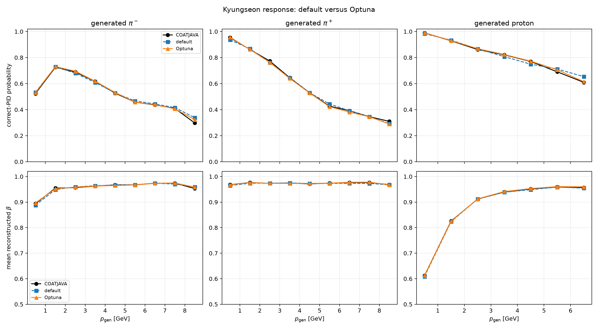

# Kyungseon β-response Optuna study

## Design

The selected physics task is fixed:

$$
(I_\beta,T_\beta,\lambda_{\rm PID})=(1,1,1),
$$

with the same particle population, event-disjoint split, response targets,
PID vocabulary, and $K=8$ mixture components as the branch default.
Hyperparameters are selected without using the test split by minimizing

$$
T_{\rm val}=
\frac{\sum_{s,b}N_{s,b}{\rm TV}_{s,b}}
{\sum_{s,b}N_{s,b}}.
$$

The study contains $16$ complete fixed-seed trials and no failed trials. It
includes the branch default and two recipes transferred from earlier Optuna
studies.

## Selection

| Parameter | Selected value |
|---|---:|
| Hidden width | 768 |
| Hidden layers | 6 |
| Dropout | 0.1418133 |
| Batch size | 4096 |
| Learning rate | 0.00295845 |
| Weight decay | 0.00014951 |
| Schedule | cosine |

The transferred recipe wins with $T_{\rm val}=0.009285$; the default gives
$0.019258$. The best newly proposed TPE trial gives $0.009328$, so fresh
retuning does not improve the transferred optimum within this budget.

## Same-seed test closure

| Metric | Default | Optuna | Change |
|---|---:|---:|---:|
| Particle-weighted PID TV | 0.023674 | 0.009119 | $-61.5\%$ |
| PID cross-entropy | 0.991976 | 0.976924 | $-1.5\%$ |
| PID accuracy | 0.677787 | 0.679945 | $+0.22$ points |
| Residual NLL | -4.952066 | -5.828562 | lower |
| Macro $W_1(\beta)$ | 0.005159 | 0.002334 | $-54.8\%$ |

Correct-ID MAE decreases from $1.07\%$ to $0.62\%$ for $\pi^-$, from
$0.78\%$ to $0.64\%$ for $\pi^+$, and from $1.67\%$ to $0.49\%$ for protons.

## Interpretation

Optuna helps primarily where the scientific objective asks it to help:
momentum-dependent stochastic PID closure and continuous β closure. The small
accuracy change shows that top-1 classification is not an adequate surrogate
for detector-response closure. This is one selected seed; it improves the
deployable endpoint but does not alter the branch's $10$-seed causal ablation.

The primary checkpoint SHA-256 is
`034b2d09458c09d86396e3f2532e34a37b2655b6aa6bdd4e15998c526960cad8`.
