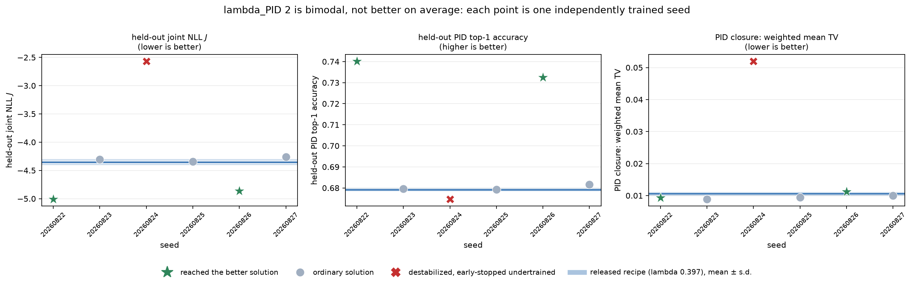
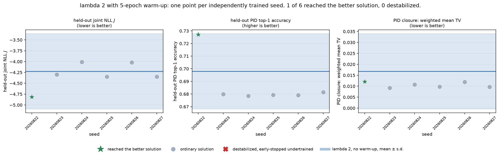

# Hyper-parameter tuning of the step-one FD response model

Branch `feature/optuna-hparam-tuning`, branched from `main`.
Hardware: two NVIDIA GeForce RTX 2080 Ti (11 GB each) on `wcs164084`,
PyTorch 2.11.0+cu128, Optuna 4.9.0.

## 1. What was assumed before, and what this changes

The published recipe (`configs/gpu_full.yaml`, `configs/tara_gpu_full.yaml`)
fixed a four-layer width-256 backbone, $K=8$ mixture components, thirty epochs,
a constant learning rate of $10^{-3}$, and $\lambda_{\mathrm{PID}}=0.20$. None
of those numbers had been searched. This study searches eleven hyper-parameters
jointly on the same deterministic, event-disjoint splits, and then retrains,
repeats over seeds, and evaluates on the untouched test split.

## 2. Objective and selection rule

### 2.1 Trials cannot be ranked by the training loss

The training objective is
$\mathcal L=\mathcal L_{\mathrm R}+\lambda_{\mathrm{PID}}\mathcal L_{\mathrm{PID}}$.
Because $\lambda_{\mathrm{PID}}$ is itself searched, a trial could lower
$\mathcal L$ by weighting the PID term less rather than by fitting better.
Trials are ranked instead by the validation **joint negative log likelihood**

$$
J=\mathrm{NLL}_\Delta+\mathrm{CE}_{\mathrm{PID}},
$$

the unweighted log density of the factorized model
$q(z_\Delta\mid z_x,s)\,q(c\mid z_x,s)$. It contains no $\lambda_{\mathrm{PID}}$
and is therefore comparable across every trial. Checkpoint selection inside a
trial uses the same quantity (`training.selection_metric: joint_nll`).

### 2.2 The likelihood alone does not choose the model

The search demonstrated the failure mode directly rather than hypothetically.
Trial 47 had the best likelihood of the whole study but distinctly worse
physics closure than trial 41:

| trial | $J$ | PID closure (mean TV) | moment closure |
|---:|---:|---:|---:|
| 47, best $J$ | **-4.7001** | 0.02959 | 0.04854 |
| 41, selected | -4.3748 | **0.01018** | **0.01555** |

A diagonal Gaussian mixture can buy log likelihood with heavy tails that cost
almost nothing in density while visibly distorting the sampled
$\mathrm{Std}\,(\Delta)$. Ranking on $J$ alone would have paid roughly a factor
of three in both closure metrics to gain 0.33 nats.

The final checkpoint is therefore chosen by closure **inside a likelihood
floor**:

$$
\text{feasible}=\{\text{trial}:J\le J_{\mathrm{floor}}\},\qquad
\text{selected}=\arg\min_{\text{feasible}}
\left[\frac{\mathrm{TV}}{\mathrm{median}\,\mathrm{TV}}
+\frac{\mathrm{moment}}{\mathrm{median}\,\mathrm{moment}}\right].
$$

$J_{\mathrm{floor}}=-3.63200$ is not a tuned constant: it is the best validation
$J$ of the published `runs/tara_gpu_full` run, which shares the seed and split
boundaries and is therefore in the same units. The rule reads *"fit the joint
density at least as well as the recipe being replaced, and among all such models
have the best physics closure."* 27 of 29 completed trials cleared the floor.
A configuration dominated on both closure axes can never minimize the composite,
so the selected trial is always on the closure Pareto front, here {37, 41, 42}.

### 2.3 Closure statistics

$$
\text{PID closure}=\frac{\sum_{s,b}N(s,b)\,\mathrm{TV}(s,b)}{\sum_{s,b}N(s,b)},
\qquad
\mathrm{TV}(s,b)=\tfrac12\sum_r\left|P_{\mathrm{FM}}(r\mid s,b)-P_{\mathrm{CJ}}(r\mid s,b)\right|,
$$

over generated species $s$ and fixed 1 GeV generated-momentum bins $b$, and

$$
\text{moment closure}=\frac19\sum_{s,t}
\left[\frac{|\mathrm E[t]_{\text{model}}-\mathrm E[t]_{\text{obs}}|}{\mathrm{Std}(t)_{\text{obs}}}
+\left|\frac{\mathrm{Std}(t)_{\text{model}}}{\mathrm{Std}(t)_{\text{obs}}}-1\right|\right],
$$

both dimensionless so that GeV and radian targets can be averaged.

## 3. Protocol

90 trials, multivariate TPE, median pruner with a twelve-epoch warm-up, one
worker per GPU with independent sampler seeds. 29 trials completed, 61 were
pruned, none failed. Total training cost 5,059 GPU-seconds.

Every trial used the same seed, so score differences are attributable to the
hyper-parameters and not to initialization noise. **The test split was never
touched during the search**, nor during the $\lambda_{\mathrm{PID}}$ scan, which
is itself a selection procedure.

**Pruning bias check.** Pruning a search in which the epoch budget is a
dimension can be unfair, because a trial on a long cosine schedule is
deliberately still at a high learning rate when a short-schedule trial is
already converging. Measured pruning rates were close to balanced, so no
correction was applied:

| | 40 epochs | 70 epochs | 100 epochs | cosine | constant |
|---|---:|---:|---:|---:|---:|
| pruned | 3 | 4 | 5 | 5 | 7 |
| completed | 3 | 2 | 4 | 4 | 5 |

(counts at the time of the check, part-way through the study)

## 4. What actually mattered

fANOVA importance for $J$ over the completed trials:

| hyper-parameter | importance |
|---|---:|
| learning rate | 0.333 |
| hidden width | 0.260 |
| hidden layers | 0.141 |
| mixture components $K$ | 0.103 |
| batch size | 0.071 |
| $\lambda_{\mathrm{PID}}$ | 0.026 |
| weight decay | 0.016 |
| dropout | 0.014 |
| epoch budget | 0.013 |
| LR schedule | 0.013 |
| species embedding dim | 0.011 |

The learning rate dominates: the baseline's $10^{-3}$ is well below the
productive region, which the search places at $2$-$4\times10^{-3}$. Width is
second, and the search does move it up from 256, but not monotonically -- the
1024-wide configurations did not win, and depth beyond about six layers did not
help.

The importance of the epoch budget and the schedule is understated by this
statistic and should not be read as "they do not matter". fANOVA explains
variance *over the observed distribution of completed trials*, and TPE
concentrated on cosine schedules with a 70-epoch budget, leaving little variance
in those dimensions to explain. The eight best trials by closure composite were
unanimously cosine and seven of eight used a 70-epoch budget.

## 5. Selected configuration

Trial 41, written to `configs/gpu_optuna_best.yaml`.

| | baseline (`gpu_full.yaml`) | tuned | change |
|---|---:|---:|---|
| `hidden_width` | 256 | 768 | 3x wider |
| `hidden_layers` | 4 | 6 | deeper |
| `pid_embedding_dim` | 16 | 8 | smaller |
| `mixture_components` | 8 | 8 | unchanged |
| `dropout` | 0.03 | 0.1418 | much stronger |
| `epochs` | 30 | 70 | longer |
| `batch_size` | 8192 | 4096 | smaller |
| `learning_rate` | 0.001 | 0.002958 | 3x higher |
| `weight_decay` | 1e-05 | 0.0001495 | 15x higher |
| `pid_loss_weight` | 0.20 | 0.3975 | 2x higher |
| `lr_schedule` | constant | cosine | new |
| trainable parameters | 222,324 | 3,024,476 | 13.6x |

The selected checkpoint is epoch 70 of a 70-epoch budget, so the cosine schedule
was still improving when it ended. The epoch budget is binding, and a longer
schedule is the most obvious next thing to try.

## 6. Held-out test results

Both recipes were retrained to completion on this hardware and evaluated on the
untouched 158,985-row test split, seed 20260822.

| Metric | Published `tara_gpu_full` | Baseline reproduction | **Tuned** |
|---|---:|---:|---:|
| Residual negative log likelihood | -4.7581 | -4.5304 | **-5.3365** |
| Reconstructed-PID cross entropy | 1.1774 | 1.0294 | **0.9806** |
| Joint negative log likelihood $J$ | -3.5808 | -3.5011 | **-4.3559** |
| Reconstructed-PID top-1 accuracy | 67.22% | 67.50% | **67.93%** |
| Maximum PID marginal discrepancy | 0.426% | 0.291% | **0.200%** |
| PID closure, particle-weighted mean TV | -- | 0.04423 | **0.01001** |
| PID closure, worst momentum bin TV | -- | 0.16402 | **0.05039** |
| Moment closure error | 0.05291 | 0.05614 | **0.03152** |
| Physical sampled $(p,\theta)$ fraction | 97.13% | 96.11% | **99.08%** |
| Trainable parameters | 222,324 | 222,324 | 3,024,476 |
| Test evaluation throughput | 112,434/s | 74,579/s | 76,012/s |

The published run and the reproduction differ because they are two draws of the
same recipe on different hardware; the reproduction lies inside the baseline
seed spread measured in section 7. Throughput differs because the published run
used an H100 and these runs use a 2080 Ti. The two dashes are quantities the
published run predates.

Per generated species, on the same test particles:

| Generated species | Baseline mean TV | Tuned mean TV | Baseline worst bin | Tuned worst bin | Baseline mean absolute correct-ID error | Tuned |
|---|---:|---:|---|---|---:|---:|
| $\pi^-$ | 0.04193 | **0.01085** | 0.10337 (0-1 GeV) | 0.05039 (8-9 GeV) | 0.01991 | **0.00452** |
| $\pi^+$ | 0.05397 | **0.01122** | 0.16402 (8-9 GeV) | 0.02867 (8-9 GeV) | 0.02343 | **0.00413** |
| proton | 0.03620 | **0.00807** | 0.12816 (6-7 GeV) | 0.01916 (5-6 GeV) | 0.03151 | **0.00573** |


The baseline's PID response departs from the COATJAVA teacher at both ends of
the momentum range, and in opposite directions for the two pion charges. Above
about 6 GeV it over-predicts correct identification for protons and $\pi^+$, by
up to $+0.125$ for protons in the 6-7 GeV bin and $+0.085$ for $\pi^+$ in the
8-9 GeV bin, while under-predicting it for $\pi^-$ by about $-0.035$. At the
lowest momenta it under-predicts for $\pi^+$ and protons, by $-0.043$ and
$-0.058$ in the 0-1 GeV bin, and over-predicts for $\pi^-$ by $+0.044$. The
tuned model stays within $\pm0.031$ everywhere and within $\pm0.010$ in all but
three of the twenty-five bins, tracking the teacher inside its statistical error
bars over almost the whole range.


The tuned model has a lower total-variation distance than the baseline in every
momentum bin of every species.


## 7. Seed repeats

A single seed cannot separate an architectural gain from run-to-run luck. Both
recipes were retrained at seeds 20260823 and 20260824. In this project the seed
drives the model initialization *and* the deterministic hash that assigns events
to train/validation/test, so a repeat varies the data partition as well. That
makes the spread a measure of total run-to-run variability, and it makes the two
recipes exactly paired: at a given seed both saw the same events.

| Metric | Baseline mean $\pm$ s.d. | Tuned mean $\pm$ s.d. | Paired difference | Paired $t$ | Same sign in all 3 |
|---|---:|---:|---:|---:|:--:|
| Residual NLL | $-4.6388\pm0.0949$ | $-5.3350\pm0.0421$ | $-0.6961$ | $-10.9$ | yes |
| PID cross entropy | $1.0351\pm0.0204$ | $0.9817\pm0.0032$ | $-0.0534$ | $-4.0$ | yes |
| Joint NLL $J$ | $-3.6037\pm0.0950$ | $-4.3533\pm0.0452$ | $-0.7496$ | $-10.8$ | yes |
| PID top-1 accuracy | $0.67537\pm0.00031$ | $0.67916\pm0.00057$ | $+0.00379$ | $+9.8$ | yes |
| PID weighted mean TV | $0.0495\pm0.0158$ | $0.0105\pm0.0005$ | $-0.0390$ | $-4.2$ | yes |
| PID worst-bin TV | $0.1346\pm0.0581$ | $0.0361\pm0.0124$ | $-0.0985$ | $-3.2$ | yes |
| Moment closure error | $0.0416\pm0.0127$ | $0.0240\pm0.0073$ | $-0.0175$ | $-4.8$ | yes |
| Physical sample fraction | $0.9769\pm0.0138$ | $0.9911\pm0.0004$ | $+0.0143$ | $+1.8$ | yes |


Every metric improves, and the improvement has the same sign in all three
paired seeds. With three seeds the $t$ values are descriptive, not a hypothesis
test, but the joint likelihood and the PID closure separate by far more than the
observed spread. The tuned recipe is also markedly *more stable*: its standard
deviation is smaller than the baseline's on every quantity, by a factor of
thirty for the PID closure and the physical-sample fraction.

## 8. How reliable are the two closure statistics?

Before comparing small closure differences it is worth knowing their resolution.
The two statistics are not alike, and the difference is structural rather than
incidental.

`pid_closure_tv` is built from the *mean PID-head softmax probability*, which is
a deterministic function of the checkpoint. `moment_closure_error` is built from
one stochastic draw per particle, and its width term is a sample standard
deviation; a mixture density with heavy tails puts real weight on rare large
draws, and a second moment is exactly what such draws move.

`experiments/closure_sampling_uncertainty.py` re-samples a fixed checkpoint under
ten sampling seeds on the validation split, holding weights and data constant:

| Run | moment closure, mean $\pm$ s.d. | moment peak-to-peak | PID TV s.d. |
|---|---:|---:|---:|
| baseline reproduction | $0.06074\pm0.00315$ | 0.01054 | $0$ exactly |
| tuned | $0.03138\pm0.00239$ | 0.00866 | $0$ exactly |

So:

- Every PID closure comparison in this report is exact given the checkpoints.
  Re-sampling cannot move it at all, which is also a check that the harness does
  what section 2.3 claims.
- Moment closure carries $\sigma\approx0.003$ per evaluation. Differences below
  about 0.006 between two checkpoints mean nothing on their own. The
  tuned-versus-baseline gap of 0.029 on validation is roughly ten times that, so
  it is safe; but the per-cell width ratios in section 6 should not be read to
  the fourth decimal, and neither should small wiggles in the scan below.

## 9. What $\lambda_{\mathrm{PID}}$ actually does

The joint search ranked $\lambda_{\mathrm{PID}}$ sixth of eleven by fANOVA
importance, which invites the conclusion that the weight hardly matters. That
conclusion is wrong, and the controlled scan shows why: the search samples
$\lambda$ jointly with everything else, and TPE concentrated on small values
early, so it never paired a large $\lambda$ with the architecture it eventually
selected.

Holding the entire selected configuration fixed and moving only
$\lambda_{\mathrm{PID}}$, on the validation split:

| $\lambda_{\mathrm{PID}}$ | residual NLL | PID cross entropy | $J$ | PID top-1 accuracy | PID closure TV | moment closure |
|---:|---:|---:|---:|---:|---:|---:|
| 0.05 | -5.3332 | 0.9818 | -4.3514 | 0.6801 | 0.01219 | 0.01498 |
| 0.1 | -5.3436 | 0.9807 | -4.3629 | 0.6800 | 0.01110 | 0.01821 |
| 0.2 | -5.3661 | 0.9802 | -4.3859 | 0.6800 | 0.01070 | 0.01169 |
| 0.5 | -5.3652 | 0.9795 | -4.3857 | 0.6801 | 0.00949 | 0.01393 |
| 1 | -5.3446 | 0.9789 | -4.3657 | 0.6802 | 0.00982 | 0.01123 |
| **2** | **-5.7137** | **0.7164** | **-4.9973** | **0.7399** | 0.00858 | **0.00714** |
| 5 | -5.7000 | 0.7144 | -4.9856 | **0.7403** | 0.00840 | 0.02298 |
| 10 | -5.6976 | 0.7145 | -4.9831 | 0.7400 | **0.00832** | 0.02119 |


This is not the smooth trade-off the objective implies. Between $\lambda=1$ and
$\lambda=2$ there is a step: PID top-1 accuracy jumps from 0.680 to 0.740, PID
cross entropy falls from 0.979 to 0.716, and the *residual* likelihood improves
as well, from -5.34 to -5.71. Above $\lambda=2$ everything plateaus. Both terms
of the objective improving together is not a re-weighting effect; the run has
reached a different and better solution.

A plausible mechanism is that with `gradient_clip_norm = 5.0` and a learning rate
of $3\times10^{-3}$ the clip is frequently active, so raising
$\lambda_{\mathrm{PID}}$ changes the *direction* of the clipped update and not
only the relative weight of the two losses. That is a hypothesis this study did
not test, and it is written here as one.

## 10. Is the large-$\lambda$ regime usable? Not yet

The scan above was run at one seed. Because the effect is large and would change
the recommended recipe, the $\lambda_{\mathrm{PID}}=2$ configuration was
retrained at six seeds and evaluated on the held-out test split. It does not
survive.

| Seed | Epochs run | Test $J$ | Test PID top-1 | PID closure TV | Outcome |
|---|---:|---:|---:|---:|---|
| 20260822 | 70 | **-5.0091** | **0.7402** | 0.00936 | reached the better solution |
| 20260823 | 70 | -4.3041 | 0.6796 | 0.00888 | ordinary |
| 20260824 | **12** | -2.5682 | 0.6747 | 0.05196 | destabilized, early-stopped undertrained |
| 20260825 | 70 | -4.3455 | 0.6792 | 0.00943 | ordinary |
| 20260826 | 70 | **-4.8605** | **0.7326** | 0.01118 | reached the better solution |
| 20260827 | 70 | -4.2591 | 0.6816 | 0.01001 | ordinary |



Two of six seeds reach the better solution, three are ordinary, and one
destabilizes badly enough that the patience rule stops it at epoch 12 with a
barely-trained model. The released recipe's own three-seed band is the blue
line, narrow enough to be invisible at this scale. Over all six seeds

$$
J=-4.224\pm0.870,
$$

against $-4.353\pm0.045$ for the selected $\lambda_{\mathrm{PID}}=0.397$
configuration. Excluding the diverged run it is $-4.556\pm0.351$: a better mean,
but still with roughly eight times the spread.

So the honest summary is that $\lambda_{\mathrm{PID}}\ge2$ is **not** an
improvement in expectation, and it is much less reliable. It is a large
opportunity with an unsolved optimization problem attached, not a recipe change
that can be shipped. The released configuration keeps
$\lambda_{\mathrm{PID}}=0.397$.

Two further observations sharpen what is and is not on offer:

- Where the better solution *is* reached, the gain is in per-particle
  discrimination and likelihood -- top-1 accuracy 0.740 against 0.679, test $J$
  $-5.009$ against $-4.356$ -- and **not** in the distributional PID closure
  that the physics deliverable actually targets. The particle-weighted mean TV
  is 0.00936 against 0.01001, which is a 7% relative change on a quantity the
  tuned model has already brought within 0.01 of the teacher.
- The divergent seed is the one that matters operationally. Its PID closure TV
  is 0.052, worse than the hand-written baseline's 0.044, so a single unlucky
  seed at $\lambda=2$ produces a model worse than the recipe being replaced.

The natural follow-up, which this study did not run, is to test whether a
learning-rate warm-up, a lower peak learning rate, or a schedule that ramps
$\lambda_{\mathrm{PID}}$ during training makes the better solution reachable
reliably. If it does, roughly six points of PID top-1 accuracy are available.

## 11. Recommendation

Use `configs/gpu_optuna_best.yaml`. Relative to the hand-written recipe it is
better on every held-out quantity measured, in all three paired seeds, and it is
also markedly more stable run to run.

Do not use $\lambda_{\mathrm{PID}}\ge2$ in production until the instability in
section 10 is understood.

## 12. Reproduction

```bash
experiments/run_tuning_pipeline.sh        # stages 1-7
experiments/run_tuning_pipeline.sh 2 6    # re-analyse and re-compare only
```

The study as reported used 90 search trials (5,059 GPU-seconds), two full
training runs, four seed repeats, an eight-point $\lambda_{\mathrm{PID}}$ scan,
six seeds at $\lambda_{\mathrm{PID}}=2$, and two sampling-uncertainty studies,
on two RTX 2080 Ti.

## 13. Follow-up: does learning-rate warm-up rescue the large weight?

Section 10 left a specific hypothesis: the $\lambda_{\mathrm{PID}}\ge2$ setting
might be unusable only because of its first few hundred updates, in which case
a warm-up would make the better solution reachable reliably. The diverged seed
peaked at epoch 2, so the window in question is a fraction of one epoch and an
epoch-granularity scheduler cannot address it. `training.lr_warmup_epochs`
therefore switches the learning rate to a per-step schedule: a linear ramp over
the given number of epochs' worth of optimizer steps, then the configured
cosine decay.

The same $\lambda_{\mathrm{PID}}=2$ configuration was retrained at the same six
seeds with a five-epoch warm-up (about 1,550 optimizer steps).

| Seed | No warm-up: epochs / best epoch / $J$ / top-1 | With warm-up: epochs / best epoch / $J$ / top-1 |
|---|---|---|
| 20260822 | 70 / 70 / **-5.0091** / **0.7402** | 70 / 70 / **-4.8149** / **0.7271** |
| 20260823 | 70 / 67 / -4.3041 / 0.6796 | 70 / 70 / -4.2970 / 0.6799 |
| 20260824 | **12 / 2 / -2.5682 / 0.6747** | 70 / 69 / -4.0093 / 0.6784 |
| 20260825 | 70 / 70 / -4.3455 / 0.6792 | 70 / 70 / -4.3476 / 0.6793 |
| 20260826 | 70 / 70 / **-4.8605** / **0.7326** | 62 / 52 / -4.0183 / 0.6791 |
| 20260827 | 70 / 69 / -4.2591 / 0.6816 | 70 / 67 / -4.3484 / 0.6815 |



| | reached the better solution | destabilized | $J$ mean $\pm$ s.d. |
|---|---:|---:|---:|
| $\lambda=2$, no warm-up | 2 of 6 | 1 of 6 | $-4.224\pm0.870$ |
| $\lambda=2$, 5-epoch warm-up | **1 of 6** | **0 of 6** | $-4.306\pm0.294$ |
| released, $\lambda=0.397$ | n/a | 0 of 3 | $-4.353\pm0.045$ |

The hypothesis is **half right, and the half that fails is the important one**.

Warm-up does what it was supposed to do about stability: the divergence is gone.
Seed 20260824, which previously peaked at epoch 2 and was stopped at epoch 12
with $J=-2.5682$, now trains for the full schedule and lands at $-4.0093$. No
seed destabilizes, and the spread falls by a factor of three, from $\pm0.870$ to
$\pm0.294$.

But it does not make the *gain* reliable. It makes it rarer: one seed of six
reaches the better solution instead of two, and seed 20260826 -- which reached it
without warm-up -- no longer does. The one seed that still gets there arrives
slightly lower than before, $J=-4.8149$ against $-5.0091$ and top-1 0.7271
against 0.7402.

Read together, these point away from the original framing. The large early
updates are not merely an unwanted side effect to be damped; they appear to be
causally involved in reaching the better solution. Suppressing them suppresses
the divergence and the jump together. That is consistent with the mechanism
suggested in section 9 -- that a large $\lambda_{\mathrm{PID}}$ acts through the
*direction* of the clipped update rather than through the loss weighting -- but
it is now clear that damping the early phase is not the way to exploit it.

Even with warm-up the setting is still worse than the released recipe on both
mean and spread, so the recommendation in section 11 is unchanged.

A more promising direction than warm-up, and untested here, is to make the
better solution the *target* rather than an accident: train at
$\lambda_{\mathrm{PID}}=0.397$ for the residual density and fine-tune the PID
head at a large weight, or decouple the two heads' learning rates, so that the
PID term can be strong without the shared trunk's early updates being at risk.

## 14. Can the better solution be reached on purpose?

Section 13 showed that damping the early phase with a warm-up removes the
instability and most of the gain together. Two further attempts were made to
reach the better solution deliberately rather than by accident, both at
$\lambda_{\mathrm{PID}}=2$ and both over the same six seeds.

**A. Fine-tune, so there is no fragile early phase to survive.** Each seed's own
released checkpoint is warm started and the whole model is fine-tuned for 20
epochs at $\lambda_{\mathrm{PID}}=2$ with a tenth of the peak learning rate. The
checkpoint must come from the same seed: the seed drives the partition hash, so
warm starting across seeds would leak the source split's training rows into this
run's test split. `train.py --init-from` verifies this by comparing the stored
feature and target scalers and refuses a mismatch.

**B. Decouple the learning rates, so the PID term can be strong without large
trunk updates.** `pid_loss_weight` alone couples "how fast the PID head learns"
to "how hard the PID term perturbs the shared trunk". Training from scratch at
$\lambda_{\mathrm{PID}}=2$ with `backbone_lr_multiplier: 0.25` separates them:
the trunk and the species embedding take quarter-size steps while both heads keep
the full rate.

Six seeds each, held-out test split. A run counts as a failure when its joint
NLL is more than 0.5 nats worse than the released group's mean; failure is
defined on the outcome rather than on early stopping, because an early best
epoch means divergence for a from-scratch run but only "fine-tuning did not
help" for a warm-started one.

| Strategy | $J$ mean $\pm$ s.d. | PID top-1 mean $\pm$ s.d. | PID closure TV | reached better | failed |
|---|---:|---:|---:|---:|---:|
| released, $\lambda=0.397$ | $-4.3417\pm0.0416$ | $0.6796\pm0.0010$ | $0.01054$ | 0 of 6 | 0 |
| $\lambda=2$ from scratch | $-4.2244\pm0.8701$ | $0.6980\pm0.0299$ | $0.01680$ | **2 of 6** | 1 |
| A: fine-tune at $\lambda=2$ | $-4.3430\pm0.0395$ | $0.6796\pm0.0011$ | $0.01048$ | **0 of 6** | 0 |
| B: decoupled trunk LR | $-4.3547\pm0.0529$ | $0.6796\pm0.0010$ | $0.01207$ | **0 of 6** | 0 |


**Both attempts fail, and they fail in the same informative way.** Neither
reaches the better solution in any of six seeds, and both land statistically on
top of the released recipe: PID top-1 of $0.6796\pm0.0011$ and
$0.6796\pm0.0010$ against the released $0.6796\pm0.0010$. These are not small
improvements, they are the same number.

Fine-tuning tells us the better solution is not reachable by gradient descent
from the released optimum: starting there and raising the weight leaves the
model where it already was, and in one seed the fine-tune never improved on its
starting point at all. Decoupling tells us the trunk's large updates are the
mechanism rather than a side effect, because protecting the trunk removes the
effect just as warm-up did, and it does so without any instability to blame.

Three independent interventions -- warm-up, fine-tuning, and a smaller trunk
learning rate -- each stabilize training, and each removes the gain. The
consistent reading is that the better solution is a *different basin* that is
only entered by a large, undamped perturbation of the shared trunk early in
training. It is reached by luck, and every attempt here to reach it on purpose
has instead prevented it.

That closes off the "just stabilize it" family of fixes with evidence. What
remains untried is changing the problem rather than the schedule: coupling the
heads so PID and residual predictions are not conditionally independent
(limitation 3), a different PID head parameterization, or an explicit
multi-restart procedure that trains several seeds at $\lambda\ge2$ and keeps the
one that lands well -- which is honest about being a search rather than a recipe,
and at two successes in six seeds would cost about three training runs per
usable model.

The released configuration is unchanged.
