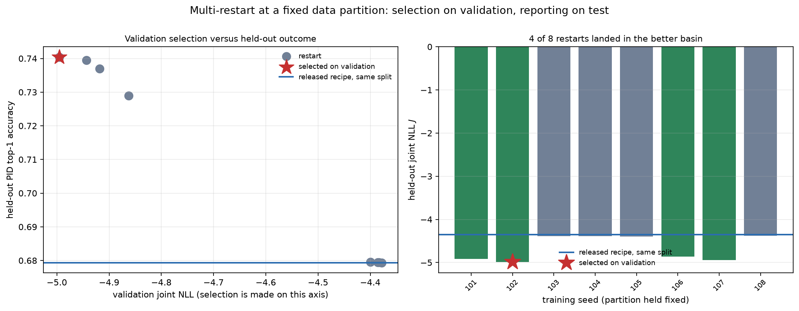

# Tuning the step-one FD response model

Branch `feature/optuna-hparam-tuning`, from `main`. Two NVIDIA RTX 2080 Ti on
`wcs164084`; PyTorch 2.11.0+cu128, Optuna 4.9.0. All raw tables and figures are
in this directory; run-level artifacts are under `runs/`.

The published recipe fixed a four-layer width-256 backbone, $K=8$, thirty
epochs, a constant learning rate of $10^{-3}$, and $\lambda_{\mathrm{PID}}=0.20$.
None had been searched.

## 1. Definitions

**1.1** (*search objective*). For a fitted model on $N$ held-out rows,

$$
J:=\mathrm{NLL}_\Delta+\mathrm{CE}_{\mathrm{PID}}
=-\frac1N\sum_i\log q_\vartheta(z_{\Delta,i}\mid z_{x,i},s_i)
-\frac1N\sum_i\log q_\vartheta(c_i\mid z_{x,i},s_i).
$$

**1.2 Remark.** $J$ is the log density of $q(z_\Delta\mid z_x,s)\,q(c\mid z_x,s)$
and contains no $\lambda_{\mathrm{PID}}$; the training loss
$\mathcal L=\mathrm{NLL}_\Delta+\lambda_{\mathrm{PID}}\mathrm{CE}_{\mathrm{PID}}$
does, so it cannot rank trials while $\lambda_{\mathrm{PID}}$ is searched — a
trial could win by down-weighting the PID term rather than by fitting better.
Checkpoint selection within a trial uses $J$ (`selection_metric: joint_nll`).
Since $J$ is a density in a standardization fitted on the training split, it is
comparable only within one partition; the code refuses a reference run whose
seed or split boundaries differ.

**1.3** (*closure functionals*). For generated species $s$, reconstructed class
$r$, fixed 1 GeV generated-momentum bins $b$, teacher $P_{\mathrm{CJ}}$ and
mean PID-head softmax $P_{\mathrm{FM}}$,

$$
\mathrm{TV}(s,b):=\tfrac12\sum_r\bigl|P_{\mathrm{FM}}(r\mid s,b)-P_{\mathrm{CJ}}(r\mid s,b)\bigr|,
\qquad
T:=\frac{\sum_{s,b}N(s,b)\,\mathrm{TV}(s,b)}{\sum_{s,b}N(s,b)},
$$

$$
M:=\frac19\sum_{s}\sum_{t\in\{\Delta p,\Delta\theta,\Delta\phi\}}
\left[\frac{\bigl|\mathrm E[t]_{\mathrm{mod}}-\mathrm E[t]_{\mathrm{obs}}\bigr|}{\sigma_{\mathrm{obs}}(t)}
+\left|\frac{\sigma_{\mathrm{mod}}(t)}{\sigma_{\mathrm{obs}}(t)}-1\right|\right].
$$

Both are dimensionless and lower-better; $A$ denotes held-out PID top-1 accuracy.

**1.4** (*final selection*). With $J_0:=-3.63200$ the published baseline's
validation $J$ and $F:=\{\text{trial}:J\le J_0\}$,

$$
\text{selected}:=\underset{F}{\arg\min}\ \Bigl[T/\mathrm{med}_F\,T+M/\mathrm{med}_F\,M\Bigr].
$$

**1.5 Remark.** Selecting on $J$ alone is unsafe: a mixture buys log density with
heavy tails that cost little in density but distort $\sigma_{\mathrm{mod}}$. The
least-$J$ trial had $(T,M)=(0.0296,0.0485)$ against $(0.0102,0.0156)$ for the
selected trial 41, at a $J$ advantage of $0.33$ nats. A point dominated in both
coordinates cannot minimize the composite, so the selection lies on the $(T,M)$
Pareto front, here $\{37,41,42\}$. $J_0$ is read from a reference run, not tuned;
27 of 29 completed trials cleared it.

## 2. Experiments

Held-out numbers are on the untouched test split. The search, the scan and all
selection use validation only.

| | Design | Scale |
|---|---|---|
| E1 | multivariate TPE over 11 dimensions, median pruner, 12-epoch warm-up | 90 trials: 29 complete, 61 pruned, 0 failed, 5,059 GPU s |
| E2 | seed repeats of baseline and tuned recipes, paired | 3 + 6 runs |
| E3 | $\lambda_{\mathrm{PID}}$ scan, architecture and schedule fixed | 8 values |
| E4 | re-sampling one fixed checkpoint under 10 sampling seeds | 10 draws $\times$ 2 runs |
| E5 | $\lambda_{\mathrm{PID}}{=}2$ seed repeats | 6 runs |
| E6 | $\lambda_{\mathrm{PID}}{=}2$ with 5-epoch per-step warm-up | 6 runs |
| E7 | $\lambda_{\mathrm{PID}}{=}2$ by fine-tune; by trunk LR $\times0.25$ | 6 + 6 runs |
| E8 | restart pools, partition pinned, validation-only selection | 4 pools, 28 runs |

**2.1 Remark** (*pruning bias*). Pruning a search whose epoch budget is itself a
dimension can be unfair: a long cosine trial is deliberately still at a high
learning rate when a short one is converging. Measured rates were near balanced
(pruned/completed: 3/3, 4/2, 5/4 at 40, 70, 100 epochs; 5/4 cosine, 7/5
constant), so no correction was applied.

**2.2 Remark** (*seeds*). Every E1 trial used one seed, so differences are
attributable to hyper-parameters. In E2 and E5-E7 the seed drives initialization
*and* the partition hash, so a repeat varies the data too; this makes the spread
a measure of total run-to-run variability and makes the recipes exactly paired at
each seed. In E8 `data.split_seed` pins the partition and only the initialization
varies — required, since selecting across seeds would otherwise select across
different test splits.

## 3. Result: parameter choices

`configs/gpu_optuna_best.yaml`, from E1 trial 41; 222,324 $\to$ 3,024,476
parameters.

| Parameter | Assumed | Final | Established by |
|---|---:|---:|---|
| `learning_rate` | 0.001 | **0.002958** | E1; fANOVA 0.333, dominant |
| `hidden_width` | 256 | **768** | E1; 0.260, non-monotone (1024 loses) |
| `hidden_layers` | 4 | **6** | E1; 0.141, flat beyond 6 |
| `mixture_components` | 8 | **8** | E1; 0.103, assumption confirmed |
| `batch_size` | 8192 | **4096** | E1; 0.071 |
| `lr_schedule` | constant | **cosine** | E1; 8/8 of the best trials by closure |
| `epochs` | 30 | **70** | E1; 7/8 of the best trials; binding, see 9.2 |
| `dropout` | 0.03 | **0.1418** | E1; 0.014 |
| `weight_decay` | $10^{-5}$ | **$1.495\times10^{-4}$** | E1; 0.016 |
| `pid_embedding_dim` | 16 | **8** | E1; 0.011 |
| `pid_loss_weight` | 0.20 | **0.3975** | E1; 0.026, but see 5-8 |

Search space: width $\in\{128,\dots,1024\}$, layers $3$-$8$, embedding
$\{8,16,32\}$, $K\in\{5,8,12,16,24\}$, dropout $0$-$0.15$, epochs
$\{40,70,100\}$, batch $\{4096,8192,16384\}$, learning rate
$2\times10^{-4}$-$4\times10^{-3}$ log, weight decay $10^{-8}$-$10^{-3}$ log,
$\lambda_{\mathrm{PID}}$ $0.05$-$10$ log, schedule $\{$constant, cosine$\}$.


**3.1 Remark.** fANOVA explains variance over the trials actually run. TPE
concentrated on cosine schedules at a 70-epoch budget, leaving little variance in
those dimensions, so their importances (0.013 each) understate them; among the
eight best trials by closure composite, 8/8 were cosine and 7/8 used 70 epochs.
The same caveat inverts the reading of $\lambda_{\mathrm{PID}}$ — see 5.2.


## 4. Result: the tuned recipe dominates the assumed one

**4.1 Proposition.** *On every held-out quantity, reproducibly.* (E2)

Marginals over $n{=}3$ baseline and $n{=}6$ tuned runs; the paired column is over
the 3 common seeds.

| | baseline ($n{=}3$) | tuned ($n{=}6$) | paired $\Delta$, same sign in all 3 |
|---|---:|---:|---|
| $J$ | $-3.6037\pm0.0950$ | $\mathbf{-4.3417\pm0.0416}$ | $-0.750$, yes |
| $A$ | $0.6754\pm0.0003$ | $\mathbf{0.6796\pm0.0010}$ | $+0.0038$, yes |
| $T$ | $0.0495\pm0.0158$ | $\mathbf{0.0105\pm0.0008}$ | $-0.0390$, yes |
| $M$ | $0.0416\pm0.0127$ | $\mathbf{0.0235\pm0.0065}$ | $-0.0175$, yes |
| physical $(p,\theta)$ | $0.9769\pm0.0138$ | $\mathbf{0.9910\pm0.0005}$ | $+0.0143$, yes |

On partition 20260822: $J$ $-3.5011\to-4.3559$, $A$ $0.6750\to0.6793$,
$T$ $0.04423\to0.01001$, $M$ $0.05614\to0.03152$, physical
$0.96105\to0.99080$. The published H100 run gives $J=-3.5808$, inside the
baseline spread, so the reproduction is faithful. The tuned recipe also has the
smaller standard deviation on every row.

Per species, $T$ falls $0.04193\to0.01085$ ($\pi^-$), $0.05397\to0.01122$
($\pi^+$), $0.03620\to0.00807$ (proton).


**4.2 Corollary.** $T$ improves in every momentum bin of every species. The
baseline departs from the teacher in opposite directions for the two pion
charges: above 6 GeV it over-predicts correct identification for protons
($+0.125$, 6-7 GeV) and $\pi^+$ ($+0.085$, 8-9 GeV) while under-predicting
$\pi^-$ by $\approx-0.035$; below 1 GeV it under-predicts $\pi^+$ ($-0.043$) and
protons ($-0.058$) and over-predicts $\pi^-$ ($+0.044$). The tuned model stays
within $\pm0.031$ everywhere and within $\pm0.010$ in 22 of 25 bins.


## 5. Result: the PID weight acts by a step

**5.1 Proposition.** *At fixed architecture, $\lambda_{\mathrm{PID}}$ has no
smooth effect below $1$ and a step at $2$.* (E3, validation)

| $\lambda_{\mathrm{PID}}$ | 0.05 | 0.1 | 0.2 | 0.5 | 1 | **2** | 5 | 10 |
|---|---:|---:|---:|---:|---:|---:|---:|---:|
| $\mathrm{NLL}_\Delta$ | -5.333 | -5.344 | -5.366 | -5.365 | -5.345 | **-5.714** | -5.700 | -5.698 |
| $\mathrm{CE}_{\mathrm{PID}}$ | 0.982 | 0.981 | 0.980 | 0.980 | 0.979 | **0.716** | 0.714 | 0.715 |
| $J$ | -4.351 | -4.363 | -4.386 | -4.386 | -4.366 | **-4.997** | -4.986 | -4.983 |
| $A$ | 0.6801 | 0.6800 | 0.6800 | 0.6801 | 0.6802 | **0.7399** | 0.7403 | 0.7400 |
| $T$ | 0.0122 | 0.0111 | 0.0107 | 0.0095 | 0.0098 | 0.0086 | 0.0084 | **0.0083** |
| $M$ | 0.0150 | 0.0182 | 0.0117 | 0.0139 | 0.0112 | **0.0071** | 0.0230 | 0.0212 |


**5.2 Remark.** Both loss terms improve across the step, so this is not
re-weighting: the run reaches a different solution and plateaus above $2$. E1
ranked $\lambda_{\mathrm{PID}}$ sixth of eleven only because TPE settled on small
values early and never paired a large one with the selected architecture.

**5.3 Remark** (*mechanism, untested*). With `gradient_clip_norm` $=5.0$ at a
learning rate of $3\times10^{-3}$ the clip is frequently active, so raising
$\lambda_{\mathrm{PID}}$ alters the *direction* of the clipped update rather than
only the relative weight of the two losses.

## 6. Result: the step is not a usable setting

**6.1 Proposition.** *Single-run use at $\lambda_{\mathrm{PID}}{=}2$ is worse in
expectation and far less reliable than the released recipe.* (E5, 6 seeds)

$J=-4.224\pm0.870$ against $-4.353\pm0.045$; excluding the diverged run,
$-4.556\pm0.351$. Two seeds of six reach the better solution; one destabilizes,
is stopped at epoch 12 with best epoch 2, and yields $T=0.052$, worse than the
assumed baseline's $0.044$.

| Seed | Epochs | $J$ | $A$ | Outcome |
|---|---:|---:|---:|---|
| 20260822 | 70 | **-5.0091** | **0.7402** | better solution |
| 20260823 | 70 | -4.3041 | 0.6796 | ordinary |
| 20260824 | **12** | -2.5682 | 0.6747 | destabilized |
| 20260825 | 70 | -4.3455 | 0.6792 | ordinary |
| 20260826 | 70 | **-4.8605** | **0.7326** | better solution |
| 20260827 | 70 | -4.2591 | 0.6816 | ordinary |


**6.2 Proposition.** *Every intervention that stabilizes training removes the
gain.* (E6, E7; 6 seeds each)

| | reached better | destabilized | $J$ | $A$ |
|---|---:|---:|---:|---:|
| $\lambda{=}2$ | 2/6 | 1/6 | $-4.224\pm0.870$ | $0.6980\pm0.0299$ |
| $+$ warm-up | **1/6** | 0/6 | $-4.306\pm0.294$ | $0.6876\pm0.0194$ |
| $+$ fine-tune | **0/6** | 0/6 | $-4.343\pm0.040$ | $0.6796\pm0.0011$ |
| $+$ trunk LR $\times0.25$ | **0/6** | 0/6 | $-4.355\pm0.053$ | $0.6796\pm0.0010$ |

Warm-up removes the divergence entirely — the seed that stopped at epoch 12 now
trains to $-4.0093$ — and cuts the spread threefold, but makes the gain rarer.
Fine-tuning and decoupling reproduce the released $A=0.6796\pm0.0010$ to four
decimals in all six seeds.


**6.3 Corollary.** The better solution is a distinct basin, entered only by a
large undamped early perturbation of the shared trunk, and not reachable by
descent from the released optimum. Fine-tuning is the decisive case: starting at
the released optimum and raising the weight leaves the model where it was.

## 7. Result: the basin is obtainable as a search

**7.1 Proposition.** *Restarts at a pinned partition, selected on validation,
reach the basin reliably.* (E8)

| Partition | Restarts | Landed | Selected | $A$ released $\to$ selected | Gain |
|---|---:|---:|---|---:|---:|
| 20260822 | 8 | 4 | `pid_restart_102` | $0.6793\to\mathbf{0.7404}$ | $+6.11$ pp |
| 20260823 | 6 | 2 | `pid_restart_s23_203` | $0.6797\to\mathbf{0.7398}$ | $+6.01$ pp |
| 20260824 | 6 | 1 | `pid_restart_s24_305` | $0.6785\to\mathbf{0.7365}$ | $+5.80$ pp |
| 20260828 | 8 | 1 | `pid_restart_s28_405` | $0.6797\to\mathbf{0.7400}$ | $+6.03$ pp |

| Partition | $J$ released $\to$ selected | $T$ released $\to$ selected |
|---|---:|---:|
| 20260822 | $-4.3559\to-4.9910$ | $0.01001\to0.00822$ |
| 20260823 | $-4.3972\to-4.9834$ | $0.01052\to0.00893$ |
| 20260824 | $-4.3068\to-4.9385$ | $0.01105\to0.01072$ |
| 20260828 | $-4.3601\to-4.9465$ | $0.00907\to0.00849$ |

Pooled: 8 of 28, rate $0.286$, Wilson 95% $[0.15,0.47]$, i.e. $\approx3.5$ runs
per usable model; a pool of 8 succeeds with probability $0.93$, of 6 only $0.87$.
Per-partition rates $0.50,0.33,0.17,0.125$ are compatible with one underlying
rate at these sizes, so budget from the interval.




**7.2 Proposition.** *Validation selection is reliable.* In 4 of 4 pools it chose
a better-basin run, with regret against a test-set oracle exactly $0$. The two
basins are $\approx0.5$ nats apart in validation $J$, an order of magnitude
beyond the noise in that quantity.

**7.3 Remark** (*what makes this non-circular*). `data.split_seed` pins the
partition, so every run in a pool loads the same 1,270,698 / 159,558 / 158,985
rows and the winner is reported on a split none of them trained on. The selector
reads only each run's validation history; `restart_selection.json` records
`selection_used_test_split: false` and the oracle regret. Partition 20260828 was
used by no other experiment here.

**7.4** On 20260822 the selected model gives $J=-4.991$, $A=0.7404$,
$T=0.00822$, $M=0.01493$, physical fraction $0.9918$: better than the released
recipe in every coordinate.

## 8. Recommendation

| | released `gpu_optuna_best.yaml` | restart search at $\lambda_{\mathrm{PID}}{=}2$ |
|---|---|---|
| $A$ | $0.6796\pm0.0010$ ($n{=}6$) | $0.7365$-$0.7404$ (4 partitions) |
| $J$ | $-4.3417\pm0.0416$ | $-4.94$ to $-4.99$ |
| $T$ | $0.0105$ | $0.0082$-$0.0107$ |
| cost | 1 run | $\approx3.5$ runs; budget 8 |
| reproducible in one run | yes | no, by construction |

Use the restart search for the best model, the single configuration when one
deterministic run is required. Do **not** set $\lambda_{\mathrm{PID}}\ge2$ in a
single run and expect the gain: it lands about a third of the time and
occasionally destabilizes. The weight is the entry ticket to a search, not a
setting.

## 9. Limits

**9.1** (*resolution*, E4). $T$ is a function of mean softmax probabilities and
is exactly reproducible under re-sampling: over 10 draws its standard deviation
is $0$ to machine precision. $M$ carries $\sigma\approx0.003$ (baseline
$0.06074\pm0.00315$, tuned $0.03138\pm0.00239$), because its width term is a
sample standard deviation of a heavy-tailed mixture. Differences $\lesssim0.006$
in $M$ are not meaningful; the tuned-baseline gap of $0.029$ is $\approx10\sigma$.

**9.2** (*binding budget*). The selected checkpoint is epoch 70 of 70, so the
cosine schedule had not stopped improving. Reported figures are a lower bound for
this architecture.

**9.3** (*structural*). The sampled $\Delta\phi$ width for $\pi^-$ is
$0.945\pm0.005$ of the observed value in all six E2 runs, assumed and searched
alike. This is the diagonal-mixture parameterization, outside the reach of
hyper-parameter choice.

**9.4** (*scope*). E1 varies capacity, regularization and the optimization
schedule. It does not vary the feature map, the diagonal parameterization, or the
residual/PID conditional-independence factorization.

**9.5** (*unexplained*). Why the basin of 6-7 exists is not known. 5.3 offers a
mechanism that was not tested.

## 10. Reproduction

```bash
experiments/run_tuning_pipeline.sh
```

Stages: 1 search, 2 analysis, 3 baseline and tuned runs, 4 seed repeats, 5 scan,
6 comparison, 7 refit at the large weight, 8 warm-up, 9 fine-tune and decoupled
LR, 10 restart pools. Individual stages take their numbers as arguments.
